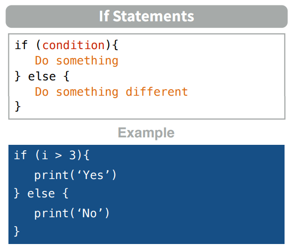
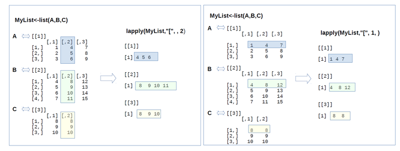

# R programming

R is a programming language most commonly used within the statistical and machine learning community. This chapter will review some of the elements of R programming that will be used in later chapters. Do not expect this chapter to be exhaustive or self-contained. It is intended to give a quick refresh of R for users that have at least some experience with this programming language. There are many topics and concepts which are fundamental but will not be reviewed in this chapter. However, you should aim to master the topics included in this chapter since they will appear again later on in these notes. There are many other resources if you want to have a more in-depth look into R programming.

 - The books of Hadley Wickham are surely a great starting point and are all available [here](http://hadley.nz/). 
 
 - If you are unsure on how to do something with R, Google it!!! The community of R users is so wide that surely someone else has already asked your same question.
 
 - The R help is extremely useful and comprehensive. If you want to know more about a function, suppose it is called function, you can type `?function`.

## Why R?

As mentioned in the previous chapter, simulation is very often applied in many areas, for instance management science and engineering. Often a simulation is carried out using an Excel spreadsheet or using a specialised software whose only purpose is creating simulations. Historically, R has not been at the forefront of the implementation of simulation models, in particular of discrete-event simulations. Only recently, R packages implementing discrete-event simulation have appeared, most importantly the `simmer` R package that you will learn using in later chapters.

These notes are intended to provide a unique view of simulation with specific implementation in the R programming language. Some of the strenght of R are:

 - it is free, open-source and available in all major operating systems;
 
 - the community of R users is huge, with many forums, sites and resources that give you practical support in developing your own code;
 
 - a massive set of add-on packages to increase the capabilities of the basic R environment;
 
 - functions to perform state-of-the-art statistical and machine-learning methods. Researchers sometimes create an associated R package to any article they publish so for others to use their methods;
 
 - the integrated development environment RStudio provides a user-friendly environment to make the R programming experience more pleasing;
 
 - powerful communication tools to create documents and presentations embedding R code and R output. As a matter of fact this very book is created in R!!!!
 
## Section Bibliography

* Crawley, M. J. (2012). The R book. John Wiley & Sons.
 
## R basics

So let's get started with R programming!

### Introduction to R

**R** is an *Open Source*, powerful, flexible and extensible statistical language. It is used by many companies (Google, Microsoft, Facebook, BBVA, etc...) and universities by Statisticians and Data Scientists in software development. Unlike traditional spreadsheets, in R programming sentences are written instead of the classic formulas. It is necessary to know the structure of the data. Prototypes can be made with a few lines of code.

### R History

R is an implementation of the statistical language S (combined with the programming language Scheme). S was developed in the AT&T labs by John Chambers in the late 1970s. The two main implementations of S are:

  - R
  - S+ (S-PLUS)

There are usually several releases a year (usually the most important in April):

  - 3.1.0 (Spring Dance) 10/04/2014
  - 3.2.0 (Full of Ingredients) 16/04/2015
  - 3.5.0 (Joy in Playing) 23/04/2018
  - 4.0.0 (Bunny-Wunnies Freak Out) 24/04/2020
  - 4.1.0 (Camp Pontanezen) 18/05/2021

### R Advantages

R is a great software for solving data analysis problems. There are many packages for data processing, statistical modelling, data mining and graphics. There is a community of users creating packages called [the R project](https://www.r-project.org). 

R is very useful for making graphs, analyzing data and obtaining statistical models with data that fit in the RAM memory of the PC. There are limitations, from a memory point of view, with large volumes of data. It is very common to use another resources to prepare the data:

+ Small or medium volumes: Python, Julia, Perl...
+ Large Volumes: Spark, Hadoop, Pig, Hive...

### What do we mean by R?

By R we usually mean:

+ The programming language.
+ The interpreter who executes the code written in R.
+ The graphics generation system of R.
+ The R programming IDE, or also known as RStudio (includes the R interpreter, graphics system, package manager and user interface).

### Console Mode

To open the **R console**, run from the command line (Terminal in Mac):

`$>R`

The console opens, which allows you to write commands interactively. Each of these commands is called **expressions**. The **R interpreter** reads these expressions and responds with the result or an error message. The command interface will store the steps followed when analyzing the data.

The `history()` command displays the history of commands entered during the **R session**. Names of variables, packages, directories, etc. are auto-completed using **tabulator**. If the name of a function is written in the console, its code is displayed. For example: `history`

```{r}
history
```

### Getting help in R

The simplest way to get help in R is to click on the Help button on the toolbar of the RGui window (this stands for R’s Graphic User Interface).

However, if you know the name of the function you want help with, you just type a question mark `?` at the command line prompt followed by the name of the function. So to get help on `read.table`, just type:

```{r}
?read.table
```

Sometimes you cannot remember the precise name of the function, but you know the subject on which you want help (e.g. data input in this case). Use the help.search function (without a question mark) with your query in double quotes like this:

```{r}
help.search("read tables")
```

Other useful functions are `find` and `apropos`. The `find` function tells you what package something is in:

```{r}
find("mean")
```

while `apropos` returns a character vector giving the names of all objects in the search list that match your (potentially partial) enquiry:

```{r}
apropos("lm")
```

To see a worked example just type the function name (e.g. linear models, `lm`) and you will see the printed and graphical output produced by the `lm` function:

```{r}
example(lm)
```

Demonstrations of R functions can be useful for seeing the range of things that R can do. Here are some for you to try:

```{r}
#demo(persp)
#demo(graphics)
#demo(Hershey)
#demo(plotmath)
```

### Packages in R

Finding your way around the contributed packages can be tricky, simply because there are so many of them, and the name of the package is not always as indicative of its function as you might hope. There is no comprehensive cross-referenced index, but there is a very helpful feature called ‘Task Views’ on CRAN, which explains the packages available under a limited number of usefully descriptive headings.

[Click here to see the 'Task Views'](https://cran.r-project.org/)

### Built-in R libraries

To use one of the built-in libraries, simply type the library function with the name of the library in brackets. Thus, to load the `dplyr` library type:

```{r}
library(dplyr)
```

### Contents of Packages

It is easy to use the `help` function to discover the contents of library packages. Here is how you find out about the contents of the `dplyr` library:

```{r}
library(help=dplyr)
```

Then, to find out how to use, say, mutate (`mutate`), just type:

```{r}
?mutate
```

### Installing Packages

The base package does not contain some of the libraries referred to in this course, but downloading these is very simple. Before you start, you should check whether you need to “Run as administrator” before you can install packages (right click on the R icon to find this). 

Run the R program, then from the command line use the install.packages function to download the libraries you want. For example, to install the `ggplot2` package type this:

```{r}
#install.packages("ggplot2")
```

### Command line versus scripts

When writing functions and other multi-line sections of input you will find it useful to use a text editor rather than execute everything directly at the command line.

Currently, most users prefer to use an IDE rather than executable text files. The most famous IDE for using R is [Rstudio](https://rstudio.com/).

### RStudio

Programming IDE to develop projects in R: https://www.rstudio.com/

There are two versions:

+ RStudio Desktop
+ RStudio Server (RStudio Desktop interface in web version)

Both versions have open source (free) and commercial (with support included) versions.

Allows the complete management of a software project:

+ Console R
+ File management
+ Help
+ Package management (installation, update, etc.)
+ Review of command history

<p align="center">
  
</p> 

### Working Directory

As we have mentioned, R is a programming language that allows us to perform certain actions through an IDE installed in our computer. 

In many cases we will need to store data or code sets to use them later. We may also need to read a data set from an external format or even write it. To do all these things, we need to know where we are on the computer, in other words, which folder we are currently in.

We will call this location the working directory. We are going to place there all the resources we need to work with R.

We will use the function setwd() to indicate our location to the R session we are working at.

Example:

```
setwd("C://User/Desktop/My_Working_Directory")
```

### Exercise: Set up your Working Directory

Try to start getting familiar with Rstudio and to set your working directory in a folder that is suitable for the rest of the course.

Remember, within this folder you can create sub-folders for each session in which you can include all the necessary material.

## Expressions, Objects and Symbols

The R code is composed by expressions. Some examples of expressions:
  
- Assignments
- Conditional sentences
- Arithmetic operations
- ...

Expressions are made up of objects and functions. Each expression is separated from another by a new line or semicolon (;).

The R code manipulates objects. Some examples of objects:

* Vectors
* Lists
* Functions
* ...

Formally the variable names in R are called symbols. Thus, we assign the object to a symbol of the current environment. The environment is formed by the set of symbols in a certain context.

### Some examples to start with

We can use R for many things, but there are certain basics that need to be learned. When we enter a code in the R console, this code will provide us with an output. Let's look at an example: If we enter a number or a word, R will return the same number or word.

```{r}
23
"Baby Yoda"
```

Each of these codes we have generated is interpreted by R, sent to our computer in a low level language, and returned in an understandable format for us. 

Each code can be understood as an object (not stored) that R is interpreting for us. If we want to store that objects in our computer RAM to use them later in the same R session we need to create an assignment (we assign something to a symbol). Example:

```{r}
my_number = 23
my_character = "Baby Yoda"
```

So we can use them later. For example, let's just print them:

```{r}
print(my_number)
print(my_character)
```

Notice that to assign something to a symbol we can use `=` or `<-`:

```{r}
my_number = 23
my_character = "Baby Yoda"
```

```{r}
print(my_number)
print(my_character)
```

## R as a Calculator

The screen prompt `>` is an invitation to put R to work. You can use the Rstudio command line as a calculator, like this:

```{r}
log(42/7.3)
```

Each line can have at most 8192 characters, but if you want to see a lengthy instruction or a complicated expression on the screen, you can continue it on one or more further lines simply by ending the line at a place where the line is obviously incomplete (e.g. with a trailing comma, operator, or with more left parentheses than right parentheses, implying that more right parentheses will follow). 

When continuation is expected, the prompt changes from > to +:

```{r}
5+6+3+6+4+2+4+8+
3+2+7
```

Note that the + continuation prompt does not carry out arithmetic plus. If you have made a mistake, and you want to get rid of the + prompt and return to the > prompt, then press the Esc key and use the Up arrow to edit the last (incomplete) line.

Two or more expressions can be placed on a single line so long as they are separated by semi-colons:

```{r}
2+3; 5*7; 3-7
```

For very big numbers or very small numbers R uses the following scheme (called exponents):

* `1.2e3`: means 1200 because the e3 means ‘move the decimal point 3 places to the right’
* `1.2e-2`: means 0.012 because the e-2 means ‘move the decimal point 2 places to the left’
* `3.9+4.5i`: is a complex number with real (3.9) and imaginary (4.5) parts, and i is the square root of –1.

### Complex numbers in R

Complex numbers consist of a real part and an imaginary part, which is identified by lower-case i like this:

```{r}
z = 3.5-8i
```

The elementary trigonometric, logarithmic, exponential, square root and hyperbolic functions are all
implemented for complex values. The following are the special R functions that you can use with com-
plex numbers:

* Determine the real part:

```{r}
Re(z)
```

* Determine the imaginary part:

```{r}
Im(z)
```

* Calculate the modulus (if x is the real part and y is the imaginary part, then the modulus is $\sqrt(x^2 + y^2)$):

```{r}
Mod(z)
```

* Calculate the argument (`Arg(x+ yi)= atan(y/x)`):

```{r}
Arg(z)
```

* Work out the complex conjugate (change the sign of the imaginary part):

```{r}
Conj(z)
```

* Check if the object is a complex number:

```{r}
is.complex(z)
```

* Coerce a number into a complex number:

```{r}
as.complex(3.8)
```

### Rounding

Various sorts of rounding (rounding up, rounding down, rounding to the nearest integer) can be done easily. Take the number `5.7` as an example. The ‘greatest integer less than’ function is `floor`:

```{r}
floor(5.7)
```

The ‘next integer’ function is ceiling:

```{r}
ceiling(5.7)
```

You can round to the nearest integer by adding 0.5 to the number, then using floor. There is a built-in function for this, but we can easily write one of our own to introduce the notion of function writing. Call it `rounded`, then define it as a function like this:

```{r}
rounded = function(x){floor(x+0.5)}
```

Now we can use the new function:

```{r}
rounded(5.7)
```

```{r}
rounded(5.4)
```

There is an R function called round that you can use by specifying 0 decimal places in the second
argument:

```{r}
round(5.7,0)
```

```{r}
round(5.4,0)
```

```{r}
round(-5.7,0)
```

### Arithmetics

The screen prompt in R is a fully functional calculator. You can add and subtract using the obvious `+` and `-` symbols, while division is achieved with a forward slash `/` and multiplication is done by using an asterisk `*` like this:

```{r}
7 + 3 - 5 * 2
```

Notice from this example that multiplication `(5 × 2)` is done *before* the additions and subtractions. 

Powers (like squared or cube root) use the caret symbol `ˆ` and are done before multiplication or division, as you can see from this example:

```{r}
3^2 / 2
```

All the mathematical functions you could ever want are here (see Table 2.1).

<p align="center">
  
</p> 

The `log` function gives logs to the base e (e = 2.718 282), for which the antilog function is `exp`:

```{r}
log(10)
```

```{r}
exp(1)
```

Logs to other bases are possible by providing the `log` function with a second argument which is the base of the logs you want to take. Suppose you want log to base 3 of 9:

```{r}
log(9,3)
```

The trigonometric functions in R measure angles in radians. A circle is $2\pi$ radians, and this is $360^\circ$ , so a right angle ($90^\circ$) is $\pi / 2$ radians. R knows the value of $\pi$ as `pi`:

```{r}
pi
```

```{r}
sin(pi/2)
```

```{r}
cos(pi/2)
```

Notice that the cosine of a right angle does not come out as exactly zero, even though the sine came out as exactly 1. The `e-017` means ‘times $10^{–17}$ ’. While this is a very small number, it is clearly not exactly zero.

### Modulo and integer quotients

Integer quotients and remainders are obtained using the notation `%/%` (percent, divide, percent) and `%%` (percent, percent) respectively. Suppose we want to know the integer part of a division: say, how many 13s are there in 119:

```{r}
119 %/% 13
```

Now suppose we wanted to know the remainder (what is left over when 119 is divided by 13): in maths this is known as **modulo**:

```{r}
119 %% 13
```

Modulo is very useful for testing whether numbers are odd or even: odd numbers have modulo 2 value 1 and even numbers have modulo 2 value 0:

```{r}
9 %% 2
```

```{r}
8 %% 2
```

Likewise, you use modulo to test if one number is an exact multiple of some other number. For instance, to find out whether 15 421 is a multiple of 7 (which it is), then ask:

```{r}
15421 %% 7
```

### Operators

R uses the following operator tokens:

* `+ - * / %/% %% ˆ`: arithmetic (plus, minus, times, divide, integer quotient, modulo, power)
* `>= < <= == !=`: relational (greater than, greater than or equals, less than, less than or equals, equals, not equals)
* `! & |`: logical (not, and, or)
* `~`: model formulae (‘is modelled as a function of’)
* `= ->`: assignment (gets)
* `$`: list indexing (the ‘element name’ operator)
* `:`: create a sequence

Several of these operators have different meaning inside model formulae. Thus * indicates the main effects plus interaction (rather than multiplication), : indicates the interaction between two variables (rather than generate a sequence) and ˆ means all interactions up to the indicated power (rather than raise to the power). You will learn more about these ideas in further sessions.


## R Basic Data types

In the previous examples we worked with numbers, but variables could be assigned other types of information. There are four basic types:
 
  - *Integers*: integer numbers. If you type an integer in R, as before 3 or 4, it will usually be stored as a double unless explicitly defined;
 
 - *Doubles*: real numbers;
 
 - *Logicals* or *Booleans*: corresponding to `TRUE` and `FALSE`, also abbreviated as `T` and `F` respectively;
 
 - *Characters*: strings of text surrounded by `"` (for example `"hi"`) or by `'` (for example 'by');
 
 - *Dates*: date-time expressions in R.
 
### Integers

Integer vectors exist so that data can be passed to C or Fortran code which expects them, and so that small integer data can be represented exactly and compactly. The range of integers is from −2 000 000 000 to + 2 000 000 000 (`-2*10ˆ9 to +2*10ˆ9`, which R could portray as `-2e+09` to `2e+09`).

Be careful. Do not try to change the class of a vector by using the `integer` function. Here is a numeric vector of whole numbers that you want to convert into a vector of integers:

```{r}
x = c(5,3,7,8)
is.integer(x)
```

```{r}
is.numeric(x)
```

To coerce a numeric vector to be an integers vector we have to use the `as.integer` function like this:

```{r}
x = c(5,3,7,8)
x = as.integer(x)
is.integer(x)
```

The integer function works as trunc when applied to real numbers, and removes the imaginary part when
applied to complex numbers:

```{r}
as.integer(5.7)
```

```{r}
as.integer(5.7 -3i)
```

### Integer vs. Double

The two most common numeric classes used in R are integer and double (for double precision floating point numbers). R automatically converts between these two classes when needed for mathematical purposes. As a result, it’s feasible to use R and perform analyses for years without specifying these differences.

By default, when you create a numeric vector using the `c()` function it will produce a vector of double precision numeric values. To create a vector of integers using `c()` you must specify explicity by placing an L directly after each number.

```{r}
dbl_var = c(1, 2.5, 4.5)
dbl_var
```

```{r}
int_var = c(1L, 6L, 10L)
int_var
```

To check whether a vector is made up of integer or double values:

```{r}
typeof(dbl_var)
```

```{r}
typeof(int_var)
```

By default, if you read in data that has no decimal points or you create numeric values using the `x = 1:10` method the numeric values will be coded as integer. If you want to change a double to an integer or vice versa you can specify one of the following:

```{r}
# integers to doubles
as.double(int_var)
```

```{r}
# doubles to integers
as.integer(dbl_var)
```

### Logical operators

A crucial part of computing involves asking questions about things. Is one thing bigger than other? Are two things the same size? Questions can be joined together using words like ‘and’ ‘or’, ‘not’. Questions in R typically evaluate to `TRUE` or `FALSE` but there is the option of a ‘maybe’ (when the answer is not available, `NA`). In R, < means ‘less than’, > means ‘greater than’, and ! means ‘not’ (see Table 2.2).

<p align="center">
  
</p> 

You can use `T` for TRUE and `F` for FALSE, but you should be aware that `T` and `F` might have been allocated
as variables. So this is obvious:

```{r}
TRUE == FALSE
```

```{r}
T == F
```

This, however, is not so obviours:

```{r}
T = 0
T == FALSE
```

```{r}
F = 1
TRUE == F
```

But now, of course, `T` is not equal to `F`:

```{r}
T != F
```

To be sure, always write TRUE and FALSE in full, and never use T or F as variable names.

Maybe you noticed in the last code chunk that, in R, TRUE is coded as `1` and FALSE as `0`:

```{r}
TRUE == 1
```

```{r}
FALSE == 0
```

Let's remove the T and F variables to avoid future errors:

```{r}
rm(list = c(T,F))
```

### Real numbers equality

You need to be careful in programming when you want to test whether or not two computed numbers are equal. R will assume that you mean ‘exactly equal’, and what that means depends upon machine precision. Most numbers are rounded to an accuracy of 53 binary digits. 

Typically therefore, two floating point numbers will not reliably be equal unless they were computed by the same algorithm, and not always even then. You can see this by squaring the square root of 2: surely these values are the same?

```{r}
x = sqrt(2)
x * x == 2
```

In fact, they are not the same. We can see by how much the two values differ by subtraction:

```{r}
x * x - 2
```

So how do we test for equality of real numbers? The best advice is not to do it. Try instead to use the alternatives ‘less than’ with ‘greater than or equal to’, or conversely ‘greater than’ with ‘less than or equal to’. Then you will not go wrong. Sometimes, however, you really do want to test for equality. In those circumstances, do not use double equals to test for equality, but employ the `all.equal` function instead.

```{r}
x = 0.3 - 0.2
y = 0.1
x == y
```

```{r}
all.equal(x,y)
```

WARNING: Do not use `all.equal` directly in `if` expressions. Either use `isTRUE(all.equal( ....))`

### Logical arithmetic

Arithmetic involving logical expressions is very useful in programming and in selection of variables. The key thing to understand is that logical expressions evaluate to either true or false (represented in R by `TRUE` or `FALSE`), and that R can coerce `TRUE` or `FALSE` into numerical values: 1 for `TRUE` and 0 for `FALSE`. Suppose that x is a sequence from 0 to 6 like this:

```{r}
x = 0:6
```

Now we can ask questions about the contents of the vector called x. Is x less than 4?

```{r}
x < 4
```

The answer is yes for the first four values (0, 1, 2 and 3) and no for the last three (4, 5 and 6). 

Two important logical functions are `all` and `any`. They check an entire vector but return a single logical value: `TRUE` or `FALSE`. Are all the x values bigger than 0?

```{r}
all(x>0)
```

No. The first x value is a zero. Are any of the x values negative?

```{r}
any(x<0)
```

No. The smallest x value is a zero.

We can use the answers of logical functions in arithmetic. We can count the true values of (`x<4`), using `sum`:

```{r}
sum(x<4)
```

We can multiply (x<4) by other vectors:

```{r}
(x<4) * runif(7)
```

### Characters

In R, character strings are defined by double quotation marks:

```{r}
a = "abc"
b = "123"
```

Numbers can be coerced to characters (as in b above), but non-numeric characters cannot be coerced to
numbers:

```{r}
as.numeric(a)
```

```{r}
as.numeric(b)
```

One of the initially confusing things about character strings is the distinction between the length of a character object (a vector), and the numbers of characters (nchar) in the strings that comprise that object. 
An example should make the distinction clear:

```{r}
pets = c("cat","dog","gerbil","terrapin")
```

Here, `pets` is a vector comprising four character strings:

```{r}
length(pets)
```

and the individual character strings have 3, 3, 6 and 8 characters, respectively:

```{r}
nchar(pets)
```

When first defined, character strings are not factors:

```{r}
class(pets)
```

```{r}
is.factor(pets)
```

We have to coerce this variable to convert it into a factor

```{r}
pets = as.factor(pets)
is.factor(pets)
```

### Characters: letters vectors

There are built-in vectors in R that contain the 26 letters of the alphabet in lower case (letters) and in upper
case (LETTERS):

```{r}
letters
```

```{r}
LETTERS
```

To discover which number in the alphabet the letter `n` is, you can use the `which` function like this:

```{r}
which(letters == "n")
```

For the purposes of printing you might want to suppress the quotes that appear around character strings by default. The function to do this is called noquote:

```{r}
noquote(letters)
```

### Characters: Pasting strings together

You can amalgamate individual strings into vectors of character information:

```{r}
c(a,b)
```

This shows that the concatenation produces a vector of two strings. It does not convert two 3-character strings into one 6-character string. The R function to do that is `paste`:

```{r}
paste(a,b,sep = "")
```

The third argument, `sep=""`, means that the two character strings are to be pasted together without any separator between them: the default for `paste` is to insert a single blank space, like this:

```{r}
paste(a,b)
```

Notice that you do not lose blanks that are within character strings when you use the `sep=""` option in
`paste`.

```{r}
paste(a,b," a longer phrase containing blanks",sep="")
```

If one of the arguments to `paste` is a vector, each of the elements of the vector is pasted to the specified character string to produce an object of the same length as the vector:

```{r}
d = c(a,b,"new")
e = paste(d, "a longer phrase containing blanks")
e
```

### Characters: Extracting parts of strings

We being by defining a phrase:

```{r}
phrase = "the quick brown fox jumps over the lazy dog"
```

The function called `substr` is used to extract substrings of a specified number of characters from within a character string. In the next example we are extracting the first 20 characters from `phrase` object:

```{r}
substr(phrase, 1, 20)
```

The second argument in `substr` is the number of the character at which extraction is to begin (in this case the first), and the third argument is the number of the character at which extraction is to end (in this case, the 20th).

### Characters: Counting things within strings

Counting the total number of characters in a string could not be simpler; just use the `nchar` function directly, like this:

```{r}
nchar(phrase)
```

So there are 43 characters including the blanks between the words. To count the numbers of separate individual characters (including blanks) you need to split up the character string into individual characters (43 of them), using `strsplit` like this:

```{r}
strsplit(phrase, split = "")
```

The `split = ""` argument is for determine the character we are going to use to split the entire object. If we use a blank space instead we can separate the string in all the different words:

```{r}
strsplit(phrase, split = " ")
```

The table function can then be used for counting the number of occurrences of each of the characters:

```{r}
table(strsplit(phrase, split = ""))
```

This demonstrates that all of the letters of the alphabet were used at least once within our phrase, and that there were eight blanks within the string called phrase. This suggests a way of counting the number of words in a phrase, given that this will always be one more than the number of blanks (so long as there are no leading or trailing blanks in the string):

```{r}
nwords = 1+table(strsplit(phrase, split = ""))[1]
nwords
```

Another solution is to `sum` all the elements in the table splitting the phrase with a blank space:

```{r}
sum(table(strsplit(phrase, split = " ")))
```

### Characters: Upper- and lower-case text

It is easy to switch between upper and lower cases using the `toupper` and `tolower` functions:

```{r}
toupper(phrase)
```

```{r}
tolower(toupper(phrase))
```

### Dates and times

The measurement of time is highly idiosyncratic. Successive years start on different days of the week. There are months with different numbers of days. Leap years have an extra day in February. Americans and Britons put the day and the month in different places: 3/4/2006 is March 4 for the former and April 3 for the latter. 

All these things mean that working with dates and times is extremely complicated. Fortunately, R has a robust system for dealing with this complexity. 

To see how R handles dates and times, have a look at Sys.time():

```{r}
Sys.time()
```

This description of date and time is strictly hierarchical from left to right: the longest time scale (years) comes first, then month, then day, separated by hyphens, then there is a blank space, followed by the time, with hours first (using the 24-hour clock), then minutes, then seconds, separated by colons. Finally, there is a character string explaining the time zone (CET stands for Central Europe Time)

This representation of the date and time as a character string is user-friendly and familiar, but it is no good for calculations. For that, we need a single numeric representation of the combined date and time. The convention in R is to base this on seconds (the smallest time scale that is accommodated in Sys.time)

The baseline for expressing today’s date and time in seconds is 1 January 1970:

```{r}
as.numeric(Sys.time())
```

This is fine for plotting time series graphs, but it is not much good for computing monthly means (e.g. is the mean for June significantly different from the July mean?) or daily means (e.g. is the Monday mean significantly different from the Friday mean?). 

To answer questions like these we have to be able to access a broad set of categorical variables associated with the date: the year, the month, the day of the week, and so forth. To accommodate this, R uses the POSIX system for representing times and dates:

```{r}
class(Sys.time())
```

You can think of the class `POSIXct`, with suffix ‘ct’, as continuous time (i.e. a number of seconds), and
`POSIXlt`, with suffix ‘lt’, as list time (i.e. a list of all the various categorical descriptions of the time,
including day of the week and so forth). It is hard to remember these acronyms, but it is well worth making
the effort. Naturally, you can easily convert to one representation to the other:

```{r}
time.list = as.POSIXlt(Sys.time())
unlist(time.list)
```

Here you see the nine components of the list. The time is represented by the number of seconds (`sec`), minutes (`min`) and hours (on the 24-hour clock). Next comes the day of the month (`mday`, starting from 1), then the month of the year (mon, starting at January = 0), then the year (starting at 0 = 1900). The day of the week (`wday`) is coded from Sunday = 0 to Saturday = 6. The day within the year (`yday`) is coded from 0 = January 1. Finally, there is a logical variable `isdst` which asks whether daylight saving time is in operation (0 = FALSE in this case). The ones you are most likely to use include `year` (to get yearly mean values), `mon` (to get monthly means) and `wday` (to get means for the different days of the week).

### Dates and times: Reading time data from files

It is most likely that your data files contain dates in Excel format, for example 03/09/2014 (a character string showing month/day/year separated by slashes).

```{r}
df = read.csv(file = "Data/boulder-precip.csv")
attach(df)
head(df)
```

To convert a factor or a character string into a POSIXlt object, we employ an important function called ‘strip time’, written `strptime`.

### Dates and times: The `strptime` function

To convert a factor or a character string into dates using the strptime function, we provide a format statement enclosed in double quotes to tell R exactly what to expect, in what order, and separated by what kind of symbol. For our present example we have day (as two digits), then slash, then month (as two digits), then slash, then year (without the century, making two digits).

```{r}
Rdate = strptime(DATE, "%m/%d/%y")
class(Rdate)
```

It is always a good idea at this stage to add the R-formatted date to your dataframe:

```{r}
df = data.frame(df, Rdate)
head(df)
```

Now, at last, we can do things with the date information. We might want the mean value of `PRECIP` for each day of the week. The name of this object is Rdate$wday:

```{r}
tapply(PRECIP,Rdate$wday,mean)
```

It is hard to remember all the format codes for strip time, but they are roughly mnemonic and they are always preceded by a percent symbol. Here is the full list of format components:

+ `%a`: Abbreviated weekday name
+ `%A`: Full weekday name
+ `%b`: Abbreviated month name
+ `%B`: Full month name
+ `%c`: Date and time, locale-specific
+ `%d`: Day of the month as decimal number (01–31)
+ `%H`: Hours as decimal number (00–23) on the 24-hour clock
+ `%I`: Hours as decimal number (01–12) on the 12-hour clock
+ `%j`: Day of year as decimal number (0–366)
+ `%m`: Month as decimal number (0–11)
+ `%M`: Minute as decimal number (00–59)
+ `%p`: AM/PM indicator in the locale
+ `%S`: Second as decimal number (00–61, allowing for two ‘leap seconds’)
+ `%U`: Week of the year (00–53) using the first Sunday as day 1 of week 1
+ `%w`: Weekday as decimal number (0–6, Sunday is 0)
+ `%W`: Week of the year (00–53) using the first Monday as day 1 of week 1
+ `%x`: Date, locale-specific
+ `%X`: Time, locale-specific
+ `%Y`: Year with century
+ `%y`: Year without century
+ `%Z`: Time zone as a character string (output only)

There is a useful function called weekdays (note the plural) for turning the day number into the appropriate name:

```{r}
y = strptime("01/02/2020", format="%d/%m/%Y")
weekdays(y)
```

which is converted from:

```{r}
y$wday
```

because the days of the week are numbered from Sunday = 0.

Here is another kind of date, with years in two-digit form (`%y`), and the months as abbreviated names (`%b`) using no separators:

```{r}
other.dates = c("1jan99", "2jan05", "31mar04", "30jul05")
strptime(other.dates, "%d%b%y")
```

Here is yet another possibility with year, then month in full, then week of the year, then day of the week abbreviated, all separated by a single blank space:

```{r}
yet.another.date = c("2016 January 2 Mon","2017 February 6 Fri","2018 March 10 Tue")
strptime(yet.another.date,"%Y %B %W %a")
```

### Dates and times: Summary

The key thing to understand is the difference between the two representations of dates and times in R. They have unfortunately non-memorable names.

+ POSIXlt gives a list containing separate vectors for the year, month, day of the week, day within the year, and suchlike. It is very useful as a categorical explanatory variable (e.g. to get monthly means from data gathered over many years using date$mon).
+ POSIXct gives a vector containing the date and time expressed as a continuous variable that you can use in regression models (it is the number of seconds since the beginning of 1970).


### Testing and coercing

The concepts of membership and coercion may be unfamiliar. Membership relates to the class of an object in R. Coercion changes the class of an object. For instance, a logical variable has class `logical` and mode logical. This is how we create the variable:

```{r}
lv = c(TRUE,FALSE,TRUE)
```

We can assess its membership by asking if it is a logical variable using the `is.logical` function:

```{r}
is.logical(lv)
```

It is not a factor, and so it does not have levels:

```{r}
levels(lv)
```

But we can coerce it be a two-level factor like this:

```{r}
fv = as.factor(lv)
fv
```

We can coerce a logical variable to be numeric: `TRUE` evaluates to 1 and `FALSE` evaluates to zero, like this:

```{r}
nv = as.numeric(lv)
nv
```

In general, the expression `as(object, value)` is the way to coerce an object to a particular class. Membership functions ask `is.something` and coercion functions say `as.something`.

Objects have a type, and you can test the type of an object using an is.type function (Table 2.3). For instance, mathematical functions expect numeric input and text-processing functions expect character input. Some types of objects can be coerced into other types. A familiar type of coercion occurs when we interpret the TRUE and FALSE of logical variables as numeric 1 and 0, respectively. Factor levels can be coerced to numbers. Numbers can be coerced into characters, but non-numeric characters cannot be coerced into numbers.

<p align="center">
  
</p> 

### Missing values, infinity and things that are not numbers

Calculations can lead to answers that are plus infinity, represented in R by `Inf`, or minus infinity, which is represented as `-Inf`:

```{r}
3/0
```

```{r}
-12/0
```

Calculations involving infinity can be evaluated: for instance,

```{r}
exp(-Inf)
0/Inf
```

Other calculations, however, lead to quantities that are not numbers. These are represented in R by NaN (‘not a number’). Here are some of the classic cases:

```{r}
0/0
Inf-Inf
Inf/Inf
```

You need to understand clearly the distinction between `NaN` and `NA` (this stands for ‘not available’ and is the missing-value symbol in R). 

The function `is.nan` is provided to check specifically for `NaN`, and `is.na` also returns `TRUE` for `NaN`. Coercing `NaN` to logical or integer type gives an `NA` of the appropriate type. There are built-in tests to check whether a number is finite or infinite:

Missing values in dataframes are a real source of irritation, because they affect the way that model-fitting functions operate and they can greatly reduce the power of the modelling that we would like to do. 

You may want to discover which values in a vector are missing. Here is a simple case:

```{r}
y = c(4,NA,7)
```

The missing value question should evaluate to `FALSE TRUE FALSE`. There are two ways of looking for missing values that you might think should work, but do not. These involve treating `NA` as if it was a piece of text and using double equals (==) to test for it. So this does not work:

```{r}
y == NA
```

because it turns all the values into `NA` (definitively not what you intended). This does not work either:

```{r}
y == "NA"
```

It correctly reports that the numbers are not character strings, but it returns `NA` for the missing value itself, rather than `TRUE` as required. This is how you do it properly:

```{r}
is.na(y)
```

To produce a vector with the `NA` stripped out, use subscripts with the not `!` operator like this:

```{r}
y[! is.na(y)]
```

Some functions do not work with their default settings when there are missing values in the data, and `mean` is a classic example of this:

```{r}
x = c(1:8, NA)
mean(x)
```

In order to calculate the mean of the non-missing values, you need to specify that the NA are to be removed, using the `na.rm=TRUE` argument:

```{r}
mean(x, na.rm = T)
```


## R Basic Data Structures

### Vectors

A vector is a variable with one or more values of the same type (atomic one dimensional arrays). For instance, the numbers of peas in six pods were 4, 7, 6, 5, 6 and 7. The vector called peas is one object of `length = 6`. In this case, the class of the object is numeric. The easiest way to create a vector in R is to concatenate (link together) the six values using the concatenate function, `c`, like this:

```{r}
peas = c(4, 7, 6, 5, 6, 7)
```

We can ask all sorts of questions about the vector called peas. For instance, what type of vector is it?

```{r}
class(peas)
```

How big is the vector?

```{r}
length(peas)
```

The great advantage of a vector-based language is that it is very simple to ask quite involved questions that involve all of the values in the vector. These vector functions are often self-explanatory:

```{r}
mean(peas)
```
```{r}
max(peas)
```
```{r}
min(peas)
```

Another way to create a vector is to input data from the keyboard using the function called `scan`:

```{r}
#peas = scan()
```

The prompt appears `1:` which means type in the first number of peas (4) then press the return key, then the prompt `2:` appears (you type in 7) and so on. When you have typed in all six values, and the prompt `7:` has appeared, you just press the return key to tell R that the vector is now complete. R replies by telling you how many items it has read:

```
Read 6 items
```

As we explained, vectors are single-dimensional arrays. The array indexes range from 1 to the vector length, `length(v)`. Vectors are also known as atomic vectors.

All elements of the vector are of the same basic type:

+ logical
+ integer
+ double
+ character
+ complex

It has a fixed size that is fixed in its creation. The simplest way to create a vector is by using the combination function `c(v1, v2,...)`. To name the elements of a vector we use the function `names(v)`. Here you have some different ways to create vectors in R:

+ Using the `vector` function

```{r}
# Logical Vector
v1 = vector(mode = 'logical', length = 4)
v1
```

```{r}
# Integer vector
v2 = vector(mode = 'integer', length = 4)
v2
```

+ Using the "type" function

```{r}
# Numeric vector
v3 = numeric(4)
v3
```

```{r}
# Character vector
v4 = character(4)
v4
```

### Sequences

An important way of creating vectors is to generate a sequence of numbers. The simplest sequences are in steps of 1, and the colon operator is the simplest way of generating such sequences. All you do is specify the first and last values separated by a colon. Here is a sequence from 0 up to 10:

```{r}
0:10
```
Here is a sequence from 15 down to 5:

```{r}
15:5
```

To generate a sequence in steps other than 1, you use the seq function. There are various forms of this, of which the simplest has three arguments: `from`, `to`, `by` (the initial value, the final value and the increment). If the initial value is smaller than the final value, the increment should be positive, like this:

```{r}
seq(0, 1.5, 0.1)
```

If the initial value is larger than the final value, the increment should be negative, like this:

```{r}
seq(6, 4, -0.2)
```

In many cases, you want to generate a sequence to match an existing vector in length. Rather than having to figure out the increment that will get from the initial to the final value and produce a vector of exactly the appropriate length, R provides the `along` and `length` options. Suppose you have a vector of population sizes:

```{r}
N = c(55,76,92,103,84,88,121,91,65,77,99)
```

You need to plot this against a sequence that starts at 0.04 in steps of 0.01:

```{r}
seq(from=0.04,by=0.01,length=11)
```

But this requires you to figure out the length of `N`. A simpler method is to use the `along` argument and specify the vector, `N`, whose length has to be matched:

```{r}
seq(0.04,by=0.01,along=N)
```

Alternatively, you can get R to work out the increment (0.01 in this example), by specifying the start and the end values (`from` and `to`), and the name of the vector (`N`) whose length has to be matched:

```{r}
seq(from=0.04,to=0.14,along=N)
```

If you want a vector made up of sequences of unequal lengths, then use the sequence function. Suppose that most of the five sequences you want to string together are from 1 to 4, but the second one is 1 to 3 and the last one is 1 to 5, then:

```{r}
sequence(nvec = c(4,3,4,4,4,5), from = 1, by = 1)
```

#### Generating repeats

You will often want to generate repeats of numbers or characters, for which the function is `rep`. The object that is named in the first argument is repeated a number of times as specified in the second argument. At its simplest, we would generate five 9s like this:

```{r}
rep(9,5)
```
You can see the issues involved by a comparison of these three increasingly complicated uses of the `rep` function:

```{r}
rep(1:4, times = 2)
```
In the simplest case, the entire first argument is repeated (i.e. the sequence 1 to 4 appears twice).

```{r}
rep(1:4, each=2)
```
You often want each element of the sequence to be repeated, and this is accomplished with the each argument.

```{r}
rep(1:4, each = 2, times = 3)
```
Finally, you might want each number repeated and the whole series repeated a certain number of times (here three times).

When each element of the series is to be repeated a different number of times, then the second argument must be a vector of the same length as the vector comprising the first argument (length 4 in this example). So if we want one 1, two 2s, three 3s and four 4s we would write:

```{r}
rep(1:4, 1:4)
```

In a more complicated case, there is a different but irregular repeat of each of the elements of the first argument. Suppose that we need four 1s, one 2, four 3s and two 4s. Then we use the concatenation function `c` to create a vector of length 4 `c(4,1,4,2)` which will act as the second argument to the `rep` function:

```{r}
rep(1:4, c(4,1,4,2))
```

Here is the most complex case with character data rather than numbers: each element of the series is repeated an irregular number of times:

```{r}
rep(c("cat", "dog", "gerbil", "goldfish", "rat"), c(2,3,2,1,3))
```

This is the most general, and also the most useful form of the `rep` function.

#### Generating Factor Levels

The function gl (‘generate levels’) is useful when you want to encode long vectors of factor levels. The syntax for the three arguments is: ‘up to’, ‘with repeats of’, ‘to total length’. Here is the simplest case where we want factor levels up to 4 with repeats of 3 repeated only once (i.e. to total length 12):

```{r}
gl(4,3)
```

Here is the function when we want that whole pattern repeated twice:

```{r}
gl(4,3,24)
```

If you want text for the factor levels, rather than numbers, use labels like this:

```{r}
Temp = gl(2, 2, 24, labels = c("Low", "High"))
Soft = gl(3, 8, 24, labels = c("Hard","Medium","Soft"))
M.user = gl(2, 4, 24, labels = c("N", "Y"))
Brand = gl(2, 1, 24, labels = c("X", "M"))
data.frame(Temp,Soft,M.user,Brand)
```

### Vector and Subscripts

You will often want to use some but not all of the contents of a vector. To do this, you need to master the use of subscripts (or indices as they are also known). In R, subscripts involve the use of square brackets `[]`. Our vector called `peas` shows the numbers of peas in six pods:

```{r}
peas = c(4, 7, 6, 5, 6, 7)
```

The first element of `peas` is 4, the second 7, and so on. The elements are indexed left to right, 1 to 6. It could not be more straightforward. If we want to extract the fourth element of peas (which you can see is a 5) then this is what we do:

```{r}
peas[4]
```

If we want to extract several values (say the 2nd, 3rd and 6th) we use a vector to specify the pods we want as subscripts, either in two stages like this:

```{r}
pods = c(2,3,6)
peas[pods]
```
or in a single step, like this:

```{r}
peas[c(2,3,6)]
```

You can drop values from a vector by using negative subscripts. Here are all but the first values of peas:

```{r}
peas[-1]
```

Here are all but the last (note the use of the `length` function to decide what is last):

```{r}
peas[-length(peas)]
```

We can use sequences of numbers to extract values from a vector. Here are the first three values of `peas`:

```{r}
peas[1:3]
```
Here are the even-numbered values of `peas`:

```{r}
peas[seq(2,length(peas), 2)]
```
or alternatively:

```{r}
peas[1:length(peas) %% 2 == 0]
```

Using the modulo function %% on the sequence 1 to 6 to extract the even numbers 2, 4 and 6. Finally, we can assign some value to the elements between some specific indices

```{r}
peas[4:5] = 0
peas
```

#### Classes of vector

The vector called `peas` contained numbers: in the jargon, it is of class numeric. R allows vectors of six types, so long as all of the elements in one vector belong to the same class. The classes are logical, integer, real, complex, string (or character) or raw. You will use numeric, logical and character variables all the time. Engineers and mathematicians will use complex numbers. But you could go a whole career without ever needing to use integer or raw.

#### Naming elements within vectors

It is often useful to have the values in a vector labelled in some way. For instance, if our data are counts of 0, 1, 2, . . . occurrences in a vector called `counts`,

```{r}
counts = c(25,12,7,4,6,2,1,0,2)
```

so that there were 25 zeros, 12 ones and so on, it would be useful to name each of the counts with the relevant number 0 to 8:

```{r}
names(counts) = 0:8
```

Now when we inspect the vector called counts we see both the names and the frequencies:

```{r}
counts
```

Or even access to some element using its name:

```{r}
counts["0"]
```

#### Working with logical subscripts

Take the example of a vector containing the 11 numbers 0 to 10:

```{r}
x = 0:10
```

There are two quite different kinds of things we might want to do with this. We might want to add up the values of the elements:

```{r}
sum(x)
```
Alternatively, we might want to count the elements that passed some logical criterion. Suppose we wanted to know how many of the values were less than 5:

```{r}
sum(x<5)
```

You see the distinction. We use the vector function `sum` in both cases. But `sum(x)` adds up the values of the x's and `sum(x<5)` counts up the number of cases that pass the logical condition ‘x is less than 5’. This works because of coercion. Logical `TRUE` has been coerced to numeric 1 and logical `FALSE` has been coerced to numeric 0.

How do you add up the values of just some of the elements of x? We specify a logical condition, but we do not want to count the number of cases that pass the condition, we want to add up all the values of the cases that pass.

Note that when we counted the number of cases, the counting was applied to the entire vector, using `sum(x<5)`. To find the sum of the values of x that are less than 5, we write:

```{r}
sum(x[x<5])
```

Let us look at this in more detail. The logical condition `x<5` is either true or false:

```{r}
x<5
```
You can imagine false as being numeric 0 and true as being numeric 1. Then the vector of subscripts `[x<5]` is five 1s followed by six 0s:

```{r}
as.numeric(x<5)
```

Now imagine multiplying the values of x by the values of the logical vector

```{r}
x*(x<5)
```

When the function `sum` is applied, it gives us the answer we want: the sum of the values of the numbers 0 + 1 + 2 + 3 + 4 = 10.

```{r}
sum(x*(x<5))
```

This produces the same answer as `sum(x[x<5])`, but is rather less elegant. There are many other ways of indexing elements of a vector using logical operators. We have a vector with values between 0 and 100:

```{r}
v = 0:100
```

We can select all the elements over 30:

```{r}
v[v>30]
```
even, all those over 30 and under or equal 50:

```{r}
v[v > 30 & v <= 50]
```

Finally, we can use a specific set of elements to select those from the vector:

```{r}
v[ v %in% c(10, 20, 30)]
```

### Vector Operations

When arithmetic operations are performed between two vectors, R returns another vector with the results of the element by element operation. Boolean operations are also possible. Most functions and operations are "vectorized".

```{r}
avector = c(1,2,3)
bvector = c(4,5,6)
```

If we sum up the two vectors the result will be a new vector with the sum of the elements with the same index:

```{r}
avector + bvector
```
If the vectors are not the same size, R repeats the smallest of them as many times as necessary.

```{r}
avector + 1
```

Vectors multiplication will follow the same rule, as the multiplication by an scalar:

```{r}
avector * bvector
```
```{r}
avector*2
```

If we want to multiplicate vectors as one-dimensional matrices (dot product) we need to use a different sintax:

```{r}
avector %*% bvector
```
In this case we obtained an scalar because the inner product was computed, but we can transpose one of the vectors to obtain the outer product using the `t()` function:

```{r}
avector %*% t(bvector)
```

### Vector Functions

One of R’s great strengths is its ability to evaluate functions over entire vectors, thereby avoiding the need for loops and subscripts. The most important vector functions are listed in Table 2.4. 

<p align="center">
  
</p> 

Here is a numeric vector:

```{r}
y = c(8,3,5,7,6,6,8,9,2,3,9,4,10,4,11)
```

Some vector functions produce a single number:

```{r}
mean(y)
```

Others produce two numbers:

```{r}
range(y)
```

here showing that the minimum was 2 and the maximum was 11. Other functions produce several numbers:

```{r}
fivenum(y)
```

This is Tukey’s famous five-number summary: the minimum, the lower hinge, the median, the upper hinge and the maximum.

Perhaps the single most useful vector function in R is `table`. You need to see it in action to appreciate just how good it is. Here is a huge vector called `counts` containing 10 000 random integers between 0 and 10 from a uniform distribution

```{r}
counts = sample(1:10, size = 10000, replace = TRUE)
```

Here is a look at the first 30 values in counts:

```{r}
counts[1:30]
```

The question is this: how many zeros are there in the whole vector of 10 000 numbers, how many 1s, and so on right up to the largest value within counts? A formidable task for you or me, but for R it is just:

```{r}
table(counts)
```

#### `tapply` function

One of the most important functions in all of R is tapply. It does not sound like much from the name, but you will use it time and again for calculating means, variances, sample sizes, minima and maxima. With weather data, for instance, we might want the 12 monthly mean temperatures rather than the whole-year average. We have a response variable, temperature, and a categorical explanatory variable, month:

```{r}
temperature = read.csv("./Data/city_temperature.csv")
attach(temperature)
names(temperature)
```

```{r}
tapply(AvgTemperature, Month, mean)
```

It is easy to apply other functions in the same way: here are the monthly variances

```{r}
tapply(AvgTemperature,Month,var)
```

and the monthly max

```{r}
tapply(AvgTemperature,Month,max)
```

If R does not have a built in function to do what you want, then you can easily write your own. Here, for instance, is a function to calculate the standard error of each mean (these are called anonymous functions in R, because they are unnamed):

```{r}
tapply(AvgTemperature, Month,  function(x) sqrt(var(x)/length(x)))
```

The `tapply` function is very flexible. It can produce multi-dimensional tables simply by replacing the one categorical variable (`Month`) by a `list` of categorical variables. Here are the monthly means calculated separately for each year, as specified by `list(Year,Month)`. The variable you name first in the list (`Year`) will appear as the row of the results table and the second will appear as the columns (`Month`):

```{r}
tapply(AvgTemperature,list(Year,Month),mean)[,1:6]
```

The subscripts [,1:6] simply restrict the output to the first six months.

There is just one thing about `tapply` that might confuse you. If you try to apply a function that has built-in protection against missing values, then `tapply` may not do what you want, producing `NA` instead of the numerical answer. This is most likely to happen with the mean function because its default is to produce NA when there are one or more missing values. The remedy is to provide an extra argument to `tapply`, specifying that you want to see the average of the non-missing values. Use `na.rm=TRUE` to remove the missing values like this:

```{r}
tapply(AvgTemperature,Year,mean,na.rm=TRUE)
```

You might want to trim some of the extreme values before calculating the mean (the arithmetic mean is famously sensitive to outliers). The `trim` option allows you to specify the fraction of the data (between 0 and 0.5) that you want to be omitted from the left- and right-hand tails of the sorted vector of values before computing the mean of the central values:

```{r}
tapply(AvgTemperature,Year,mean,trim=0.2)
```

#### `aggregate` function

Suppose that we have two response variables (`y` and `z`) and two explanatory variables (`x` and `w`) that we might want to use to summarize functions like mean or variance of `y` and/or `z`. The `aggregate` function has a formula method which allows elegant summaries of four kinds:

* one to one: `aggregate(y ~ x, mean)`
* one to many: `aggregate(y ~ x + w, mean)`
* many to one: `aggregate(cbind(y,z) ~ x, mean)`
* many to many: `aggregate(cbind(y,z) ~ x + w, mean)`

Here is an example using a dataframe with many categorical and continuous variables:

```{r}
df = read.csv("./Data/bank.csv", sep = ";", stringsAsFactors = TRUE)
head(df)
```

Here is one-to-one use of `aggregate` to find mean the `cons.price.idx` in the different `marital` samples:

```{r}
aggregate(cons.price.idx ~ marital, df, mean)
```

Here is a one-to-many use to look at the interaction between `marital` and `contact`:

```{r}
aggregate(cons.price.idx ~ marital + contact, df, mean)
```

Finally, here is a many-to-many use to find mean `euribor3m` as well as mean `cons.price.idx` for the interaction between `marital` and `contact`:

```{r}
aggregate(cbind(cons.price.idx, euribor3m) ~ marital + contact, df, mean)
```

#### Parallel minima and maxima

Here are three vectors of the same length, `x`, `y` and `z`. The parallel minimum function, `pmin`, finds the minimum from any one of the three variables for each subscript, and produces a vector as its result (of length equal to the longest of `x`, `y`, or `z`):

```{r}
x = runif(6)
x
```

```{r}
y = runif(6)
y
```


```{r}
z = runif(6)
z
```


```{r}
pmin(x,y,z)
```

#### Summary by groups with `tapply`

The vector function `tapply` is one of the most important and useful vector functions to master. The ‘t’ stands for ‘table’ and the idea is to apply a function to produce a table from the values in the vector, based on one or more grouping variables (often the grouping is by factor levels). This sounds much more complicated than it really is:


```{r}
daphnia = read.table("./Data/daphnia.txt", header = TRUE)
attach(daphnia)
names(daphnia)
```
The response variable is `Growth.rate` and the other three variables are factors. Suppose we want the mean growth rate for each detergent:

```{r}
tapply(Growth.rate, Detergent, mean)
```
This produces a table with four entries, one for each level of the factor called `Detergent`.

To produce a two-dimensional table we put the two grouping variables in a list. Here we calculate the median growth rate for water type and daphnia clone:

```{r}
tapply(Growth.rate,list(Water,Daphnia),median)
```
The first variable in the list creates the rows of the table and the second the columns.

#### Addresses within vectors

There is an important function called `which` for finding addresses within vectors. The vector y looks like this:

```{r}
y = c(8,3,5,7,6,6,8,9,2,3,9,4,10,4,11)
```

Suppose we wanted to know which elements of `y` contained values bigger than 5. We type:

```{r}
which(y>5)
```
Notice that the answer to this enquiry is a set of subscripts. We do not use subscripts inside the `which` function itself. The function is applied to the whole array. To see the values of y that are larger than 5, we just type:

```{r}
y[y>5]
```

#### Finding closest values

Finding the value in a vector that is closest to a specified value is straightforward using which. The vector `x` contains 1000 random numbers from a normal distribution with mean = 100 and standard deviation = 10:

```{r}
set.seed(2020)
x = rnorm(1000, 100, 10)
```

Here, we want to find the value of `x` that is closest to 108.0. The logic is to work out the difference between 108 and each of the 1000 random numbers, then find which of these differences is the smallest. This is what the R code looks like:

```{r}
which(abs(x-108) == min(abs(x-108)))
```

The closest value to 108.0 is in location 626 within `x`. But just how close to 108.0 is this 626 value? We use 626 as a subscript on `x` to find this out:

```{r}
x[626]
```

#### Sorting, Ranking and Ordering

These three related concepts are important, and one of them (order) is difficult to understand at the beginning. Let us take a simple example:

```{r}
set.seed(2020)
houses_prices = runif(10, 150, 500)
houses_prices
```

We apply the three different functions to the vector called `houses_price`:

```{r}
ranks = rank(houses_prices)
ranks
```
```{r}
sorted = sort(houses_prices)
sorted
```

```{r}
ordered = order(houses_prices)
ordered
```

Let's create a data frame to observe the data easily:

```{r}
view = data.frame(houses_prices, ranks, sorted, ordered)
view
```

**RANK**: The prices themselves are in no particular sequence. The `ranks` column contains the value that is the rank of the particular data point (value of `Price`), where 1 is assigned to the lowest data point and `length(Price)` – here 10 – is assigned to the highest data point.

**SORT**: The sorted vector is very straightforward. It contains the values of `Price` sorted into ascending order. If you want to sort into descending order, use the reverse order function `rev` like this:

```{r}
rev(sort(houses_prices))
```

**ORDER**: This is the most important of the three functions, and the hardest to understand. The numbers in this column are subscripts between 1 and 10. The order function returns an integer vector containing the permutation that will sort the input into ascending order.

Using `order` with subscripts is a much safer option than using `sort`, because with `sort` the values of the response variable and the explanatory variables could be uncoupled with potentially disastrous results if this is not realized at the time that modelling was carried out.

Imagine we have another variable that is the location of the house represented by a letter:

```{r}
set.seed(2020)
location = sample(LETTERS, 10)
location
```

We can use the `order` function to organize the location of the houses like this:

```{r}
location[order(houses_prices)]
```

#### `unique` and `duplicated` functions

The difference is best seen with a simple example. Here is a vector of names:

```{r}
names = c("Williams","Jones","Smith","Williams","Jones","Williams")
```

We can see how many times each name appears using table:We can see how many times each name appears using `table`:

```{r}
table(names)
```
It is clear that the vector contains just three different names. The function called `unique` extracts these three unique names, creating a vector of length 3, unsorted, in the order in which the names are encountered in the vector:

```{r}
unique(names)
```

In contrast, the function called `duplicated` produces a vector, of the same length as the vector of names, containing the logical values either `FALSE` or `TRUE`, depending upon whether or not that name has appeared already (reading from the left). You need to see this in action to understand what is happening, and why it might be useful:

```{r}
duplicated(names)
```
The first three names are not duplicated (`FALSE`), but the last three are all duplicated (`TRUE`). We can mimic the `unique` function by using this vector as subscripts like this:

```{r}
names[!duplicated(names)]
```
There you have it: if you want a shortened vector, containing only the unique values in names, then use `unique`, but if you want a vector of the same length as names then use `duplicated`.

### Sets

There are three essential functions for manipulating sets. The principles are easy to see if we work with an example of two sets:

```{r}
setA = c("a", "b", "c", "d", "e")
setB = c("d", "e", "f", "g")
```

The **union** of two sets is everything in the two sets taken together, but counting elements only once that are common to both sets:

```{r}
union(setA, setB)
```

The **intersection** of two sets is the material that they have in common:

```{r}
intersect(setA, setB)
```
Note, however, that the **difference** between two sets is order-dependent. It is the material that is in the first named set, that is not in the second named set. Thus `setdiff(A,B)` gives a different answer than `setdiff(B,A)`. For our example:

```{r}
setdiff(setA, setB)
```

```{r}
setdiff(setB, setA)
```

There is also a built-in function `setequal` for testing if two sets are equal:

```{r}
setequal(setA, setB)
```

You can use `%in%` for comparing sets. The result is a logical vector whose length matches the vector on the left:

```{r}
setA %in% setB
```
```{r}
setB %in% setA
```

### Factors

Conceptually, factors are variables in R which take on a limited number of different values; such variables are often refered to as categorical variables. One of the most important uses of factors is in statistical modeling; since categorical variables enter into statistical models differently than continuous variables, storing data as factors ensures that the modeling functions will treat such data correctly.

Factors in R are stored as a vector of integer values with a corresponding set of character values to use when the factor is displayed. The `factor` function is used to create a factor. The only required argument to `factor` is a vector of values which will be returned as a vector of factor values. Both numeric and character variables can be made into factors, but the factor levels will always be character values. You can see the possible levels for a factor through the `levels` command.

To change the order in which the levels will be displayed from their default sorted order, the `levels=` argument can be given a vector of all the possible values of the variable in the order you desire. If the ordering should also be used when performing comparisons, use the optional `ordered=TRUE` argument. In this case, the factor is known as an ordered factor.

*Reminder:*

+ **Categorical variable**: one that can take a limited number of possible values (categories). Examples of categorical variables: gender of a person, nationality...
    
    + Categorical nominal variable: one that does not have a pre-established order.
    + Categorical ordinal variable: that which has an established order.

+ **Continuous variable**: one that can take an infinite number of possible values. Examples of continuous variables: weight of a person, height of a person...

The different values that the variable can take are called levels, **factor levels**.

Why use factors?

+ They allow to establish a different order than the alphabetical one.
+ Many R models/packages use them

Factors are categorical variables that have a fixed number of levels. A simple example of a factor might be a variable called gender with two levels: ‘female’ and ‘male’. If you had three females and two males, you could create the factor like this:

```{r}
gender = factor(c("female", "male", "female", "male", "female"))
class(gender)
```

```{r}
mode(gender)
```

More often, you will create a dataframe by reading your data from a file using read.table. When we did this in the previous version of R (R3), the strings in our data table were automatically converted into factors. This was useful as long as our data table was well structured and clean, but it could cause problems in some cases. Let's see an example of a well-structured data table:

```{r}
data = read.table(file = "./Data/GenderPurchase.csv", header = TRUE, sep = ",")
is.factor(data$Gender)
```

As we can see, in this version of R (R4), the strings are coded as default character type. We can solve this by adding a parameter to our command as seen below:

```{r}
data = read.table(file = "./Data/GenderPurchase.csv", header = TRUE, sep = ",", stringsAsFactors = TRUE)
is.factor(data$Gender)
```

Let's see what happens with a data table that is not well structured in case of reading the strings as factors:

```{r}
data = read.table(file = "./Data/titanic3.csv", header = TRUE, sep = ",", stringsAsFactors = TRUE)
str(data)
```

We can find ourselves with variables that are completely useless and very difficult to manage, with as many levels of the factors as cases we have in the data table. 

In these cases it is much more comfortable to read the strings as characters and work on those variables to extract useful information from them as we will see later.

We will use the daphnia dataset to perform some examples with factors:

```{r}
daphnia = read.table("./Data/daphnia.txt", header = TRUE, stringsAsFactors = TRUE)
attach(daphnia)
```

There are some important functions for dealing with factors. You will often want to check that a variable is a factor (especially if the factor levels are numbers rather than characters):

```{r}
is.factor(Water)
```

To discover the names of the factor levels, we use the levels function:

```{r}
levels(Detergent)
```

To discover the number of levels of a factor, we use the nlevels function:

```{r}
nlevels(Detergent)
```

The same result is achieved by applying the length function to the levels of a factor:

```{r}
length(levels(Detergent))
```

By default, factor levels are treated in alphabetical order. If you want to change this (as you might, for instance, in ordering the bars of a bar chart) then this is straightforward: just type the factor levels in the order that you want them to be used, and provide this vector as the second argument to the factor function. 

Suppose we have an experiment with three factor levels in a variable called treatment, and we want them to appear in this order: ‘nothing’, ‘single’ dose and ‘double’ dose. We shall need to override R’s natural tendency to order them ‘double’, ‘nothing’, ‘single’:

```{r}
set.seed(2020)
treatment = as.factor(sample(c("double", "nothing", "single"), 100, replace = TRUE))
response = sample(c(0,1), 100, replace = TRUE)
tapply(response, treatment, mean)
```

This is achieved using the factor function like this:

```{r}
treatment = factor(treatment,levels=c("nothing","single","double"))
```

Now we get the order we want:

```{r}
tapply(response,treatment,mean)
```

Only == and != can be used for factors. Note, also, that a factor can only be compared to another factor with
an identical set of levels (not necessarily in the same ordering) or to a character vector. For example, you
cannot ask quantitative questions about factor levels, like > or <=, even if these levels are numeric.

To turn factor levels into numbers (integers) use the unclass function like this:

```{r}
as.vector(unclass(treatment))
```

### Matrices and Arrays

An array is a multi-dimensional object. The dimensions of an array are specified by its `dim` attribute, which gives the maximal indices in each dimension. So for a three-dimensional array consisting of 24 numbers in a sequence 1:24, with dimensions 2 × 4 × 3, we write:

```{r}
y = 1:24
dim(y) = c(2,4,3)
y
```

This produces three two-dimensional tables, because the third dimension is 3. This is what happens when you change the dimensions:

```{r}
dim(y) = c(3,2,4)
y
```

Now we have four two-dimensional tables, each of three rows and two columns.

A matrix is a two-dimensional array containing numbers. A dataframe is a two-dimensional list containing (potentially a mix of) numbers, text or logical variables in different columns. 

When there are two subscripts [5,3] to an object like a matrix or a dataframe, the first subscript refers to the row number (5 in this example; the rows are defined as margin number 1) and the second subscript refers to the column number (3 in this example; the columns are margin number 2). 

There is an important and powerful convention in R, such that when a subscript appears as a blank it is understood to mean ‘all of’. Thus:

+ [,4] means all rows in column 4 of an object;
+ [2,] means all columns in row 2 of an object.

### Matrices

There are several ways of making a matrix. You can create one directly like this:

```{r}
X = matrix(c(1,0,0,0,1,0,0,0,1),nrow=3)
X
```
where, by default, the numbers are entered column-wise.

The class and attributes of `X` indicate that it is a matrix of three rows and three columns (these are its `dim` attributes):

```{r}
class(X)
```
```{r}
attributes(X)
```

In the next example, the data in the vector appear row-wise, so we indicate this with `byrow=T`:

```{r}
vector = c(1,2,3,4,4,3,2,1)
V = matrix(vector,byrow=T,nrow=2)
V
```

Another way to convert a vector into a matrix is by providing the vector object with two dimensions (rows and columns) using the dim function like this:

```{r}
dim(vector) = c(4,2)
is.matrix(vector)
```

We need to be careful, however, because we have made no allowance at this stage for the fact that the data were entered row-wise into vector:

```{r}
vector
```

The matrix we want is the transpose, `t`, of this matrix:

```{r}
t(vector)
```

#### Naming the rows and columns of matrices

At first, matrices have numbers naming their rows and columns (see above). Here is a 4 × 5 matrix of random integers from a Poisson distribution with mean 1.5:

```{r}
X = matrix(rpois(20,1.5),nrow=4)
X
```

Suppose that the rows refer to four different trials and we want to label the rows ‘Trial.1’ etc. We employ the function `rownames` to do this. We could use the `paste` function but here we take advantage of the `prefix` option:

```{r}
rownames(X) = rownames(X,do.NULL=FALSE,prefix="Trial.")
X
```

For the columns we want to supply a vector of different names for the five drugs involved in the trial, and use this to specify the `colnames(X)`:

```{r}
drug.names = c("aspirin", "paracetamol", "nurofen", "hedex", "placebo")
colnames(X) = drug.names
X
```

#### Matrices Functions

Using R, we can operate with matrices easily, since by default this type of data structures are designed for matrix algebra.

Let's create a matrix to see some examples:

```{r}
M1 = matrix(1:9, byrow = T, nrow = 3)
M1
```
 
We can know the size of the matrix using the `dim` function:

```{r}
dim(M1)
```

We can also create diagonal matrices using the `diag` function:

```{r}
diag(5)
```

Or even create a diagonal matrix using a defined vector:

```{r}
diag(c(1,2,3))
```

We can calculate a matrix transpose:

```{r}
t(M1)
```

And the trace of a matrix easily:

```{r}
sum(diag(M1))
```

To calculate the determinant we just need to use the `det` function:

```{r}
det(M1)
```

In case the determinant is not 0 we can calculate the inverse of that matrix using the `solve` function. Let's see what happens in this case:

```{r}
#solve(M1)
```

```
Error in solve.default(M1) : system is computationally singular: reciprocal condition number = 2.59052e-18
```

We can create a random matrix to check this function:

```{r}
set.seed(2020)
M2 = matrix(sample(1:100, size = 9), byrow = T, nrow = 3)
det(M2)
```

And now apply the `solve` function:

```{r}
solve(M2)
```

Finally, we can perform a matrix decomposition using the `eigen` function in R, obtaining the eigenvectors and the eigenvalues of that decomposition,

```{r}
eigen(M1)
```

or even a Singular Value Decomposition using the `svd` function:

```{r}
s = svd(M1)
s
```

We can check that R makes a successful decomposition:

```{r}
s$u %*% diag(s$d) %*% t(s$v)
```

#### Matrices Operations

We can perform arithmetic operations with matrices (additions, subtractions, multiplications...) in a similar way as we have done with vectors.

```{r}
M1 = matrix(1:9, byrow = TRUE, nrow = 3)
M2 = matrix(11:19, byrow = TRUE, nrow = 3)

M3 = M1 + M2
M3
```

```{r}
M1 + 2
```

In the case of matrices multiplication we must remember that two matrices can be multiplied only when the number of columns in the first equals the number of rows in the second


```{r}
M1 = matrix(1:6, byrow = TRUE, nrow = 3, ncol = 2)
M1
```

```{r}
M2 = matrix(10:15, byrow = TRUE, nrow = 2, ncol = 3)
M2
```


```{r}
M3 = M1 %*% M2
M3
```

```{r}
M4 = M2 %*% M1
M4
```

We can also apply some other R built-in functions to a matrix. For example: 

+ `rowSums` will sum up all the elements for each row
+ `colSums` will do the same by columns
+ `rowMeans` will calculate the mean of each row (is the same for columns with `colMeans`)
+ `summary` will show some statistics about the matrix by columns

```{r}
summary(M4)
```

#### Matrices Manipulation

To add columns to a matrix you use the function `cbind(m1, m2, ...)`, which joins matrices and/or vectors per column.

```{r}
M5 = cbind(M1, M3)
M5
```

We can add just a new column:

```{r}
M5 = cbind(M5, c(1,2,3))
M5
```

To add rows to a matrix you use the `rbind(m1, m2, ...)` function, which joins arrays and/or vectors per row.

```{r}
M5 = rbind(M2, M3)
M5
```

And we can add an extra row using the same function:

```{r}
M5 = rbind(M5, c(1,2,3))
M5
```

#### Indexing Matrices

As with vectors, we will use the square brackets `[ ]` to index matrices. In the particular case of matrices we will use two integers: one for the row and one for the column `[row, column]`.

To select all the elements of a row or a column, it is enough not to include any number before or after the comma, respectively. For example: `matrix[row, ]`; `matrix[, col]`.

```{r}
M1 = matrix(1:9, byrow = T, nrow = 3)
M1
```

Let's see some examples:

```{r}
# We select the first two rows
M1[1:2,]
```
```{r}
# We select the last column
M1[, ncol(M1)]
```

As we did with vectors, we can use vectors to perform selections inside a matrix,

```{r}
# Select the first and last columns
M1[, c(1,ncol(M1))]
```

and assign values to a specific position

```{r}
M1[1,1] = 0
M1
```

Finally, we can use logical expressions to select elements inside a matrix:

```{r}
M1[M1 < 4]
```
```{r}
M1[M1 > 3 & M1 < 8]
```

### Lists

Lists are extremely important objects in R. You will have heard of the problems of ‘comparing apples and oranges’ or how two things are ‘as different as chalk and cheese’. You can think of lists as a way of getting around these problems. Here are four completely different objects: a numeric vector, a logical vector, a vector of character strings and a vector of complex numbers:

```{r}
apples = c(4,4.5,4.2,5.1,3.9)
oranges = c(TRUE, TRUE, FALSE)
chalk = c("limestone", "marl","oolite", "CaC03")
cheese = c(3.2-4.5i,12.8+2.2i)
```

We cannot bundle them together into a dataframe, because the vectors are of different lengths. However, despite their differences, however, we can bundle them together in a single list called items:

```{r}
items = list(apples,oranges,chalk,cheese)
items
```

Subscripts on vectors, matrices, arrays and dataframes have one set of square brackets [6], [3,4] or [2,3,2,1], but subscripts on lists have double square brackets [[2]] or [[i,j]]. If we want to extract the chalk from the list, we use subscript [[3]]:

```{r}
items[[3]]
```

If we want to extract the third element within chalk (oolite) then we use single subscripts after the double subscripts like this:

```{r}
items[[3]][3]
```

There is another indexing convention in R which is used to extract named components from lists using the element names operator $. This is known as ‘indexing tagged lists’. For this to work, the elements of the list must have names. At the moment our list called `items` has no names:

```{r}
names(items)
```

You can give names to the elements of a list in the function that creates the list by using the equals sign like this:

```{r}
items = list(first=apples,second=oranges,third=chalk,fourth=cheese)
```

Now you can extract elements of the list by name

```{r}
items$fourth
```

#### `lapply` function

We can ask a variety of questions about our new list object:

```{r}
class(items)
```
```{r}
is.numeric(items)
```

```{r}
is.list(items)
```

```{r}
length(items)
```

Note that the length of a list is the number of items in the list, not the lengths of the individual vectors within the list.

The function lapply applies a specified function to each of the elements of a list in turn (without the need for specifying a loop, and not requiring us to know how many elements there are in the list). A useful function to apply to lists is the length function; this asks how many elements comprise each component of the list. Technically we want to know the length of each of the vectors making up the list:

```{r}
lapply(items, length)
```

This shows that items consists of four vectors, and shows that there were 5 elements in the first vector, 3 in the second 4 in the third and 2 in the fourth. But 5 of what, and 3 of what? To find out, we apply the function class to the list:

```{r}
lapply(items, class)
```

So the answer is there were 5 numbers in the first vector, 3 logical variables in the second, 4 character strings in the third vector and 2 complex numbers in the fourth.

Applying numeric functions to lists will only work for objects of class `numeric` or `complex`, or objects (like logical values) that can be coerced into numbers. Here is what happens when we use `lapply` to apply the function `mean` to `items`:

```{r}
lapply(items, mean)
```

Finally, the most useful overview of the contents of a list is obtained with str, the structure function:

```{r}
str(items)
```

### Data Frames

Data frame is a two dimensional data structure in R. It is a special case of a list which has each component of equal length.
  
```{r, echo= FALSE}
x = data.frame("SN" = 1:2, "Age" = c(21,15), "Gender" = c("Male","Female"))
```

#### Check if a variable is a data frame or not

We can check if a variable is a data frame or not using the `class()` function.

```{r}
typeof(x)
```
```{r}
class(x)
```

In this example, x can be considered as a list of 3 components with each component having a two element vector.

#### Functions of data frame

Here you have some useful functions we can use to have a better understanding about the content we have inside our data frame:

  + We can check the names of the variables using the `names()` function
  
```{r}
names(x)
```
  + We can know the number of columns and rows we have in our data frame (the `length()` function will return also the number of columns, it is taking the number of elements we are storing in the underlying list, which are the column vectors):
  
```{r}
ncol(x)
```
```{r}
nrow(x)
```
```{r}
length(x)
```
  + The `str()` and the `summary()` are the most useful functions to understand our data frames:
  
```{r}
str(x)
```
```{r}
summary(x)
```
  
#### How to create a data frame

We can create a data frame using the `data.frame()` function. Below you can see how to create the data frame we are using for all the previous examples:

```{r}
x = data.frame("SN" = 1:2, "Age" = c(21,15), "Gender" = c("Male","Female"))
```

Let's take another look to the data frame structure:

```{r}
str(x)
```

Which is the type of the `Gender` variable? Do we need to change it? It is a character vector and, in order to use this variable in future models we will need to transform it into a factor. Remember that R3 automatically converts all the characters into factors, but we need to define those in R4.

```{r}
x = data.frame("SN" = 1:2, "Age" = c(21,15), "Gender" = c("Male","Female"), stringsAsFactors = T)
str(x)
```

**NOTE**: Many data input functions of R like, `read.table()`, `read.csv()`, `read.delim()`, `read.fwf()` also read data into a data frame.

#### How to access components of a data frame

Components of data frame can be accessed like a list or like a matrix.

##### Accessing like a list

We can use either `[`, `[[` or `$` operator to access columns of data frame.

Accessing with `[[` or `$` is similar. However, it differs for `[` in that, indexing with `[` will return us a data frame but the other two will reduce it into a vector.

```{r}
x["Gender"]
```
```{r}
x$Age
```
```{r}
x[["Gender"]]
```
```{r}
x[2]
```
```{r}
x[[3]]
```

##### Accessing like a matrix

Data frames can be accessed like a matrix by providing index for row and column.

To illustrate this, we use datasets already available in R. Datasets that are available can be listed with the command `library(help = "datasets")`.

We will use the `trees` dataset which contains `Girth`, `Height` and `Volume` for Black Cherry Trees.

A data frame can be examined using functions like `str()` and `head()`.

```{r}
str(trees)
```
```{r}
head(trees, 3)
```

We can see that trees is a data frame with 31 rows and 3 columns. We also display the first 3 rows of the data frame.

Now we proceed to access the data frame like a matrix.

```{r}
trees[2:3,]    # select 2nd and 3rd row
```
```{r}
trees[trees$Height > 82,]    # selects rows with Height greater than 82
```

#### How to modify a Data Frame

Data frames can be modified like we modified matrices through reassignment.

```{r}
x[1,"Age"] = 20; x
```

##### Adding Components

Rows can be added to a data frame using the `rbind()` function.

```{r}
(rbind(x,list(1,16,"Female")))
```

Similarly, we can add columns using `cbind()`.

```{r}
(cbind(x,State=c("NY","FL")))
```

Since data frames are implemented as list, we can also add new columns through simple list-like assignments.

```{r}
x$State = c("NY","FL"); x
```

##### Deleting Components

Data frame columns can be deleted by assigning `NULL` to it.

```{r}
x$State = NULL; x
```

Similarly, rows can be deleted through reassignments.

```{r}
x = x[-1,]; x
```

#### Exporting a data frame

As we have mentioned before, any data table we import in R will take the form of a data frame by default. This facilitates us enormously the work of data cleaning since there are many libraries that work on data frames and will help us in this process. We will see many of these resources in the "Data Wrangling" module.

For now, we only need some knowledge of importing and exporting data tables in R. Let's start with a built-in dataframe like `trees`.

```{r}
head(trees, 3)
```


This dataframe can be exported in different formats, but let's see only the two main ones that we will use in R, .csv and .txt. The basic function in R for exporting data is called `write.table()`, and it has a lot of parameters. My recommendation is that you take a look at the documentation of this function to familiarize yourself with it.

The main parameters of the `write.table()` function are

  + `x`: will be the object we want to export, in this case a data frame
  + `file`: is the name of the file to be exported. In this argument we can also enter a path to organize the file in our OS. The file will take the extension that we indicate in its name.
  + `append`: we will use it if the file already exists and we want to add new information. By default it is `FALSE`.
  + `quote`: by default it is also `FALSE.` If you set it to `TRUE` this parameter will return the factors and strings with quotes
  + `sep`: in this parameter we can decide how to separate the columns of our file. The default is a comma.
  + `dec`: this parameter will allow us to change the symbol of the decimals that by default is a dot.
  + ...

Let's see an example. Next we are going to export the data frame `trees` as a .txt file.

```{r}
write.table(x = trees, file = "./Data/trees.txt", quote = TRUE, sep = ";", dec = ",", row.names = FALSE)
```

Although the function `write.table()` already provides a simple method to export data tables, we can also use the function `write.csv()`, which will facilitate the export of .csv files with a predetermined format to facilitate their subsequent use.

This function `write.csv()` or `write.csv2()` (a second version that has different default parameters) use as a base the `write.table()` function, so its behavior is practically the same.

Let's see the same example, but exporting the file in this case as a .csv:

```{r}
write.csv(x = trees, file = "./Data/trees.csv")
write.csv2(x = trees, file = "./Data/trees2.csv")
```

#### Importing a data frame

When importing data tables the operation will be exactly the same. In this case, the basic function of R is `read.table()`, and the functions `read.csv()` and `read.csv2()` use the previous one to define other behaviors focused on reading .csv files.

The parameters of `read.table()` are the same as those of write.table() with some exceptions.

+ `header`: is a logical parameter (TRUE/FALSE) that indicates if the file contains a header.
+ `quote`: it is not a logical parameter anymore, but it allows us to decide how we want to code the quotes.
+ `row.names` and `col.names`: they also existed in the previous function but in this case they make more sense. These parameters will take a vector the size of the number of rows or columns respectively, and set it as such in the data frame
+ `na.strings`: logical vector that by default is FALSE, and assigns as NA's to all character type elements.
+ `skip`: is a parameter that will skip the number of lines of the data table that we indicate with an integer.
+ `stringsAsFactors`: logical vector that by default is FALSE and helps us to code the character type vectors as factors. In some cases it will be useful, but in others we prefer to have the versatility that character vectors offer.

Let's see how to import the files that we have previously exported with the `read.table()` function:

```{r}
df = read.table(file = "./Data/trees.txt", header = TRUE, sep = ";", dec = ",", 
                na.strings = FALSE, stringsAsFactors = TRUE)
str(df)
```

In the case of the functions `read.csv()` and r`ead.csv2()` we can ensure that the format in which we have exported the files will be the same as that in which we should read it:

```{r}
df1 = read.csv(file = "./Data/trees.csv")
str(df1)
```
```{r}
df2 = read.csv2(file = "./Data/trees2.csv")
str(df2)
```


## Control Flow

Flow control statements allow us to generate portions of code that perform certain actions given certain conditions. Let's differentiate between: Conditional sentences and loops


### Conditional statements

Conditional statements allow us to perform actions based on specific conditions that we attribute to objects created in our R session. In this way, we can generate huge chains of conditionals that result in multiple different actions. To work with conditional statements in R we will use the following keywords: `if`, `else if` and `else`. 

<p align="center">
  
  
</p> 

The specific syntax to create conditional statements in R is the following

<p align="center">
  
</p> 

Let's see some code examples. In this first example R will perform an action (to print something) in case `x` is a negative number:

```{r}
x = -3
if (x < 0) {
  print("x is a negative number")
}
```

In a second example we are using the `if` and `else` statements to print if `x` is negative or positive

```{r}
x = 5
if (x < 0) {
  print("x is a negative number")
} else {
  print("x is a positive number or zero")
}
```

In this third example we are using more conditions to print if `x` is negative, zero or positive.

```{r}
x = -3
if (x < 0) {
  print("x is a negative number")
} else if (x == 0) {
  print("x is zero")
} else {
  print("x is a positive number")
}
```

### Loops

The classic, Fortran-like loop is available in R. The syntax is a little different, but the idea is identical; you request that an index (e.g. `i`), takes on a sequence of values, and that one or more lines of commands are executed as many times as there are different values of i. Here is a loop executed five times with the values of i from 1 to 5; we print the square of each value:

```{r}
# This is the abbreviated way to write a for loop
for (i in 1:5) print(i^2)
```

For multiple lines of code, you use curly brackets `{}` to enclose material over which the loop is to work. Note that the ‘hard return’ (the Enter key) at the end of each command line is an essential part of the structure (you can replace the hard returns by semicolons if you like, but clarity is improved if you put each command on a separate line):

```{r}
j = k = 0
for (i in 1:5) {
  j = j+1
  k = k+i*j
  print(i+j+k)
  }
```

There are two types of loops:

* `while` loops: they perform a certain action iteratively until a stop condition is met

* `for` loops: they execute a certain action in an iterative way for each element of a vector (set of elements).

We must be very careful not to make an infinite loop. This will produce that our R session starts working without a stop condition and we will have to kill the process to finish it. To prevent this situation we can always use the `break` keyword in our loops. 

<p align="center">
  
  
</p> 

Here you can see the specific syntax we use in R to create loops:

<p align="center">
  
</p> 

#### While loops examples

In this first example we are creating a `ctr` variable that starts in `1`. Inside our while loop we are going to print our variable and later add `1` in each iteration

```{r}
ctr = 1
while (ctr <= 7) {
  print(paste("ctr is", ctr))
  ctr = ctr + 1
}
```

We can apply the same logic to create a countdown to zero:

```{r}
count = 10
while (count >= 0){
    print (count)
    count = count - 1
}
```

#### For loops example

As we said, `for` loops are going to execute certain action for each element in any data structure (normally a vector). In this example we are just printing each element we have inside the cities vector.

```{r}
# Print each element in a vector
cities = c("New York", "Paris", "London", "Tokyo", "Rio de Janeiro", "Cape Town")
for (i in cities) {
  print(i)
}
```

#### Loops and conditional statements combination

Once we know the different flow control methods we can combine them to perform much more complex actions. Let's look at some examples.

We can use a conditional statement to break our loops. In this example we are printing our `ctr` variable as we did before, but we will break the loop if the module obtained dividing ctr by 5 is equal to 0.

```{r}
# Using the break keyword with a condition
ctr = 1
while (ctr <= 7) {
  if (ctr %% 5 == 0)
    break
  print(paste("ctr is", ctr))
  ctr = ctr + 1
}
```

We can also introduce the `next` statement inside our loops. This will skip the current iteration, not performing all the actions we have below it inside the loop. In this case we are printing all the cities with a number of characters different to 6.

```{r}
# Print cities with 6 characters
cities = c("New York", "Paris", "London", "Tokyo", "Rio de Janeiro", "Cape Town")
for (city in cities) {
  if (nchar(city) == 6)
    next
  print(city)
}
```

In this last example we are printing only the even numbers in the `numbers` list:

```{r}
# Print even numbers
numbers = c(1:100)
for (number in numbers){
    if (number %% 2 == 0){
        print(number)
    }
}
```

#### Nested for loops

We can use a for loop within another for loop to iterate over two things at once (e.g., rows and columns of a matrix).

```{r}
for(i in 1:5){
  for(j in 1:5){
    print(paste(i,j))
  }
}
```

#### The `ifelse` function

Sometimes you want to do one thing if a condition is true and a different thing if the condition is false (rather than do nothing, as in previous examples). The `ifelse` function allows you to do this for entire vectors without using for loops.

```{r}
v = 0:10
ifelse(v>5, yes = T, no = F)
ifelse(v > 5, v*2, v)
```

`ifelse` returns a value with the same shape as `v` which is filled with elements selected from either yes or no depending on whether the element of test is `TRUE` or `FALSE`.

### Functions

Functions are R objects that evaluate a set of input arguments and return an output. This is the syntax we use in R to create functions:

<p align="center">
  
</p> 

Arguments are a set of variable names that will be used within the function

Arguments can be:

+ Required.
+ Optional (they are assigned a default value).
+ Adjustable length (each of these parameters is accessed with ..1, ..2, etc.).

The function return is specified by calling the function `return(x)`. Sometimes it is not necessary, and the result of the last evaluated expression will be returned. It is recommended to use it for legibility.

The function below has a required parameter (a) and an optional parameter (b).

Parameter b, being optional, if it is not passed in the call, will take the value 1.

The function has two returns:

+ When b equals zero (with return)
+ When b is not equal to zero (without return)

```{r}
z = 1
do_something = function(a, b = 1) {
    if (b == 0)
        return(0)
    z = z + a*b + a/b
    z
}

do_something(5)
do_something(4,4)
```

#### Domain of variables in functions

When a function is invoked, a new memory frame is created for it.

Each memory frame is inside the call stack, the first frame corresponding to the global environment.

Each function call will create a local frame.

The names of the variables within a function are resolved in the following order:

+ Local environment.
+ Parent environment (functions defined within functions).
+ ...
+ Global environment.

Thus, a variable that is defined within a function is not available outside the function.

#### Replicating code with functions

As in any programming environment, the functions are very useful in order to replicate code by specifying certain parameters. Remember the countdown example? Below we have converted the same code into a function to decide the initial value of this process.

```{r}
countdown = function(count = 5){
  while (count >= 0){
    print (count)
    count = count - 1
  }
}
```

By default, the countdown starts in 5,

```{r}
countdown()
```
But we can change the `count` parameter, so it will start in the number we specify

```{r}
countdown(3)
```

### The `apply` Family

The `apply()` family pertains to the R base package and is populated with functions to manipulate slices of data from matrices, arrays, lists and dataframes in a repetitive way. These functions allow crossing the data in a number of ways and avoid explicit use of loop constructs. They act on an input list, matrix or array and apply a named function with one or several optional arguments.

The called function could be:

+ An aggregating function, like for example the mean, or the sum (that return a number or scalar);
+ Other transforming or subsetting functions; and
+ Other vectorized functions, which yield more complex structures like lists, vectors, matrices, and arrays.

The `apply()` functions form the basis of more complex combinations and helps to perform operations with very few lines of code. More specifically, the family is made up of the `apply()`, `lapply()`, `sapply()`, `vapply()`, `mapply()`, `rapply()`, and `tapply()` functions.

But how and when should we use these?

Well, this depends on the structure of the data that you want to operate on and the format of the output that you need.

#### `apply()` Function

Let’s start with the godfather of the family, `apply()`, which operates on arrays. For simplicity, we will use 2D arrays, which are also known as matrices.

The R base manual tells you that it’s called as follows: `apply(X, MARGIN, FUN, ...)` where:

+ `X` is an array or a matrix if the dimension of the array is 2;
+ `MARGIN` is a variable defining how the function is applied: when `MARGIN=1`, it applies over rows, whereas with `MARGIN=2`, it works over columns. Note that when you use the construct `MARGIN=c(1,2)`, it applies to both rows and columns; and
+ `FUN`, which is the function that you want to apply to the data. It can be any R function, including a User Defined Function (UDF).

Let’s construct a 5 x 6 matrix and imagine you want to sum the values of each column.

```{r}
# Construct a 5x6 matrix
X = matrix(rnorm(30), nrow=5, ncol=6)

# Sum the values of each column with `apply()`
apply(X, 2, sum)
```

Remember that in R, a matrix can be seen as a collection of line vectors when you cross the matrix from top to bottom (along the vertical line 1, which specifies the dimension or margin 1), or as a list of columns vectors, spanning the matrix left to right along the dimension or margin 2.

<p align="center">
  
</p> 

That means that the instruction you have just entered, depicted in figure 1, translates into: “apply the function ‘sum’ to the matrix X along margin 2 (by column), summing up the values of each column.

Note that, to avoid cluttering the picture, just one of the columns is highlighted.

```{r}
# Construct a 5x6 matrix
X = matrix(rnorm(30), nrow=5, ncol=6)

# Sum the values of each column with `apply()`
apply(X, 2, sum)
```

You end up with a line vector containing the sums of the values of each column.

The output of the above code, a line vector, would have also been given if you summed along the lines of the matrix. This is how R displays the result.

#### The `lapply()` Function

You want to apply a given function to every element of a list and obtain a list as a result. When you execute `?lapply`, you see that the syntax looks like the `apply()` function.

The difference is that:

1. It can be used for other objects like dataframes, lists or vectors; and 
2. The output returned is a list (which explains the “l” in the function name), which has the same number of elements as the object passed to it.

To see how this works, create a few matrices and extract from each a given column.

This is a quite common operation performed on real data when making comparisons or aggregations from different dataframes.

<p align="center">
  
</p> 

Again, you start by specifying the object of interest, the list `Mylist.` You use the standard R selection operator `[` and then omit the first parameter (which therefore translates into “any”, that’s why you see the two commas).

Next, you specify the second parameter, which is `2`: our margin is ‘column’. So you extract the second column from all the matrices within the list.

In the right-hand side of figure 2, you can see an alternative extraction: this time you omit the first parameter, and you get the first row from each of the matrices. Our toy example, depicted in the last figure can be coded as:

```{r}
# Create a list of matrices
A = matrix(1:9, nrow = 3)
B = matrix(4:15, nrow = 4)
C = cbind(c(8,9,10), c(8,9,10))

MyList = list(A,B,C)

# Extract the 2nd column from `MyList` with the selection operator `[` with `lapply()`
lapply(MyList,"[", , 2)

# Extract the 1st row from `MyList`
lapply(MyList,"[", 1, )
```

A few notes to the code above:

+ The `[` notation is the select operator. Remember, for example, that to extract all the elements of the third line of B requires: `B[3,]`;
+ The `[[ ]]` notation expresses the fact that we are dealing with lists: [[2]] means the second element of the list. This is also shown in the output given by R;
+ The output is a list with as many elements as the element in the input; and
+ Note that you could also have extracted a single element for each matrice, like this: `lapply(MyList,"[", 1, 2)`

#### The `sapply()` Function

The `sapply()` function works like `lapply()`, but it tries to simplify the output to the most elementary data structure that is possible. And indeed, `sapply()` is a ‘wrapper’ function for `lapply()`.

Essentially, `sapply()` calls `lapply()` on its input and then applies the following algorithm:

  + If the result is a list where every element is length 1, then a vector is returned
  + If the result is a list where every element is a vector of the same length (> 1), a matrix is returned.
  + If neither of the above simplifications can be performed then a list is returned

An example may help to understand this: let’s say that you want to repeat the extraction operation of a single element as in the last example, but now take the first element of the second row (indexes 2 and 1) for each matrix.

Applying the `lapply()` function would give us a list unless you pass `simplify=FALSE` as a parameter to `sapply()`. Then, a list will be returned. See how it works in the code chunk below:

```{r}
# Return a list with `lapply()`
lapply(MyList,"[", 2, 1 )

# Return a vector with `sapply()`
sapply(MyList,"[", 2, 1 )

# Return a list with `sapply()`
sapply(MyList,"[", 2, 1, simplify=F)

# Return a vector with `unlist()`
unlist(lapply(MyList,"[", 2, 1 ))
```

### `apply` Family Examples

Let's use the `mtcars` built-in dataset to see some examples:

```{r}
head(mtcars)
```

In this datset we can appreciate some characteristics of different cars. Imagine we want to obtain the average of each feature. We can use the `apply` function for that purpose:

```{r}
apply(mtcars, 2, mean)
```

We could also obtain the mean of each call in all the features, but it doesn't make sense at all. Let's generate a list of four items to provide an example:

```{r}
data = list(item1 = 1:4,
            item2 = rnorm(10),
            item3 = rnorm(20,1),
            item4 = rnorm(100,5))
```

We can get the mean of each of the items we have in the list using the `lapply` function.

```{r}
lapply(data, mean)
```

The last slide provides a simple example where each list item is simply a vector of numeric values. However, consider the case where you have a list that contains data frames and you would like to loop through each list item and perform a function to the data frame. In this case we can embed an `apply` function within an `lapply` function.

For example, the following creates a list for R’s built in beaver data sets. The lapply function loops through each of the two list items and uses apply to calculate the mean of the columns in both list items. 

```{r}
beaver_data = list(beaver1 = beaver1, 
                    beaver2 = beaver2)
```

```{r}
lapply(beaver_data, function(x) apply(x, 2, mean))
```

To illustrate the differences between `lapply` and `sapply` functions we can use the previous example using a list with the beaver data and compare the outputs:

```{r}
lapply(beaver_data, function(x) round(apply(x, 2, mean), 2))
```

```{r}
sapply(beaver_data, function(x) round(apply(x, 2, mean), 2))
```

Finally, I would like to show a `tapply` example. We didn't dig into this function because we had already seen it in previous sessions, but it also deserves it's own applied example.

**Remember**: `tapply()` is used to apply a function over subsets of a vector. It is primarily used when we have the following circumstances:

  + A dataset that can be broken up into groups (via categorical variables - aka factors)
  + We desire to break the dataset up into groups
  + Within each group, we want to apply a function

The arguments to tapply() are as follows:

  + `x` is a vector
  + `INDEX` is a factor or a list of factors (or else they are coerced to factors)
  + `FUN` is a function to be applied
  + `...` contains other arguments to be passed FUN
  + `simplify`, should we simplify the result?

```
# syntax of tapply function
tapply(x, INDEX, FUN, ..., simplify = TRUE)
```

To provide an example we’ll use the built in mtcars dataset and calculate the mean of the `mpg` variable grouped by the `cyl` variable.

```{r}
tapply(mtcars$mpg, mtcars$cyl, mean)
```

Now let’s say you want to calculate the mean for each column in the mtcars dataset grouped by the cylinder categorical variable. To do this you can embed the `tapply` function within the `apply` function.

```{r}
apply(mtcars, 2, function(x) tapply(x, mtcars$cyl, mean))
```


## The pipe operator

In practice we often have to call functions in a sequence. Suppose for example you have a vector of numbers. Of those numbers you would like to first compute the absolute value. Then you would like to compute the logarithm of those absolute values. Last you would like to compute the mean of those numbers. In standard R we can write this as

```{r}
x <- -5:-1
mean(log(abs(x)))
```

Such nested code where we apply multiple functions over the same line of code becomes cluttered and difficult to read. 

For this reason the package `magrittr` introduces the so-called pipe operator `%>%` which makes the above code much more readable. Consider the same example using the pipe operator.

```{r warning = FALSE}
library(magrittr)
x <- -5:-1
x %>% abs() %>% log() %>% mean()
```

The above code can be seen as follows: consider the vector `x` and apply the function `abs` over its entries. Then apply the function `log` over the resulting vector and last apply the function `mean`.

The code is equivalent to standard R but it is simpler to read. So sometimes it is preferrable to code using pipes instead of standard R syntax.

## Plotting

R has great plotting capabilities. Details about plotting functions and a discussion of when different representations are most appropriate are beyond the scope of these notes. This is just to provide you with a list of functions:

 - `barplot` creates a barplot: notice that you first need to construct a so-called contingency table using the function `table`.
 
 - `hist` creates an histogram;
 
 - `boxplot` creates a boxplot;
 
 - `plot` creates a scatterplot;
 
There are many functions to customize such plots, and again details can be found in the references given. A package which is often used to create nice data visualization is `ggplot2`.


