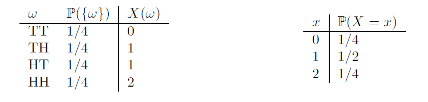
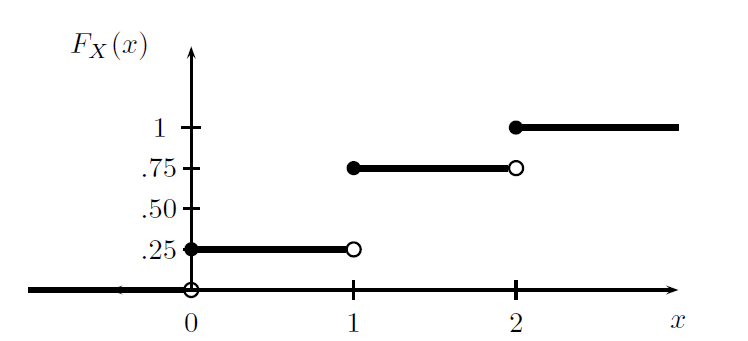
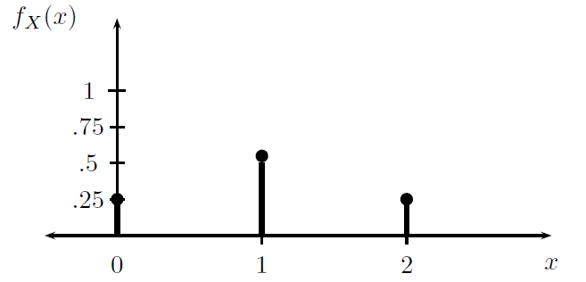
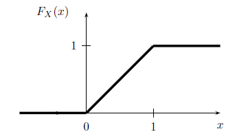

# Probability Basics

Our final aim is to be able to mimic real-world systems as close as possible. In most scenarios we will not know with certainty how things unfold. For instance, we will rarely know the times at which customers enter a shop or the time it will take an employee to complete a task. Let's think again at the donut shop example. The time it takes an employee to serve a costumer depends  on the time it takes the customer to specify the order, the number and types of donuts requested, the type of payment etc. To an external observer all these possible causes of variation of serving times appear to be random and due to chance: they cannot be predicted with certainty. 

For this reason we will in general assume a probabilistic model for the various components of a simulation. This chapter gives a review of possible models as well as their characteristics.

##  Set theory

<l class="definition">**Set Definition** </l>

A set is a [primitive notion](https://en.wikipedia.org/wiki/Primitive_notion). That is, it is a basic idea of human thought. A set is a collection of objects: numbers, images ... anything, football players, words, colors ... The basic set theory is simple and natural and is what we need for this course. Mathematical set theory is more complex and presents several paradoxes. The sets usually have a mother set such as:

* $\mathbb{N}=\{0,1,2,\ldots\}$
* $\mathbb{Z}=\{\ldots,-2,-1,0,1,2,\ldots\}$
* $\mathbb{Q}=\left\{\frac{p}{q}\quad\Big|\quad p,q\in \mathbb{Z} \mbox{ and } q \not= 0.\right\}$
* $\mathbb{R}=\{\mbox{All points in a line.}\}$
* Alphabet = $\{a,b,c,\ldots, A,B,C,\ldots\}.$
* Words = $\{peace, war, love, probability,\ldots\}.$

Each $\omega$ object of $\Omega$ is called **the element of the set** $\Omega$ and we say that $\omega$ belongs to $\Omega$.  We will denote it with $\omega\in \Omega$. A **set of one element**, for example, $\{1\}$ is called a **singleton**. 

Let $A$ be another set we will say that $A$ **is equal to** $B$ if all the $A$ elements are in $B$ and all the $B$ elements are in $A$. For example $A=\{1,2,3\}$ is equal to $B=\{3,1,2\}$. If $A$ is another set such that if $x\in A$ then $x\in B$ we will say that $A$ is a subset of or is contained in $B$. We will denote it by $A\subseteq B.$

The set that has no elements is called an empty set and is denoted by the symbol $\emptyset$. Given $A$ a set obviously $\emptyset\subseteq A.$

Let's take as a base set $\Omega=\{1,2,3\}$

$\Omega$ is a set of cardinal 3, it is denoted by $\#(\Omega)=3$  or by $|\Omega|=3$. The $\Omega$ set has $2^3=8$ subsets:

   + the empty $\emptyset$ and the elementaries $\{1\},\{3\},\{3\}$
   + the subsets of two elements: $\{1,2\},\{1,3\},\{2,3\}$
   + the total set of three elements $\Omega=\{1,2,3\}.$

### Sample Spaces

Probability is the mathematical language we use to quantify uncertainty.

* The *sample space* $\Omega$ is the set of possible outcomes of an experiment. 
* Points $\omega\in\Omega$ are called *outcomes*, *realizations*, or *elements*.
* Subsets of $\Omega$ are called *events*

**Example:** If we toss a coin twice then $\Omega =\{ HH, HT, TH, TT\}$. The event that the first toss is heads is $A=\{HH,HT\}$.

**Example:** Let $\omega$ be the outcome of a measurement of some physical quantity, for example, temperature. Then $\Omega=\mathbb{R}=(-\infty,\infty)$ (without considering that there is a lower bound, no harm in this). The event that the measurement is larger than 10 but less than or equal to 23 is $A=(10,23]$.

**Example:** If we toss a coin forever, then the sample space is the infinite set $\Omega = \{w=(w_1,w_2,w_3,\dots): w_i\in\{H,T\}\}$. Let $E$ be the event that the first head appears on the third toss. Then

\[
E=\{(w_1,w_2,w_3,\dots):w_1=T,w_2=T,w_3=H,w_i\in\{H,T\}\;\; for\;\; i>3\}.
\]


## Probability

We will assign a real number $\mathbb{P}(A)$ to every event $A$, called the *probability* of $A$. We also call $\mathbb{P}$ a *probability distribution* or a *probability measure*. To qualify as a probability $\mathbb{P}$ must satisfy three axioms.

**Definition:** A function $\mathbb{P}$ that assigns a real number $\mathbb{P}(A)$ to each event $A$ is a *probability distribution* if it satifies the following three axioms:

* $\mathbb{P}(A)\geq 0$ for every event $A$
* $\mathbb{P}(\Omega)=1$
* If $A_1,A_2,\dots$ are disjoint then $\mathbb{P}(\cup_{i=1}^\infty A_i)=\sum_{i=1}^\infty\mathbb{P}(A_i)$

One can derive many properties from the axioms, such as:

* $\mathbb{P}(\emptyset)=0$
* $A\subset B \Rightarrow \mathbb{P}(A) \leq \mathbb{P}(B)$
* $0\leq \mathbb{P}(A) \leq 1$
* $\mathbb{P}(A^c)= 1-\mathbb{P}(A)$
* $A\cap B = \emptyset \Rightarrow \mathbb{P}(A\cup B) = \mathbb{P}(A)+\mathbb{P}(B)$
* In general $\mathbb{P}(A\cup B) = \mathbb{P}(A)+\mathbb{P}(B)- \mathbb{P}(A\cap B)$

Consider the experiment of throwing two dice. The sample space is

\[
\Omega = \{(\omega_1,\omega_2): \omega_1=1,\dots,6, \omega_2=1,\dots,6\}
\]

where $\omega_1$ is the number of the first dice and $\omega_2$ is the number of the second dice. There are 36 elements in the sample space and if the dice are fair each have probability 1/36. Consider the event that the sum of the dice is seven. The event of interest is

\[
A=\{(\omega_1,\omega_2):\omega_1+\omega_2=7\}=\{(1,6),(2,5),(3,4),(4,3),(5,2),(6,1)\}
\]

and thus $\mathbb{P}(A)=6/36=1/6$.

Consider now the event of observing at least one six. The event of interest is now

\[
A=\{(\omega_1,\omega_2): \omega_1=6 \; and/or \; \omega_2=6\}
\]

We can write $A=A_1\cup A_2$ where $A_1\{(\omega_1,\omega_2): \omega_1=6 \}$ and $A_2\{(\omega_1,\omega_2): \omega_2=6 \}$. Notice that $A_1\cap A_2 =\{(6,6)\}$ and that $\mathbb{P}(A_1)=\mathbb{P}(A_2)=6/36$ whilst $\mathbb{P}(A_1\cap A_2)=1/36$. Thus

\[
\mathbb{P}(A)=\mathbb{P}(A_1\cup A_2)=\mathbb{P}(A_1)+\mathbb{P}(A_2)-\mathbb{P}(A_1\cap A_2)=6/36+ 6/36 -1/36 =11/36.
\]

### Independence

If we flip a fair coin twice, then the probability of two heads is $\frac{1}{2}\times \frac{1}{2}$. We multiply the probabilities because we regard the two tosses as independent.

**Definition:** Two events $A$ and $B$ are *independent* if 

\[
\mathbb{P}(A,B)=\mathbb{P}(A)\mathbb{P}(B)
\]

Independence can arise in two distinct ways. Sometimes, we explicitly assume that two events are independent (for example in the toss of two coins). In other instances we derive independence by veryfing that  $\mathbb{P}(A,B)=\mathbb{P}(A)\mathbb{P}(B)$ holds.

Suppose that $A$ and $B$ are disjoint events, each with positive probability. Can they be independent? No. This follows since $\mathbb{P}(A)\mathbb{P}(B)>0$ yet $\mathbb{P}(A,B)=\mathbb{P}(\emptyset)=0.$

Consider the toss of a fair dice. Let $A=\{2,4,6\}$ and $B=\{1,2,3,4\}$. Then $A\cap B = \{2,4\}$, $\mathbb{P}(A,B)=2/6$, $\mathbb{P}(A)\mathbb{P}(B)=(1/2)\times (2/3)$ and so $A$ and $B$ are independent.

Toss a fair coin 10 times. Let $A$ be the event at least one head. Let $T_j$ be the event that tails occurs on the jth toss. Then

\begin{align}
\mathbb{P}(A) & = 1 - \mathbb{P}(A^c)\\
& = 1- \mathbb{P}(all\; tails)\\
& = 1- \mathbb{P}(T_1,T_2,\dots,T_{10})\\
& = 1- \mathbb{P}(T_1)\times\cdots\times\mathbb{P}(T_{10})\\
& = 1- (1/2)^{10}\approx 0.999
\end{align}


### Conditional Probabilities

**Definition** The conditional probability of $A$ given that $B$ has occurred, assuming $\mathbb{P}(B)>0$, is 

\[
\mathbb{P}(A|B)=\frac{\mathbb{P}(A,B)}{\mathbb{P}(B)}
\]

**Example** A medical test for a disease $D$ has outcomes + and -. The probabilities are

\begin{align}
\mathbb{P}(D,+)&=0.009\\
\mathbb{P}(D,-)&=0.001 \\
\mathbb{P}(D^c,+)&=0.099\\
\mathbb{P}(D^c,-)&=0.891
\end{align}


From the definition of conditional probability

\[
\mathbb{P}(+|D)=\frac{\mathbb{P}(+,D)}{\mathbb{P}(D)}=\frac{0.009}{0.009+0.001}=0.9
\]

and
\[
\mathbb{P}(-|D^c)=\frac{\mathbb{P}(-,D^c)}{\mathbb{P}(D^c)}=\frac{0.891}{0.891+0.099}\approx 0.9
\]

The test is fairly accurate: sick people yield a positive 90 percent of the time and healthy people yield a negative about 90 percent of the times. Suppose you go for a test and get a positive. What is the probability you have the disease?

\[
\mathbb{P}(D|+)=\frac{\mathbb{P}(+,D)}{\mathbb{P}(+)}=\frac{0.009}{0.009+0.099}\approx 0.08
\]

### Conditional Probabilities and Independence

**Theorem** If $A$ and $B$ are independent events then $\mathbb{P}(A|B)=\mathbb{P}(A)$. Also for any pair of events $A$ and $B$
\[
\mathbb{P}(A,B)=\mathbb{P}(A|B)\mathbb{P}(B)=\mathbb{P}(B|A)\mathbb{P}(A)
\]

**Example** Draw two cards from a deck without replacement. Let $A$ be the event that the first draw is the ace of clubs and let $B$ be the event that the second draw is the queen of diamonds. Then $\mathbb{P}(A,B)=\mathbb{P}(B|A)\mathbb{P}(A)=(1/51)\times (1/52)$.


## Random Variables

Statistics is concerned with data. The concept of a random variable provides the link between sample spaces and events to data.

**Definition:** A *random variable* is a mapping
\[
X: \Omega \rightarrow \mathbb{R}
\]

that assigns a real number $X(\omega)$ to each outcome $\omega$. We will basically only work directly with random variables and although the sample space will be barely mentioned, you should keep in mind that it is there!

**Example:** Flip a coin ten times. Let $X$ be the random variable counting the number of heads. For example, if $\omega= HHTHHTHHTT$, then $X(\omega)=6$.

**Example:** Let $\Omega=\{(x,y): x^2+y^2 \leq 1\}$. Consider drawing a point at random from $\Omega$ (we will make this idea more precise later). A typical outcome is of the form $\omega=(x,y)$. Some examples of random variables are $X(\omega)=x$, $Y(\omega)=y$, $Z(\omega)=x+y$.

Given a random variable $X$ and a subset $A$ of the real line, let 

\begin{align}
\mathbb{P}(X\in A) &= \mathbb{P}(\{\omega\in\Omega: X(\omega)\in A\})\\
\mathbb{P}(X = x) &= \mathbb{P}(\{\omega\in\Omega: X(\omega)=x\})
\end{align}

Notice that $X$ denotes the random variable and $x$ denotes a particular value of $X$

**Example:** Flip a coin twice and let $X$ be the number of heads. Then, $\mathbb{P}(X=0)=\mathbb{P}(\{TT\})=1/4$, $\mathbb{P}(X=1)=\mathbb{P}(\{TH,HT\})=1/2$ and $\mathbb{P}(X=2)=\mathbb{P}(\{HH\})=1/4$. The random variable and its distribution can be summarized as follows:

<p align="center">
  
</p>

### Distribution Functions

**Definition** Given a random variable $X$, the *cumulative distribution function* or CDF is the function $F_X:\mathbb{R}\rightarrow [0,1]$ defined by

\[
F_X(x)=\mathbb{P}(X\leq x)
\]

**Example:** Flip a fair coin twice and let $X$ be the number of heads. Then $\mathbb{P}(X=0)=\mathbb{P}(X=2)=1/4$ and $\mathbb{P}(X=1)=1/2$. The distribution function is 

\[
F_X(x)=\left\{
\begin{array}{ll}
0, & x<0\\
1/4, & 0\leq x <1\\
3/4, & 1\leq x <2 \\
1, & x\geq 2
\end{array}
\right.
\]

<p align="center">
  
</p>

The following result shows that the CDF completely determines the distribution of a random variable

**Theorem** Let $X$ have CDF $F_X$ and let $Y$ have CDF $F_Y$. If $F_X(x)=F_Y(x)$ for all $x$, then $\mathbb{P}(X\in A)=\mathbb{P}(Y\in A)$ for all $A$.

Some properties of the CDF are:

* $F_X$ is non-decreasing: $x_1<x_2$ implies that $F_X(x_1)\leq F_X(x_2)$
* $F_X$ is normalized: $\lim_{x\rightarrow -\infty}F_X(x)=0$ and $\lim_{x\rightarrow +\infty}F_X(x)=1$
* $F_X$ is right-continuous
* It is defined for all $x\in\mathbb{R}$.

### Random variable types

There are two fundamental types of random variables, discrete and continuous. The following is a rough definition.

<l class="definition">Discrete and Continuous Random Variables </l>

* A random variable is **discreet** if it can only take a number of values with positive probability.
* Random **continuous** variables take values in intervals.

<div class="example">
**Example**

These are *discreet random* variables:
      
* number of damaged items in a shipment
* Number of customers arriving at a bank in an hour.
* Number of errors detected in a company's accounts.
* Number of health insurance policy claims.
      
These are *continuous random* variables:
      
* Annual income of a family.
* Amount of oil imported by a country.
* Variation in the price of a telecommunication company's shares.
* Percentage of impurities in a batch of chemicals.
      
</div>

### Discrete Random Variables

We will now describe the behavior of r.v. To do this we will use different functions that will give us some probabilities of the random variable. In the discrete case these functions are the probability function and the cumulative distribution function. In the discrete case the probability function is the one that gives us the probabilities of the elementary events of r.v.

**Definition:** $X$ is *discrete* if it takes countably many values $\{x_1,x_2,\dots\}$. We define the *probability function* or *probability mass function* for $X$ by $f_X(x)=\mathbb{P}(X=x)$.

Thus $f_X(x)\geq 0$ for all $x$ and $\sum_i f_X(x_i)=1$. The CDF of $X$ is related to $f_X$ by
\[
F_X(x)=\mathbb{P}(X\leq x)=\sum_{x_i\leq x}f_X(x_i)
\]

**Example:** The probability mass function for the example of the toss of two coins is 
\[
f_X(x)=\left\{
\begin{array}{ll}
1/4, & x=0\\
1/2, & x=1\\
1/4, & x=2 \\
0, & otherwise
\end{array}
\right.
\]

<p align="center">
  
</p>

Consider the throw of two dice and define the random variable $X$ as the absolute difference of the dice results. $X$ can thus take values ${0,1,2,3,4,5}$. By counting appropriately the possible cases the PMF can be derived as 

\[
f_X(x)=\left\{
\begin{array}{ll}
6/36 & x=0 \\
10/36 & x=1 \\
8/36 & x=2\\
6/36 & x=3 \\
4/36 & x=4\\
2/36 & x=5
\end{array}
\right.
\]

### Continuous Random Variables

**Definition** A random variable $X$ is *continuous* if there exists a function $f_X$ such that $f_X(x)\geq 0$ for all $x$, $\int_{-\infty}^{\infty}f_X(x)dx=1$ and for every $a\leq b$
\[
\mathbb{P}(a<X<b)=\int_a^bf_x(x)dx
\]
The function $f_X$ is called the *probability density function* (PDF). We have that 
\[
F_X(x)=\int_{-\infty}^xf_x(t)dt
\]
and $f_X(x)=F_X^{'}(x)$ at all points $x$ at which $F_X$ is differentiable.

**Example:** Suppose that $X$ has PDF
\[
f_X(x)=\left\{
\begin{array}{ll}
1, & for  \; 0\leq x\leq 1\\
0, & otherwise
\end{array}
\right.
\]

Clearly, $f_X(x)\geq 0$ and $\int_{-\infty}^{\infty}f_X(x)dx=1$. The CDF is given by
\[
F_X(x)=\left\{
\begin{array}{ll}
0, & x<0\\
x, & 0\leq x \leq 1\\
1, & x>1
\end{array}
\right.
\]

<p align="center">
  
</p>

Continuous random variables can lead to confusion. First, note that if $X$ is continuous then $\mathbb{P}(X=x)=0$ for every $x$. Do not try to think of $f_X(x)$ as $\mathbb{P}(X=x)$. This only holds for discrete random variables. We get probabilities from a PDF by integrating.

* $\mathbb{P}(X=x)=0$
* $\mathbb{P}(x< X \leq y)= F_X(y)-F_X(x)$
* $\mathbb{P}(X>x)=1-F_X(x)$
* If $X$ is continuous then
\[
F_X(b)-F_X(a)= \mathbb{P}(a<X<b)=\mathbb{P}(a\leq X<b)=\mathbb{P}(a<X\leq b)=\mathbb{P}(a\leq X \leq b)
\]

Let's make a simple example to understand that $\mathbb{P}(X=x)=0$

Suppose we have a uniform continuous random variable $X$ with a PDF:

\[
f_{X}(x)=\begin{cases}
\frac{1}{5},\ for\ 0 \leq x \leq 5\\
0,\ otherwise
\end{cases}
\]

The plot of the PDF will be:

```{r, fig.height = 4, fig.width = 6}
X = density(runif(9999999, 0, 5))
plot(X, col = "blue", main = "X PDF",xlab = "", xlim = c(-2,7))
```

And the CDF is given by:
\[
F_{X}(x)=\begin{cases}
0,\ x < 0 \\
\frac{x}{5},\ 0 \leq x \leq 5  \\
1, x > 5
\end{cases}
\]

Since we are working with a uniform distribution, we can assume that the area under the curve is equal to base per height. We already know that the area equals 1, and the base equals 5. This way we can calculate that: 

\[
AUC = base*height, \\
1 = 5*height, \\
height = 1/5 = 0.2
\]

With this information it will be very easy for us to calculate more specific probabilities. For example, let's calculate $\mathbb{P}(1 \leq x \leq 2)$:

\[
\mathbb{P}(1 \leq x \leq 2) = 1*1/5 = 0.2
\]

```{r, fig.height = 4, fig.width = 2, fig.align="center"}
plot(X, col = "blue", main = "X PDF",xlab = "",xlim=c(1,2))
```

Well, now let's look at more extreme scenarios. Let's calculate the following probabilities:

- $\mathbb{P}(4 \leq x \leq 4.333) = 1/3 * 1/5 = 0.0666$ 
- $\mathbb{P}(2.9 \leq x \leq 3.1) = 1/5 * 1/5 = 0.04$
- $\mathbb{P}(2.99 \leq x \leq 3.01) = 1/50 * 1/5 = 0.004$
- $\mathbb{P}(2.999 \leq x \leq 3.001) = 1/500 * 1/5 = 0.0004$
- $\mathbb{P}(x=3) = 1/\infty * 1/5 = 0$

### Expectation of a Random Variable

The *expected value* or *expectation* or *mean* of $X$ is defined to be 
\[
\mathbb{E}(X)=\sum_x xf_X(x)
\]
if $X$ is discrete and
\[
\int xf_X(x)dx
\]
if $X$ is continuous.

The expectation is a one-number summary of the distribution characterizing the average behavior of the random variable.

**Example:** Flip a fair coin two times. Let $X$ be the number of heads. Then $\mathbb{E}(X)=\sum_{x}xf_X(x)= 0\times f_X(0)+1\times f_X(1) + 2\times f_X(2)=0\times 1/4 + 1 \times 1/2 +2 \times 1/4 = 1$.

* For any two random variables $X$ and $Y$, $\mathbb{E}(X+Y)=\mathbb{E}(X)+\mathbb{E}(Y)$.
* For any random variable $X$ and constant $a$, $\mathbb{E}(aX)=a\mathbb{E}(X)$.
* For any constant $b$, $\mathbb{E}(b)=b$.
* So more generally $\mathbb{E}(aX+bY+c)=a\mathbb{E}(X)+b\mathbb{E}(Y)+c$.
* If $X$ and $Y$ are independent $\mathbb{E}(XY)=\mathbb{E}(X)\mathbb{E}(Y)$.

### Variance of Random Variables
The *variance* of a random variable $X$, denoted by $\mathbb{V}(X)$, measures the spread of a distribution and is defined by
\[
\mathbb{V}(X)=\mathbb{E}((X-\mathbb{E}(X))^2).
\]
If $X$ is discrete 
\[
\mathbb{V}(X)=\sum_x(x-\mathbb{E}(X))²f_X(x)
\]
and if $X$ is continuous
\[
\mathbb{V}(X)=\int(x-\mathbb{E}(X))f_X(x)dx
\]
The *standard deviation* is $sd(X)=\sqrt{\mathbb{V}(X)}$.

* $\mathbb{V}(X)=\mathbb{E}(X^2)-\mathbb{E}(X)^2$
* If $a$ and $b$ are constants then $\mathbb{V}(aX+b)=a^2\mathbb{V}(X)$
* If $X$ and $Y$ are independent $\mathbb{V}(X+Y)=\mathbb{V}(X)+\mathbb{V}(Y)$.

### Sample Mean and Sample Variance
If $X_1,\dots,X_n$ are random variables then we define the *sample mean* to be 
\[
\bar{X}_n=\frac{1}{n}\sum_{i=1}^n X_i
\]
and the *sample variance* to be 
\[
S_n^2=\frac{1}{n-1}\sum_{i=1}^n(X_i-\bar{X}_n)^2
\]

**Theorem** Let $X_1,\dots, X_n$ be independent and let $\mu=\mathbb{E}(X_i)$ and $\sigma^2=\mathbb{V}(X_i)$. Then
\[
\mathbb{E}(\bar{X}_n)=\mu, \qquad \mathbb{V}(\bar{X}_n)=\frac{\sigma^2}{n} \qquad \mathbb{E}(S_n^2)=\sigma^2
\]

### Covariance between Random Variables

If $X$ and $Y$ are random variables then the covariance and the correlation between $X$ and $Y$ measure the strength of their linear relationship.

The covaraince between $X$ and $Y$ is defined by
\[
Cov(X,Y)=\mathbb{E}\left((X-\mathbb{E}(X))(Y-\mathbb{E}(Y))\right)
\]
and the correlation by
\[
\rho(X,Y)=\frac{Cov(X,Y)}{sd(X)sd(Y)}
\]

* The covariance satisfies
\[
Cov(X,Y)=\mathbb{E}(XY)-\mathbb{E}(X)\mathbb{E}(Y)
\]
* The correlation satisfies 
\[
-1\leq \rho(X,Y)\leq 1
\]
* If $X$ and $Y$ are independent then $Cov(X,Y)=\rho(X,Y)=0$, but the converse is in general not true.
* If $Y=aX+b$, then $\rho(X,Y)=1$ if $a>0$ and $\rho(X,Y)=-1$ if $a<0$.
* It holds that 
\[
\mathbb{V}(X+Y)=\mathbb{V}(X)+\mathbb{V}(Y)+2Cov(X,Y)
\]
\[
\mathbb{V}(X-Y)=\mathbb{V}(X)+\mathbb{V}(Y)-2Cov(X,Y)
\]


## Discrete Random Variables

We start introducing discrete random variables. Here we will not enter in all the mathematical details and some concepts will be introduced only intuitively. However, some mathematical details will be given for some concepts.

In order to introduce discrete random variables, let's inspect each of the words:

 - *variable*: this means that there is some process that takes some value. It is a synonym of function as you have studied in other mathematics classes.
 
 - *random*: this means that the variable takes values according to some probability distribution.
 
 - *discrete*: this refers to the possible values that the variable can take. In this case it is a countable (possibly infinite) set of values.
 
In general we denote a random variable as $X$ and its possible values as $\mathbb{X}=\{x_1,x_2,x_3,\dots\}$. The set $\mathbb{X}$ is called the sample space of $X$. In real-life we do not know which value in the set $\mathbb{X}$ the random variable will take.

Let's consider some examples.

 - The number of donuts sold in a day in a shop is a discrete random variable which can take values $\{0,1,2,3,\dots\}$, that is the non-negative integers. In this case the number of possible values is infinite.

 - The outcome of a COVID-19 test can be either positive or negative but in advance we do not know which one. So this can be denoted as a discrete random variable taking values in $\{negative,positive\}$. It is customary to denote the elements of the sample space $\mathbb{X}$ as numbers. For instance, we could let $negative = 0$ and $positive = 1$ and the sample space would be $\mathbb{X}=\{0,1\}$.
 
 - The number shown on the face of a dice once thrown is a discrete random variable taking values in $\mathbb{X}=\{1,2,3,4,5,6\}$.
 
### Probability Mass Function

The outcome of a discrete random variable is in general unknown, but we want to associate to each outcome, that is to each element of $\mathbb{X}$, a number describing its likelihood. Such a number is called a probability and it is in general denoted as $P$.

The *probability mass function* (or pmf) of a random variable $X$ with sample space $\mathbb{X}$ is defined as
\[
p(x)=P(X=x), \hspace{1cm} \mbox{for all } x\in\mathbb{X}
\]
So for any outcome $x\in\mathbb{X}$ the pmf describes the likelihood of that outcome happening.

Recall that pmfs must obey two conditions:

 - $p(x)\geq 0$ for all $x\in\mathbb{X}$;
 
 - $\sum_{x\in\mathbb{X}}p(x)=1$.
 
So the pmf associated to each outcome is a non-negative number such that the sum of all these numbers is equal to one.

Let's consider an example at this stage. Suppose a biased dice is thrown such that the numbers 3 and 6 are twice as likely to appear than the other numbers. A pmf describing such a situation is the following:

| $x$     | 1    | 2 | 3 | 4 | 5 | 6 | 
|:--------:|:---:|:-:|:-:|:-:|:-:|:-:|
| $p(x)$  | 1/8  |1/8|2/8|1/8|1/8|2/8| 

It is apparent that all numbers $p(x)$ are non-negative and that their sum is equal to 1: so $p(x)$ is a pmf. Figure \@ref(fig:disc-pmf) gives a graphical visualization of such a pmf.

```{r disc-pmf, fig.cap = "PMF for the biased dice example", echo = FALSE, warning = FALSE, message = FALSE}
## Code for PMF
ggplot(data = data.frame(x = 1:6,
                         y = c(0.125,0.125,0.25,0.125,0.125,0.25),
                         yend = rep(0,6)),
       aes(x = x, y = y, xend = x, yend = yend)) +
  geom_point() +
  geom_segment() +
  scale_x_continuous(name="\nValue of X",
                     breaks=1:6,
                     limits = c(0.5, 6.5)) +
  scale_y_continuous(name="Probability\n",
                     limits = c(0.0,0.3)) +
  ggtitle("PMF for discrete random variable X\n") +
  annotate(geom = "text",
           x = c(1:6),
           y = c(0.15,0.15,0.275,0.15,0.15,0.275),
           label = c("P = 1/8",
                     "P = 1/8",
                     "P = 2/8",
                     "P = 1/8",
                     "P = 1/8",
                     "P = 2/8")) +
  theme_bw() +
  theme(plot.title = element_text(hjust = 0.5),
        text = element_text(size = 15))
```

### Cumulative Distribution Function

Whilst you should have been already familiar with the concept of pmf, the next concept may appear to be new. However, you have actually used it multiple times when computing Normal probabilities with the tables.

We now define what is usually called the *cumulative distribution function* (or cdf) of a random variable $X$. The cdf of $X$ at the point $x\in\mathbb{X}$ is
\[
F(x) = P(X \leq x) = \sum_{y \leq x} p(y)
\]
that is the probability that $X$ is less or equal to $x$ or equally the sum of the pmf of $X$ for all values less than $x$.

Let's consider the dice example to illustrate the idea of cdf and consider the following values $x$:

 - $x=0$: we compute $F(0) = P(X\leq 0 )= 0$ since $X$ cannot take any values less or equal than zero;
 
 - $x= 0.9$: we compute $F(0.9)= P(X\leq 0.9) = 0$ using the same reasoning as before;
 
 - $x = 1$: we compute $F(1)= P(X\leq 1) = P(X=1) = 1/8$ since $X$ can take the value 1 with probability 1/8;
 
 - $x = 1.5$: we compute $F(1.5) = P(X\leq 1.5) = P(X=1) = 1/8$ using the same reasoning as before;
 
 - $x = 3.2$: we compute $F(3.2)=P(X\leq 3.2)=P(X=1)+ P(X=2) + P(X=3)=1/8 + 1/8 + 2/8 = 0.5$ since $X$ can take the values 1, 2 and 3 which are less than 3.2;
 
We can compute in a similar way the cdf for any value $x$. A graphical visualization of the resulting CDF is given in Figure \@ref(fig:disc-cdf).

```{r disc-cdf, fig.cap = "CDF for the biased dice example", echo = FALSE, warning = FALSE, message = FALSE}
x <- c(seq(-2,1,length.out = 10),seq(1,2,length.out = 10),seq(2,3,length.out = 10),seq(3,4,length.out = 10),seq(4,5,length.out = 10), seq(5,6,length.out = 10),seq(6,9,length.out = 10))
y <- c(rep(0,10),rep(0.125,10), rep(0.25,10),rep(0.5,10),rep(0.625,10),rep(0.75,10),rep(1,10))
ggplot(data = data.frame(x = x,
                         y = y),
       aes(x = x, y = y)) +
 geom_line() +  scale_x_continuous(name="\nValue of X",breaks=1:6) +
  scale_y_continuous(name="P(X <= x)\n") +
  ggtitle("CDF for discrete random variable X\n") +
    theme_bw() +
  theme(plot.title = element_text(hjust = 0.5),
        text = element_text(size = 15))
```

The plot highlights some properties of CDFs which can proved hold in general for any discrete CDF:

 - it is a step function which is also non-decreasing;
 
 - on the left-hand-side it takes the value 0;
 
 - on the right-hand-side it takes the value 1.
 

### Summaries

The pmf and the cdf fully characterize a discrete random variable $X$. Often however we want to compress that information into a single number which still retains some aspect of the distribution of $X$. 

The *expectation* or *mean* of a random variable $X$ denoted as $E(X)$ is defined as
\[
E(X)=\sum_{x\in\mathbb{X}}xp(x)
\]
The expectation can be interpreted as the mean value of a large number of observations from the random variable $X$. Consider again the example of the biased dice. The expectation is
\[
E(X)=1\cdot1/8 + 2\cdot1/8 + 3\cdot 2/8 + 4\cdot 1/8 + 5\cdot 1/8 + 6\cdot 2/8 = 3.75
\]
So if we were to throw the dice a large number of time, we would expect the average of the number shown to be 3.75.

The *median* of the random variable $X$ denoted as $m(X)$ is defined as the value $x$ such that $P(X\leq x)$ is larger or equal to 0.5 and $P(X\geq x)$ is larger or equal to 0.5. It is defined as the middle value of the distribution. For the dice example the median is the value 3: indeed $P(X\leq 3 ) = P(X=1)+P(X=2)+P(X=3)=0.5 \geq 0.5$ and $P(X\geq 3) = P(X=3) + P(X=4) + P(X=5) + P(X=6) = 0.75 \geq 0.5$.

The *mode* of the random variable $X$ is the value $x$ such that $p(x)$ is largest: it is the value of the random variable which is expected to happen most frequently. Notice that the mode may not be unique: in that case we say that the distribution of $X$ is bimodal. The example of the biased dice as an instance of a bimodal distribution: the values 3 and 6 are the equally likely and they have the largest pmf.


The above three summaries are measures of *centrality*: they describe the central tendency of $X$. Next we consider measures of *variability*: such measures will quantify the spread or the variation of the possible values of $X$ around the mean.

The *variance* of the discrete random variable $X$ is the expectation of the squared difference between the random variable and its mean. Formally it is defined as
\[
V(X)=E((X-E(X))^2)=\sum_{x\in\mathbb{X}}(x-E(X))^2p(x)
\]
In general we will not compute variance by hand. The following R code computes the variance of the random variable associated to the biased dice.
```{r}
x <- 1:6  # outcomes of X
px <- c(1/8,1/8,2/8,1/8,1/8,2/8)  # pmf of X
Ex <- sum(x*px)  # Expectation of X
Vx <- sum((x-Ex)^2*px)  # Variance of X
Vx
```

The *standard deviation* of the discrete random variable $X$ is the square root of $V(X)$.

## Notable Discrete Variables

In the previous section we gave a generic definition of discrete random variables and discussed the conditions that a pmf must obey. We considered the example of a biased dice and constructed a pmf for that specific example. 

There are situations that often happen in practice: for instance the case of experiments with binary outcomes. For such cases random variables with specific pmfs are given a name and their properties are well known and studied. 

In this section we will consider three such distributions: Bernoulli, Binomial and Poisson.


### Bernoulli Distribution

Consider an experiment or a real-world system where there can only be two outcomes:

 - a toss of a coin: heads or tails;
 
 - the result of a COVID test: positive or negative;
 
 - the status of a machine: broken or working;

By default one outcome happens with some probability, that we denote as $p\in [0,1]$ and the other with probability $1-p$.

Such a situation is in general modeled using the so-called *Bernoulli distribution* with parameter $p$. One outcome is associated to the number 1 (usually referred to as sucess) and the other is associated to the number 0 (usually referred to as failure). So $P(X=1)=p(1)=p$ and $P(X=0)=p(0)=1-p$.

The above pmf can be more coincisely written as
\[
p(x)=\left\{
\begin{array}{ll}
p^x(1-p)^{1-x}, & x=0,1\\
0, & \mbox{otherwise}
\end{array}
\right.
\]
The mean and variance of the Bernoulli distribution can be easily computed as
\[
E(X)=0\cdot(1-p)+ 1\cdotp=p,
\]
and 
\[
V(X)=(0-p)^2(1-p)+(1-p)^2p=p^2(1-p)+(1-p)^2p=\cdots = p(1-p)
\]

Figure \@ref(fig:bernoulli) reports the pmf and the cdf of a Bernoulli random variable with parameter 0.3.

```{r bernoulli, fig.cap = "PMF (left) and CDF (right) of a Bernoulli random variable with parameter 0.3", echo = FALSE, warning = F, message = F} 
library(gridExtra)
p1 <- ggplot(data = data.frame(x = 0:1,
                         y = dbinom(0:1,1,0.3),
                         yend = rep(0,2)),
       aes(x = x, y = y, xend = x, yend = yend)) +
  geom_point() +
  geom_segment() +
  scale_x_continuous(name="\nValue of X",
                     breaks=0:1,
                     limits = c(-0.5, 1.5)) +
  scale_y_continuous(name="Probability\n",
                     limits = c(0.0,1)) +
   theme_bw() +
  theme(plot.title = element_text(hjust = 0.5),
        text = element_text(size = 15))
p2 <- ggplot(data = data.frame(x = c(-2,-1,0,0,1,1,2,3), y = c(0,0,0,0.3,0.3,1,1,1)), aes (x = x, y= y)) + geom_line() + scale_x_continuous(name="\nValue of X") + scale_y_continuous(name="CDF\n") +
   theme_bw() +
  theme(plot.title = element_text(hjust = 0.5),
        text = element_text(size = 15))
grid.arrange(p1,p2,ncol=2)
```

R doesn't provides a specific method for the Bernoulli distribution, but as we will see in the next section, this is a specific case of the binomial experiment, so we will use the binomial method for working with the Bernoulli distribution in R. We will explain this function below, for now let's see a couple examples of the Bernoulli $Ber(p=0.25)$ distribution in R

```{r}
dbinom(0,size=1,prob=0.25) # probability of failure
dbinom(1,size=1,prob=0.25) # probability of success
rbinom(n=20,size = 1,prob=0.25) # generating 20 random numbers from a Bernoulli distribution with p = 0.25
```


### Binomial Distribution

The Bernoulli random variable is actually a very special case of the so-called *Binomial* random variable. Consider experiments of the type discussed for Bernoullis: coin tosses, COVID tests etc. Now suppose that instead of having just one trial, each of these experiments are repeated multiple times. Consider the following assumptions:

 - each experiment is repeated $n$ times;
 
 - each time there is a probability of success $p$;
 
 - the outcome of each experiment is independent of the others.
 
Let's think of tossing a coin $n$ times. Then we would expect that the probability of showing heads is the same for all tosses and that the result of previous tosses does not affect others. So this situation appears to meet the above assumptions and can be modeled by what we call a Binomial random variable.

Formally, the random variable $X$ is a Binomial random variable with parameters $n$ and $p$ if it denotes the number of successes of $n$ independent Bernoulli random variables, all with parameter $p$.

The pmf of a Binomial random variable with parameters $n$ and $p$ can be written as:
\[
p(x)=\left\{
\begin{array}{ll}
\binom{n}{x}p^{x}(1-p)^{n-x}, & x = 0,1,\dots,n\\
0, & \mbox{otherwise}
\end{array}
\right.
\]
Let's try and understand the formula by looking term by term. 

 - if $X=x$ there are $x$ successes and each success has probability $p$ - so $p^x$ counts the overall probability of successes
 
 - if $X=x$ there are $n-x$ failures and each failure has probability $1-p$ - so $(1-p)^{n-x}$ counts the overall probability of failures
 
 - failures and successes can appear according to many orders. To see this, suppose that $x=1$: there is only one success out of $n$ trials. This could have been the first attempt, the second attempt or the $n$-th attempt. The term $\binom{n}{x}$ counts all possible ways the outcome $x$ could have happened.
 
The Bernoulli distribution can be seen as a special case of the Binomial where the parameter $n$ is fixed to 1.

We will not show why this is the case but the expectation and the variance of the Binomial random variable with parameters $n$ and $p$ can be derived as
\[
E(X)=np, \hspace{2cm} V(X)=np(1-p)
\]
The formulae for the Bernoulli can be retrieved by setting $n=1$.


Figure \@ref(fig:binom) shows the pmf of two Binomial distributions both with parameter $n=10$ and with $p=0.3$ (left) and $p=0.8$. For the case $p=0.3$ we can see that it is more likely that there are a small number of successes, whilst for $p=0.8$ a large number of successes is more likely.

```{r binom, fig.cap = "PMF of a Binomial random variable with parameters n = 10 and theta =  0.3 (left) and theta = 0.8 (right)", echo = FALSE, warning = F, message = F} 
library(gridExtra)
p1 <- ggplot(data = data.frame(x = 0:10,
                         y = dbinom(0:10,10,0.3),
                         yend = rep(0,11)),
       aes(x = x, y = y, xend = x, yend = yend)) +
  geom_point() +
  geom_segment() +
  scale_x_continuous(name="\nValue of X",
                     breaks=0:10,
                     limits = c(-0.5, 10.5)) +
  scale_y_continuous(name="Probability\n",
                     limits = c(0.0,1)) +
   theme_bw() +
  theme(plot.title = element_text(hjust = 0.5),
        text = element_text(size = 15))
p2 <- ggplot(data = data.frame(x = 0:10,
                         y = dbinom(0:10,10,0.8),
                         yend = rep(0,11)),
       aes(x = x, y = y, xend = x, yend = yend)) +
  geom_point() +
  geom_segment() +
  scale_x_continuous(name="\nValue of X",
                     breaks=0:10,
                     limits = c(-0.5, 10.5)) +
  scale_y_continuous(name="Probability\n",
                     limits = c(0.0,1)) +
   theme_bw() +
  theme(plot.title = element_text(hjust = 0.5),
        text = element_text(size = 15))
grid.arrange(p1,p2,ncol=2)
```

R provides a straightforward implementation of the Binomial distribution through the functions `dbinom` for the pmf and `pbinom` for the cdf. They require three arguments:

 - first argument is the value at which to compute the pmf or the cdf;
 
 - `size` is the parameter $n$ of the Binomial;
 
 - `prob` is the parameter $p$ of the Binomial.
 
So for instance
```{r}
dbinom(3, size = 10, prob = 0.5)
```
returns $P(X=3)=p(3)$ for a Binomial random variable with parameter $n=10$ and $p = 0.5$.

Similarly,
```{r}
pbinom(8, size = 20, prob = 0.2)
```
returns $P(X\leq 8) = F(8)$ for a Binomial random variable with parameter $n=20$ and $p = 0.2$.

R also provides a method for generating pseudo-random numbers using a binomial distribution through the function `rbinom`. This function will require three arguments: 

- `n` is the parameter for specifying the number of pseudo-random numbers we want to generate;
- `size` is the parameter $n$ of the Binomial;
- `prob` is the parameter $p$ of the Binomial.

<div class="example"> 
**Example**
The below example would be equivalent to repeating 100 times the experiment of tossing a coin 20 times and counting the number of heads.
</div>

```{r}
rbinom(100,size = 20,prob=0.5)
```


### Geometric distribution

We've all played a coin toss until we get the first head, or even throwing a ball into a basketball hoop until we get the first one in. From another point of view we can also try to model the number of times we flip a switch and the bulb lights up until it fails, or the number of times an ATM gives us money until it fails.

The **modelling of this kind of problems is achieved with the so called Geometric Distribution**.

<l class="definition"> Geometric distribution </l>

- Let's repeat a Bernoulli experiment, of $p$ parameter, independently until we get the first success.
- Let $X$ be the random variable that counts the number of failures before the first success. For example, if we have had $x$ failures, it will be a sequence of $x$ failures culminated with a success. More specifically 

\[
P(\overbrace{FFF\ldots F}^{x}S)=P(F)^{x}\cdot P(S)=(1-p)^{x}\cdot p=q^{x}\cdot p.
\]

Its probability function is 

\[
P_X(x)=P(X=x)=\left\{\begin{array}{ll}
(1-p)^{x}\cdot p & \mbox{ if } x=0,1,2,\ldots\\
0 &\mbox{ otherwise}
\end{array}\right..
\]

The random variable defined above is said to follow a geometric distribution of $p$ parameter. We will denote it by $Ge(p)$. Its domain is $D_X=\{0,1,2,\ldots\}$.

Now imagine that we want to calculate P($X\leq 3$). By the property of the probability of the complementary event we have that

\[
P(X\leq 3 )=1-P(X> 3)=1-P(X\geq 4)
\]

In fact, the $X\leq 3$ complementary tells us that we have failed more than three times until we get the first success, that is, **we have failed 4 or more times**. We can symbolize this event in the following way:

\[
\{X>3\}=\{X\geq 4\}= \{FFFF\}
\]

Now, since the attempts are independent, we have that:


\begin{align}
P(X>3) & = & P(\{FFFF\})= P(F)\cdot P(F)\cdot P(F)\cdot P(F)\\
&=& (1-p)\cdot (1-p)\cdot (1-p)\cdot (1-p)= (1-p)^{3+1}\\
&=&(1-p)^{4}
\end{align}


The value of the distribution function of $X$ in $x=3$ will be:

\[
F_X(3)=P(X\leq 3)=1-P(X>3)=1-(1-p)^{3+1}.
\]

Generalizing the result before any positive integer  $k=0,1,2,\ldots$, we have that:

\[
F_X(k)=P(X\leq k)=1-(1-p)^{k+1},\mbox{ if } k=0,1,2,\ldots
\]

In general, we'll have that: 
\[
F_X(x)=P(X\leq x)=
\left\{\begin{array}{ll} 
0, & \mbox{ if } x<0,\\
1- (1-p),  & \mbox{ if } k=0\leq x <1,\\
1- (1-p)^2, & \mbox{ if } k=1\leq x <2,\\
1- (1-p)^3, & \mbox{ if } k=2\leq x <3,\\
1- (1-p)^{k+1}, & \mbox{ si } \left\{ \begin{array}{l}k\leq x< k+1,\\\mbox{for } k=0,1,2,\ldots\end{array}
    \right.\end{array}\right.
\]

More compactly, we'll have that:
\[
F_X(x)=P(X\leq x)=
\left\{\begin{array}{ll} 
0, & \mbox{ if } x<0,\\
1- (1-p)^{k+1}, & \mbox{ if } \left\{ \begin{array}{l}k\leq x< k+1,\\\mbox{for } k=0,1,2,\ldots\end{array}
    \right.\end{array}
    \right.
\]

Notice that the limit of the distribution function is:
\[
\displaystyle\lim_{k\to +\infty } F_X(k)=\lim_{k\to +\infty } 1-(1-p)^{k+1}=
1,
\]

We will not show here the calculation of the expectation and variance of a geometric random variable. They can be derived as:

\[
E(X)= \frac{1-p}{p}, \\
Var(X) =  \frac{1-p}{p^2}
\]


And its standard desviation is:

\[
\sqrt{Var(X)}=\sqrt{\frac{1-p}{p^2}}
\]

Another interpretation of the geometric random variable is using the number of attempts rather than the number of failures. Let's say we're only interested in the **number of attempts** to get the first success. If we define $Y$= number of attempts to get the first success Then $Y=X+1$ where $X\equiv Ge(p)$. Its domain is $D_Y=\{1,2,\ldots\}$. The average increases in one attempt due to success $E(Y)=E(X+1)=E(X)+1=\frac{1-p}{p}+1=\frac1{p}$. The variance is the same $Var(Y)=Var(X+1)=Var(X)=\frac{1-p}{p^2}$.

$Ge(p)$ starting in 0 is the experiment to calculate the probability of having a specific number of attempts to obtain the first success

R provides a method for performing calculations with a geometric random variable. The `dgeom` and `pgeom` functions will have the next arguments:

- `x` will take the value of the geometric random variable we want to evaluate
- `prob` is the probability of success in each of the attempts

Let's see some examples for the geometric distribution $Ge(p=0.25)$.

$P(X=0)=(1-0.25)^0\cdot 0.25^1=0.25$

```{r}
dgeom(x = 0, prob=0.25)
```

$P(X\leq 0)=1- (1-0.25)^{0+1}=1-0.75=0.25$

```{r}
pgeom(0,prob=0.25)
```

$P(X\leq 4)=1-(1-0.25)^{4+1}=1-0.75^5 = 0.76$

```{r}
pgeom(4,prob=0.25)
```

R also provides a method for generating pseudo-random numbers using a geometric distribution. The parameters of this function are:

- `n` is the amount of pseudo-random numebers we want to generate
- `prob` is the probability of success in each of the attempts

A random sample of size 25 of a $Ge(0.25)$ can be generated as:

```{r}
rgeom(n=25,prob=0.25)
```

Figure \@ref(fig:geom) shows the PMF and CDF of a Geometric distribution with parameter $n=30$ and with $p=0.25$.

```{r geom, fig.cap = "PMF and CDF of a Geometric random variable with parameters n = 30 and p =  0.25", echo = FALSE, warning = F, message = F} 

  par(mfrow=c(1,2))
  p=0.25
  n=30
  aux=rep(0,(n+1)*2)
  aux[seq(2,(n+1)*2,2)]=dgeom(c(0:n),prob=p)
  plot(x=c(0:n),y=dgeom(c(0:n),prob=p),
       ylim=c(0,1),xlim=c(-1,n+1),xlab="x",
       main=paste0(c("Probability Function\n Ge(p=",p,")"),collapse = ""))
  lines(x=rep(0:n,each=2),y=aux, type = "h", lty = 2,col="blue")
  curve(pgeom(x,prob=p),
        xlim=c(-1,n+1),col="blue",
        main=paste0(c("Distribution Function\n Ge(p=",p,")"),collapse = ""))
  par(mfrow=c(1,1))
```


### Poisson Distribution

The last class of discrete random variables we discuss is the so-called *Poisson* distribution. Whilst for Bernoulli and Binomial we had an interpretation of why the pmf took its specific form by associating it to independent binary experiments each with an equal probability of success, for the Poisson there is no such an interpretation.

A discrete random variable $X$ has a Poisson distribution with parameter $\lambda$ if its pmf is
\[
p(x)=\left\{
\begin{array}{ll}
\frac{e^{-\lambda}\lambda^x}{x!}, & x = 0,1,2,3,\dots\\
0, & \mbox{otherwise}
\end{array}
\right.
\]
where $\lambda > 0$.

So the sample space of a Poisson random variable is the set of all non-negative integers.

One important characteristic of the Poisson distribution is that its mean and variance are equal to the parameter $\lambda$, that is
\[
E(X)= V(X) = \lambda.
\]

Figure \@ref(fig:poisson) gives an illustration of the form of the pmf of the Poisson distribution for two parameter choices: $\lambda=1$ (left) and $\lambda = 4$ (right). The x-axis is shown until $x=10$ but recall that the Poisson is defined over all non-negative integers. For the case $\lambda=1$ we can see that the outcomes 0 and 1 have the largest probability - recall that $E(X)=0$. For the case $\lambda = 4$ the outcomes $x = 2,3,4,5$ have the largest probability. 


```{r poisson, fig.cap = "PMF of a Poisson random variable with parameter 1 (left) and 4 (right)", echo = FALSE, warning = F, message = F} 
library(gridExtra)
p1 <- ggplot(data = data.frame(x = 0:10,
                         y = dpois(0:10,1),
                         yend = rep(0,11)),
       aes(x = x, y = y, xend = x, yend = yend)) +
  geom_point() +
  geom_segment() +
  scale_x_continuous(name="\nValue of X",
                     breaks=0:10,
                     limits = c(-0.5, 10.5)) +
  scale_y_continuous(name="Probability\n",
                     limits = c(0.0,1)) +
   theme_bw() +
  theme(plot.title = element_text(hjust = 0.5),
        text = element_text(size = 15))
p2 <- ggplot(data = data.frame(x = 0:10,
                         y = dpois(0:10,4),
                         yend = rep(0,11)),
       aes(x = x, y = y, xend = x, yend = yend)) +
  geom_point() +
  geom_segment() +
  scale_x_continuous(name="\nValue of X",
                     breaks=0:10,
                     limits = c(-0.5, 10.5)) +
  scale_y_continuous(name="Probability\n",
                     limits = c(0.0,1)) +
   theme_bw() +
  theme(plot.title = element_text(hjust = 0.5),
        text = element_text(size = 15))
grid.arrange(p1,p2,ncol=2)
```

The interesting thing about Poisson variables is that we can modify (if the model allows it) the time interval $(0,t]$ in which we count the events. Of course, this doesn't necessarily have to be possible. But in general if the variable is poisson in $(0,t]$ it will be also in any sub-interval $(0,t']$ for all $t'$ such that $0<t'<t$. So we will be able to define a series of variables $X_t$ of distribution $Po(t)$.

<l class="prop"> Poisson process definition </l> Let's consider a *Poisson* experiment with $\lambda$ equal to the average number of events in a unit of time. If $t$ is an amount of time in time units, the random variable $X_{t}$ = number of events in the interval $(0,t]$ is a $Po(\lambda\cdot t)$. The set of variables $\{X_t\}_{t>0}$ is called a **Poisson process**.

R provides a straightforward implementation of the Poisson distribution through the functions `dpois` for the pmf and `ppois` for the cdf. They require three arguments:

 - first argument is the value at which to compute the pmf or the cdf;
 
 - `lambda` is the parameter $\lambda$ of the Poisson;
 
So for instance
```{r}
dpois(3, lambda = 1)
```
returns $P(X=3)=p(3)$ for a  Poisson random variable with parameter $\lambda = 1$.

Similarly,
```{r}
ppois(8, lambda = 4)
```
returns $P(X\leq 8) = F(8)$ for a Poisson random variable with parameter  $\lambda = 4$.

We can also generate pseudo-random numbers from a poisson distribution using the `rpois` method. This method has two arguments in r:

- `n` amount of pseudo-random numbers
- `lambda` is the expectation for a specific time interval

This way,
```{r}
rpois(n=100,lambda = 3)
```

Returns a sequence of 100 observations for a Poisson distribution of \lambda = 3.

### Some Examples

We next consider two examples to see in practice the use of the Binomial and Poisson distributions.

#### Probability of Marriage

A recent survey indicated that 82\% of single women aged 25 years old will be married in their lifetime. Compute

 - the probability of at most 3 women will be married in a sample of 20;
 
 - the probability of at least 90 women will be married in sample of 100;
 
 - the probability of two or three women in a sample of 20 will never be married.
 
 The above situation can be modeled by a Binomial random variable where the parameter $n$ depends on the question and $p = 0.82$. 
 
 The first question requires us to compute $P(X\leq 3)= F(3)$ where $X$ is Binomial with parameters $n=20$ and $p =0.82$. Using R
```{r}
pbinom(3, size = 10, prob = 0.82)
```

The second question requires us to compute $P(X\geq 90)$ where $X$ is a Binomial random variable with parameters $n=100$ and $p = 0.82$. Notice that 
\[
P(X\geq 90) = 1 - P(X< 90) = 1 - P(X\leq 89) = 1 - F(89).
\]
Using R
```{r}
1 - pbinom(89, size = 100,  prob = 0.82)
```

For the third question, notice that saying two women out of 20 will never be married is equal to 18 out of 20 will be married. Therefore we need to compute $P(X=17) + P(X=18)= p(17) + p(18)$ where $X$ is a Binomial random variable with parameters $n=20$ and $p = 0.82$. Using R
```{r}
sum(dbinom(17:18, size = 20, prob = 0.82))
```

#### The Bad Stuntman

A stuntman injures himself an average of three times a year. Use the Poisson probability formula to calculate the probability that he will be injured:

 - 4 times a year

 -  Less than twice this year.

 - More than three times this year.
 
The above situation can be modeled as a Poisson distribution $X$ with parameter $\lambda = 3$. 

The first question requires us to compute $P(X=4)$ which using R can be computed as
```{r}
dpois(4, lambda =3)
```

The second question requires us to compute $P(X<2) = P(X=0)+P(X=1)= F(1)$ which using R can be computed as
```{r}
ppois(1,lambda=3)
```

The third question requires us to compute $P(X>3) = 1 - P(X\leq 2) = 1 - F(2)$ which using R can be computed as
```{r}
1 - ppois(2, lambda = 3)
```


## Continuous Random Variables

Our attention now turns to continuous random variables. These are in general more technical and less intuitive than discrete ones. You should not worry about all the technical details, since these are in general not important, and focus on the interpretation. 

A continuous random variable $X$ is a random variable whose sample space $\mathbb{X}$ is an interval or a collection of intervals. In general $\mathbb{X}$ may coincide with the set of real numbers $\mathbb{R}$ or some subset of it. Examples of continuous random variables:

 - the pressure of a tire of a car: it can be any positive real number;

 - the current temperature  in the city of Madrid: it can be any real number;
 
 - the height of the students of Simulation and Modeling to understand change: it can be any real number.

Whilst for discrete random variables we considered summations over the elements of $\mathbb{X}$, i.e. $\sum_{x\in\mathbb{X}}$, for continuous random variables we need to consider integrals over appropriate intervals.

You should be more or less familiar with these from previous studies of calculus. But let's give an example. Consider the function $f(x)=x^2$ computing the squared of a number $x$. Suppose we are interested in this function between the values -1 and 1, which is plotted by the red line in Figure \@ref(fig:x-sq). Consider the so-called integral $\int_{-1}^{1}x^2dx$: this coincides with the area delimited by the function and the x-axis. In Figure \@ref(fig:x-sq) the blue area is therefore equal to $\int_{-1}^{1}x^2dx$.

```{r x-sq, fig.cap = "Plot of the squared function and the area under its curve", out.width = "50%", fig.align = "center", echo = F}
ggplot(data = data.frame(x = seq(-1,1,0.01), y = seq(-1,1,0.01)^2), aes(x,y)) + geom_line(lwd = 1.3, col= "red") + geom_area(alpha=0.6, fill = "lightskyblue2") +  theme_bw() 

```

We will not be interested in computing integrals ourselves, so if you do not know/remember how to do it, there is no problem!

### Probability Density Function

Discrete random variable are easy to work with in the sense that there exists a function, that we called probability mass function, such that $p(x)=P(X=x)$, that is the value of that function in the point $x$ is exactly the probability that $X=x$.

Therefore we may wonder if this is true for a continuous random variable too. Sadly, the answer is no and probabilities for continuous random variables are defined in a slightly more involved way.

Let $X$ be a continuous random variable with sample space $\mathbb{X}$. The probability that $X$ takes values in the interval $[a,b]$ is given by
\[
P(a\leq X \leq b) = \int_{a}^bf(x)dx
\]
where $f(x)$ is called the *probability density function* (pdf in short). Pdfs, just like pmfs must obey two conditions:

 - $f(x)\geq 0$ for all $x\in\mathbb{X}$;
 
 - $\int_{x\in\mathbb{X}}f(x)dx=1$.

So in the discrete case the pmf is defined exactly as the probability. In the continuous case the pdf is the function such that its integral is the probability that random variable takes values in a specific interval.

As a consequence of this definition notice that for any specific value $x_0\in\mathbb{X}$, $P(X=x_0)=0$ since 
\[
\int_{x_0}^{x_0}f(x)dx = 0.
\]

Let's consider an example. The waiting time of customers of a donuts shop is believed to be random and to follow a random variable whose pdf is 
\[
f(x) = \left\{
\begin{array}{ll}
\frac{1}{4}e^{-x/4}, & x\geq 0\\
0, & \mbox{otherwise}
\end{array}
\right.
\]

The pdf is drawn in Figure \@ref(fig:exp) by the red line. One can see that $f(x)\geq 0$ for all $x\geq 0$ and one could also compute that it integrates to one. 

Therefore the probability that the waiting time is between any two values $(a,b)$ can be computed as
\[
\int_a^b\frac{1}{4}e^{-x/4}dx.
\]
In particular if we were interested in the probability that the waiting time is between two and five minutes, corresponding to the shaded area in Figure \@ref(fig:exp), we could compute it as
\[
P(2<X<5)=\int_2^5f(x)dx=\int_{2}^5\frac{1}{4}e^{-x/4}dx= 0.32
\]

```{r exp, fig.cap = "Probability density function for the waiting time in the donut shop example", out.width = "50%", fig.align = "center", echo = F, warning = F}
data <- data.frame(x=seq(0.01,15,0.05),y=dexp(seq(0.01,15,0.05),1/4))
ggplot(data = data, mapping = aes(x = x, y = y)) +
     geom_line(lwd=1.3,col="red")+
     geom_area(mapping = aes(x = ifelse(x>=2 & x<= 5 , x, 0)), fill = "lightskyblue2", alpha =0.6) +     xlim(0.01, 15) + theme_bw() + ylab("f(x)")
```

Notice that since $P(X=x_0)=0$ for any $x_0\in\mathbb{X}$, we also have that 
\[
P(a\leq X \leq b)=P(a < X \leq b) = P(a\leq X < b) = P(a<X<b).
\]

### Cumulative Distribution Function

For a continuous random variable $X$ the cumulative distribution function (cdf) is equally defined as 
\[
F(x) = P(X \leq x),
\]
where now
\[
P(X \leq x) = P(X < x) = \int_{-\infty}^xf(t)dt.
\]
so the summation is substituted by an integral.

Let's consider again the donut shop example as an illustration. The cdf is defined as
\[
F(x)=\int_{-\infty}^xf(t)dt = \int_{-\infty}^x\frac{1}{4}e^{-x/4}.
\]
This integral can be solved and $F(x)$ can be calculated as
\[
F(x)= 1- e^{-x/4},
\]
which is plotted in Figure \@ref(fig:expcdf).

```{r expcdf, fig.cap = "Cumulative distribution function for the waiting time at the donut shop", fig.align="center", echo = F, warning = F, out.width="50%"}
x <- seq(-2,20,0.5)
y <- pexp(x,1/4)
data <- data.frame(x=x,y=y)
ggplot(data,aes(x,y)) + geom_line(lwd=1.3,col="red") + theme_bw() + ylab("F(x)")
```

We can notice that the cdf has similar properties as in the discrete case: it is non-decreasing, on the left-hand side is zero and on the right-hand side tends to zero.

In the continuous case, one can prove that cdfs and pdfs are related as
\[
f(x)=\frac{d}{dx}F(x).
\]

### Summaries

Just as for discrete random variables, we may want to summarize some features of a continuous random variable into a unique number. The same set of summaries exists for continuous random variables, which are almost exactly defined as in the discrete case (integrals are used instead of summations).

 - *mean*: the mean of a continuous random variable $X$ is defined as
 \[
 E(X) = \int_{-\infty}^{+\infty}xf(x)dx
 \]
 
 - *median*: the median of a continuous random variable $X$ is defined as the value $x$ such that $P(X\leq x) = 0.5$ or equally $F(x)=0.5$.
 
 - *mode*: the mode of a continuous random variable $X$ is defined the value $x$ such that $f(x)$ is largest.
 
 - *variance*: the variance of a continuous random variable $X$ is defined as
 \[
 V(X)=\int_{-\infty}^{+\infty}(x-E(X))^2f(x)dx
 \]

 - *standard deviation*: the standard deviation of a continuous random variable $X$ is defined as $\sqrt{V(X)}$.
 
## Notable Continuous Distribution

As in the discrete case, there are some types of continuous random variables that are used frequently and therefore are given a name and their proprieties are well-studied.

### Uniform Distribution

The first, and simplest, continuous random variable we study is the so-called (continuous) *uniform* distribution. We say that a random variable $X$ is uniformly distributed on the interval $[a,b]$ if its pdf is 
\[
f(x)=\left\{ 
\begin{array}{ll}
\frac{1}{b-a}, & a\leq x \leq b\\
0, & \mbox{otherwise} 
\end{array}
\right.
\]
This is plotted in Figure \@ref(fig:unipdf) for choices of parameters $a=2$ and $b=6$

```{r unipdf, fig.cap = "Probability density function for a uniform random variable with parameters a = 2 and b = 6", fig.align="center", echo = F, warning = F, out.width="50%"}
x <- c(seq(-1,2,0.01),seq(2,6,0.01),seq(6,9,0.01))
y <- c(rep(0,length(seq(-1,2,0.01))),rep(1/4,length(seq(2,6,0.01))),rep(0,length(seq(6,9,0.01))))
ggplot(data.frame(x=x,y=y),aes(x,y)) + geom_line(lwd=1.3,col="red") + theme_bw() + ylab("f(x)")
```

By looking at the pdf we see that it is a flat, constant line between the values $a$ and $b$. This implies that the probability that $X$ takes values between two values $x_0$ and $x_1$ only dependens on the length of the interval $(x_0,x_1)$.

Its cdf can be derived as 
\[
F(x)=\left\{
\begin{array}{ll}
0, & x<a\\
\frac{x-a}{b-a}, & a\leq x \leq b\\
1, & x>b
\end{array}
\right.
\]
and this is plotted in Figure \@ref(fig:unicdf).

```{r unicdf, fig.cap = "Cumulative distribution function for a uniform random variable with parameters a = 2 and b = 6", fig.align="center", echo = F, warning = F, out.width="50%"}
x <- c(seq(-1,2,0.01),seq(2,6,0.01),seq(6,9,0.01))
y <- c(rep(0,length(seq(-1,2,0.01))),(seq(2,6,0.01)-2)/4,rep(1,length(seq(6,9,0.01))))
ggplot(data.frame(x=x,y=y),aes(x,y)) + geom_line(lwd=1.3,col="red") + theme_bw() + ylab("f(x)")
```

The mean and variance of a uniform can be derived as
\[
E(X)=\frac{a+b}{2}, \hspace{1cm} V(X)=\frac{(b-a)^2}{12}.
\]
So the mean is equal to the middle point of the interval $(a,b)$.

The uniform distribution will be fundamental in simulation. We will see that the starting point to simulate random numbers from any distribution will require the simulation of random numbers uniformly distributed between 0 and 1. 

R provides an implementation of the uniform random variable with the functions `dunif` and `punif` whose details are as follows:

 - the first argument is the value at which to compute the function;
 
 - the second argument, `min`, is the parameter $a$, by default equal to zero;
 
 - the third argument, `max`, is the parameter $b$, by default equal to one.
 
So for instance
```{r}
dunif(5, min = 2, max = 6)
```
computes the pdf at the point 5 of a uniform random variable with parameters $a=2$ and $b=6$.

Conversely,
```{r}
punif(0.5)
```
computes the cdf at the point 0.5 of a uniform random variable with parameters $a=0$ and $b=1$.

### Exponential Distribution

The second class of continuous random variables we will study are the so-called *exponential* random variables. We have actually already seen such a random variable in the donut shop example. More generally, we say that a continuous random variable $X$ is exponential with parameter $\lambda>0$ if its pdf is 
\[
f(x) = \left\{
\begin{array}{ll}
\lambda e^{-\lambda x}, & x\geq 0\\
0, & \mbox{otherwise}
\end{array}
\right.
\]

Figure \@ref(fig:exppdf1) reports the pdf of exponential random variables for various choices of the parameter $\lambda$.

```{r exppdf1, fig.cap = "Probability density function for exponential random variables", fig.align="center", echo = F, warning = F, out.width="50%"}
values <- c(0.25,1,2.5)
colours <- palette()[1:length(values)]

p <- ggplot(data.frame(x=c(0,3)), aes(x)) +
  stat_function(fun= function(x) dexp(x,rate = 0.25),aes(colour="0.25"))+
   stat_function(fun= function(x) dexp(x,rate = 1),aes(colour="1"))+
 stat_function(fun= function(x) dexp(x,rate = 2.5),aes(colour="2.5"))+
   scale_colour_manual("lambda:", values=colours, breaks=as.character(values)) + theme_bw() + ylab("f(x)")
p
```

Exponential random variables are very often used in dynamic simulations since they are very often used to model interarrival times in process: for instance the time between arrivals of customers at the donut shop. 

Its cdf can be derived as 
\[
F(x)=\left\{
\begin{array}{ll}
0, & x <0\\
1-e^{-\lambda x}, & x\geq 0
\end{array}
\right.
\]
and is reported in Figure \@ref(fig:expcdf1) for the same choices of parameters.

```{r expcdf1, fig.cap = "Cumulative distribution function for exponential random variables", fig.align="center", echo = F, warning = F, out.width="50%"}
values <- c(0.25,1,2.5)
colours <- palette()[1:length(values)]

p <- ggplot(data.frame(x=c(0,6)), aes(x)) +
  stat_function(fun= function(x) pexp(x,rate = 0.25),aes(colour="0.25"))+
   stat_function(fun= function(x) pexp(x,rate = 1),aes(colour="1"))+
 stat_function(fun= function(x) pexp(x,rate = 2.5),aes(colour="2.5"))+
   scale_colour_manual("lambda:", values=colours, breaks=as.character(values)) + theme_bw() + ylab("f(x)")
p
```

The mean and the variance of exponential random variables can be computed as

\[
E(X)=\frac{1}{\lambda}, \hspace{1cm} V(X)=\frac{1}{\lambda^2}
\]

R provides an implementation of the uniform random variable with the functions `dexp` and `pexp` whose details are as follows:

 - the first argument is the value at which to compute the function;
 
 - the second argument, `rate`, is the parameter $\lambda$, by default equal to one;
 
So for instance
```{r}
dexp(2, rate = 3)
```
computes the pdf at the point 2 of an exponential random variable with parameter $\lambda =3$.

Conversely
```{r}
pexp(4)
```
computes the cdf at the point 4 of an exponential random variable with parameter $\lambda =1$.

### Normal Distribution

The last class of continuous random variables we consider is the so-called *Normal* or *Gaussian* random variable. They are the most used and well-known random variable in statistics and we will see why this is the case. 

A continuous random variable $X$ is said to have a Normal distribution with mean $\mu$ and variance $\sigma^2$ if its pdf is
\[
f(x) = \frac{1}{\sqrt{2\pi\sigma^2}}\exp\left(-\frac{1}{2}\frac{(x-\mu)^2}{\sigma^2}\right).
\]
Recall that 
\[
E(X)=\mu, \hspace{1cm} V(X)=\sigma^2,
\]
and so the parameters have a straightforward interpretation in terms of mean and variance. 

Figure \@ref(fig:norm) shows the form of the pdf of the Normal distribution for various choices of the parameters. On the left we have Normal pdfs for $\sigma^2=1$ and various choices of $\mu$: we can see that $\mu$ shifts the plot on the x-axis. On the right we have Normal pdfs for $\mu=1$ and various choices of $\sigma^2$: we can see that all distributions are centered around the same value while they have a different spread/variability.

```{r norm, fig.cap = "Probability density function for normal random variables", fig.align="center", echo = F, warning = F, out.width="50%"}
mu <- c(0,1,2)
colours1 <- palette()[1:length(mu)]
sigma <- c(0.5,1,2)
colours2 <- palette()[1:length(sigma)]

p <- ggplot(data.frame(x=c(-3,5)), aes(x)) +
  stat_function(fun= function(x) dnorm(x,mean = 0),aes(colour="0"))+
   stat_function(fun= function(x) dnorm(x,mean = 1),aes(colour="1"))+
 stat_function(fun= function(x) dnorm(x,mean = 2),aes(colour="2"))+
   scale_colour_manual("mu:", values=colours1, breaks=as.character(mu)) + theme_bw() + ylab("f(x)")
p1 <- ggplot(data.frame(x=c(-3,5)), aes(x)) +
  stat_function(fun= function(x) dnorm(x,mean = 1, sd =sqrt(0.5)),aes(colour="0.5"))+
   stat_function(fun= function(x) dnorm(x,mean = 1, sd=sqrt(1)),aes(colour="1"))+
 stat_function(fun= function(x) dnorm(x,mean = 1, sd = sqrt(2)),aes(colour="2"))+
   scale_colour_manual("sigma^2:", values=colours2, breaks=as.character(sigma)) + theme_bw() + ylab("f(x)")
grid.arrange(p,p1,ncol=2)
```


The form of the Normal pdf is the well-known so-called bell-shaped function. We can notice some properties:

 - it is symmetric around the mean: the function on the left-hand side and on the right-hand side of the mean is mirrored. This implies that the median is equal to the mean ;
 
 - the maximum value of the pdf occurs at the mean. This implies that the mode is equal to the mean (and therefore also the median).
 
The cdf of the Normal random variable with parameters $\mu$ and $\sigma^2$ is
\[
F(x) = P(X\leq x)=\int_{-\infty}^{+\infty}\frac{1}{\sqrt{2\pi\sigma^2}}\exp\left(-\frac{1}{2}\frac{(x-\mu)^2}{\sigma^2}\right)dx
\]

The cdf of the Normal for various choices of parameters is reported in Figure \@ref(fig:pnorm).

```{r pnorm, fig.cap = "Cumulative distribution function for normal random variables", fig.align="center", echo = F, warning = F, out.width="50%"}
mu <- c(0,1,2)
colours1 <- palette()[1:length(mu)]
sigma <- c(0.5,1,2)
colours2 <- palette()[1:length(sigma)]

p <- ggplot(data.frame(x=c(-3,5)), aes(x)) +
  stat_function(fun= function(x) pnorm(x,mean = 0),aes(colour="0"))+
   stat_function(fun= function(x) pnorm(x,mean = 1),aes(colour="1"))+
 stat_function(fun= function(x) pnorm(x,mean = 2),aes(colour="2"))+
   scale_colour_manual("mu:", values=colours1, breaks=as.character(mu)) + theme_bw() + ylab("f(x)")
p1 <- ggplot(data.frame(x=c(-3,5)), aes(x)) +
  stat_function(fun= function(x) pnorm(x,mean = 1, sd =sqrt(0.5)),aes(colour="0.5"))+
   stat_function(fun= function(x) pnorm(x,mean = 1, sd=sqrt(1)),aes(colour="1"))+
 stat_function(fun= function(x) pnorm(x,mean = 1, sd = sqrt(2)),aes(colour="2"))+
   scale_colour_manual("sigma^2:", values=colours2, breaks=as.character(sigma)) + theme_bw() + ylab("f(x)")
grid.arrange(p,p1,ncol=2)
```

Unfortunately it is not possible to solve such an integral (as for example for the Uniform and the Exponential), and in general it is approximated using some numerical techniques. This is surprising considering that the Normal distribution is so widely used!!!

However, notice that we would need to compute such an approximation for every possible value of $(\mu,\sigma^2)$, depending on the distribution we want to use. This is unfeasible to do in practice.

There is a trick here, that you must have used multiple times already. We can transform a Normal $X$ with parameters $\mu$ and $\sigma^2$ to the so-called *standard Normal* random variable $Z$, and viceversa, using the relationship:
\begin{align}
 (\#eq:standard)
Z = \frac{X-\mu}{\sigma}, \hspace{1cm} X= \mu + \sigma Z.
\end{align}
It can be shown that $Z$ is a Normal random variable with parameter $\mu=0$ and $\sigma^2=1$.

The values of the cdf of the standard Normal random variable then need to be computed only once since $\mu$ and $\sigma^2$ are fixed. You have seen these numbers many many times in what are usually called the tables of the Normal distribution.

As a matter of fact you have also computed many times the cdf of a generic Normal random variable. First you computed $Z$ using equation \@ref(eq:standard) and then looked at the Normal tables to derive that number.

Let's give some details about the standard Normal. Its pdf is
\[
\phi(z)=\frac{1}{\sqrt{2\pi}}\exp\left(-z^2/2\right).
\]
It can be seen that it is the same as the one of the Normal by setting $\mu=0$ and $\sigma^2=1$. Such a function is so important that it is given its own symbol $\phi$.

The cdf is 
\[
\Phi(z)=\int_{-\infty}^z\frac{1}{\sqrt{2\pi}}\exp\left(-x^2/2\right)dx
\]
Again this cannot be computed exactly, there is no closed-form expression. This is why you had to look at the tables instead of using a simple formula. The cdf of the standard Normal is also so important that it is given its own symbol $\phi$.

Instead of using the tables, we can use R to tell us the values of Normal probabilities. R provides an implementation of the Normal random variable with the functions `dnorm` and `pnorm` whose details are as follows:

 - the first argument is the value at which to compute the function;
 
 - the second argument, `mean`, is the parameter $\mu$, by default equal to zero;
 
 - the third argument, `sd`, is the standard deviation, that is $\sqrt{\sigma^2}$, by default equal to one.
 
So for instance
```{r}
dnorm(3)
```
computes the value of the standard Normal pdf at the value three.

Similarly,
```{r}
pnorm(0.4,1,0.5)
```
compute the value of the Normal cdf with parameters $\mu=1$ and $\sqrt{\sigma^2}=0.5$ at the value 0.4.

## The Central Limit Theorem

As a final topic in probability we will briefly discuss why the Normal distribution is so important and widely known. The reason behind this is the existence of a theorem, called the *Central Limit Theorem* which is perhaps the most important theorem in probability which has far-reaching consequences in the world of statistics.

Let's first state theorem. Suppose you have random variables $X_1,\dots, X_n$ which have the following properties:

 - they are all independent of each other;
 
 - they all have the same mean $\mu$;
 
 - the all have the same standard deviation $\sigma^2$.
 
Consider the random variable 
\[
\bar{X}_n= \frac{X_1+\cdots X_n}{n}.
\]
Then it holds that
\[
\lim_{n\rightarrow + \infty} \frac{\bar{X}_n-\mu}{\sigma/\sqrt{n}} = Z
\]
where $Z$ is the standard normal random variable.

We can also state the theorem as
\[
\lim_{n\rightarrow + \infty} \bar{X}_n = Y
\]
where $Y$ is a Normal random variable with mean $\mu$ and variance $\sigma^2/n$.

The interpretation of the Central Limit Theorem is as follows. The sample mean $\bar{X}_n$ of independent random variables with the same mean and variance can be approximated by a Normal distribution, if the sample size $n$ is large. Notice that we made no assumption whatsoever about the distribution of the $X_i$'s and still we were able to deduce the distribution of the sample mean. 

The existence of this theorem is the reason why you used so often Normal probabilities to construct confidence intervals or to carry out tests of hypothesis. As you will continue study statistics, you will see that the assumption of Normality of data is made most often and is justified by the central limit theorem.

