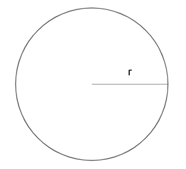
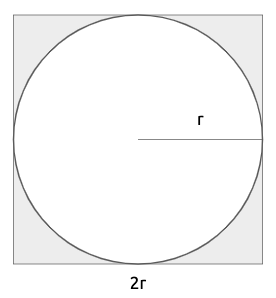

# Monte Carlo Simulation

The previous chapters laid the foundations of probability and statistics that now allow us to carry out meaningful simulation experiments. In this chapter we start looking at non-dynamic simulations which are often referred to as *Monte Carlo simulations*.

## What does Monte Carlo simulation mean?

The definition of the Monte Carlo concept can be a bit confusing. For this reason, we will take *Sawilowsky's* example and distinguish between: Simulation, Monte Carlo method and Monte Carlo simulation.

  - A **Simulation** is a fictitious representation of reality. For example: Drawing one pseudo-random uniform variable from the interval [0,1] can be used to simulate the tossing of a coin. If the value is less than or equal to 0.50 designate the outcome as heads, but if the value is greater than 0.50 designate the outcome as tails. This is a simulation, but not a Monte Carlo simulation.
  
  - A **Monte Carlo method** is a technique that can be used to solve a mathematical or statistical problem. For example: Pouring out a box of coins on a table, and then computing the ratio of coins that land heads versus tails is a Monte Carlo method of determining the behavior of repeated coin tosses, but it is not a simulation.

  - A **Monte Carlo simulation** uses repeated sampling to obtain the statistical properties of some phenomenon (or behavior). For example: drawing a large number of pseudo-random uniform variables from the interval [0,1] at one time, or once at many different times, and assigning values less than or equal to 0.50 as heads and greater than 0.50 as tails, is a Monte Carlo simulation of the behavior of repeatedly tossing a coin.
  

The main idea behind this method is that a phenomenon is simulated multiple times on a computer using random-number generation based and the results are aggregated to provide statistical summaries associated to the phenomenon.

Sawilowsky lists the characteristics of a high-quality Monte Carlo simulation:

  - the (pseudo-random) number generator has certain characteristics (e.g. a long "period" before the sequence repeats)

  - the (pseudo-random) number generator produces values that pass tests for randomness
  
  - there are enough samples to ensure accurate results
  
  - the algorithm used is valid for what is being modeled
  
  - it simulates the phenomenon in question.

## A bit of history

There were several approaches to the Monte Carlo method in the early 20th century, but it was in the mid-1940s during the Manhattan Project at "Los Alamos" that this method was first intentionally developed by Stanislaw Ulam and John von Neumann for early work relating to the development of nuclear weapons.

Below you can read a quote from Stanislaw Ulam in which he explains how he came up with this simple but powerful method:

>  The first thoughts and attempts I made to practice [the Monte Carlo Method] were suggested by a question which occurred to me in 1946 as I was convalescing from an illness and playing solitaires. The question was what are the chances that a Canfield solitaire laid out with 52 cards will come out successfully? After spending a lot of time trying to estimate them by pure combinatorial calculations, I wondered whether a more practical method than "abstract thinking" might not be to lay it out say one hundred times and simply observe and count the number of successful plays. This was already possible to envisage with the beginning of the new era of fast computers, and I immediately thought of problems of neutron diffusion and other questions of mathematical physics, and more generally how to change processes described by certain differential equations into an equivalent form interpretable as a succession of random operations. Later [in 1946], I described the idea to John von Neumann, and we began to plan actual calculations.


Being secret, the work of von Neumann and Ulam required a code name. A colleague of von Neumann and Ulam, Nicholas Metropolis, suggested using the name Monte Carlo, which refers to the Monte Carlo Casino in Monaco where Ulam's uncle would borrow money from relatives to gamble.


## Steps of Monte Carlo simulation

Monte Carlo methods vary, but tend to follow a particular pattern:

  1. Define a domain of possible inputs
  
  2. Generate inputs randomly from a probability distribution over the domain
  
  3. Perform a deterministic computation on the inputs
  
  4. Aggregate the results


To better understand how Monte Carlo simulation works we will develop a classic experiment: The $\pi$ number estimation.

$\pi$ is the mathematical constant, which is equal to 3.14159265...,  defined as the ratio of a circle's circumference to its diameter. It has been calculated in hundreds of different ways over the years. Today, with computational advances, a very useful way is through Monte Carlo Simulation.

Consider a circle with radius $r$, which is fixed and known.

```{r, echo=FALSE, out.width="25%", fig.align="center"}

```

Imagine that this circle is circumscribed within a square, which therefore has side $2r$ (also equal to the diameter).


```{r, echo=FALSE, out.width="25%", fig.align="center"}

```

What is the probability that if I choose a random point inside the square, it will also be inside the circle?  If I choose any random point within the square, it can be inside the circle or just inside the square. A very simple way to compute this probability is the ratio between the area of the circle and the area of the square.

$$
P(point\ inside\ the\ circle) = \frac{area\ of\ the\ circle}{area\ of\ the\ square}=\frac{\pi r^2}{2r\times 2r}=\frac{\pi}{4}
$$

The probability that a random selected point in the square is in the circle is $\pi/4$. This means that if I were to replicate the selection of a random point in the square a large number of times, I could count the proportion of points inside the circle, multiply it by four and that would give me an approximation of $\pi$.

We will create a Monte Carlo experiment in R which implements the ideas above. We will carry out the experiment in 5 steps:

  1. Generate 2 random numbers between -1 and 1 in total 100 times ($x$ and $y$).

  2. Calculate $x^2 + y^2$ (This is the circumference equation).
      - If the value is less than 1, the case will be inside the circle
      - If the value is greater than 1, the case will be outside the circle.

  3. Calculate the proportion of points inside the circle and multiply it by four to approximate the $\pi$ value.

  4. Repeat the experiment a thousand times, to get different approximations to $\pi$.
  
  5. Calculate the average of the previous 1000 experiments to give a final value estimate.
  
### Estimating $\pi$: step 1

Generate two random numbers between -1 and 1, 100 times:

```{r}
set.seed(2021)
nPoints <- 100
x <- runif(nPoints,-1,1)
y <- runif(nPoints,-1,1)
head(x)
head(y)
```

So both `x` and `y` are vectors of length 100 storing numbers between -1 and 1.

### Estimating $\pi$: step 2

Calculate the circumference equation.

  - If the value is less than 1, the case will be inside the circle
  - If the value is greater than 1, the case will be outside the circle.

```{r}
result <- ifelse(x^2 + y^2 <= 1, TRUE, FALSE)
head(result)
```

The vector `result` has in i-th position `TRUE` if `x[i]^2 + y[i]^2 <= 1`, that is if the associated point is within the circle. We can see that out of the first six simulated points, only one is outside the circle.


### Estimating $\pi$: step 3

Calculate the proportion of points inside the circle and multiply it by four to approximate the $\pi$ value.

```{r}
4*sum(result)/nPoints
```

So using our 100 simulated points, we came up with an approximation of `r 4*sum(result)/nPoints` for the value of $\pi$. Of course this number depends on the random numbers that were generated. If we were to repeat it, we would get a different approximation.

```{r}
set.seed(1988)
x <- runif(nPoints,-1,1)
y <- runif(nPoints,-1,1)
result <- ifelse(x^2 + y^2 <= 1, TRUE, FALSE)
4*sum(result)/nPoints
```


### Estimating $\pi$: step 4

Repeat the experiment a thousand times, to get different approximations to $\pi$.

We could do this by coding a `for` cycle, but we will take advantage of some features already implemented in R. In order to do this however, we first need to define a function which repeats our estimation of $\pi$ given 100 random points.

```{r}
piVal <- function(nPoints = 100){
  x <- runif(nPoints,-1,1)
  y <- runif(nPoints,-1,1)
  result <- ifelse(x^2+y^2 <= 1, TRUE, FALSE)
  4*sum(result)/nPoints
}

set.seed(2021)
piVal()
set.seed(1988)
piVal()
```

So we can see that the function works since it gives us the same output as the code above. 

Now we can use the function `replicate` in R, to replicate the experiment 1000 times, or to put it differently, to compute the function `piVal` 1000 times. `replicate` takes two inputs:

 -  `n`: the number of times we want to replicate the experimet;
 
 - `expr`: the function we want to be replicated
 
Therefore the following code replicates the experiment:

```{r}
set.seed(2021)
N <- 1000
pis <- replicate(N, piVal())
head(pis)
```

We can see that the first entry of the vector `pis` is indeed `pis[1]` which is the same value we obtained running the function ourselves (in both cases we fixed the same seed).

### Estimating $\pi$: step 5

Calculate the average of the previous 1000 experiments to give a final value estimate.

```{r}
mean(pis)
```

The average gives us a good approximation of $\pi$.


A boxplot can give us a visualization of the results.

```{r out.width="50%", fig.align='center'}
boxplot(pis)
```

The boxplot importantly tells us two things:

 1. if we were to take the average of the 1000 approximatations of $\pi$ we would get a value close to the true value (look at the horizontal line within the box).

 2. if we were to choose a value for $\pi$ based on a single simulation, then we could pick values between `r min(pis)` and `r max(pis)`.
 
### Estimating $\pi$: conclusions

One thing you might wonder now is the following. Why did we replicate the experiment 1000 times and each time took only 100 points. Could have we not taken a much larger number of points only once (for example $1000\times 100$)? 

On one hand that would have clearly given us a good approximation, using the same total number of simulated points. Indeed
```{r}
set.seed(2021)
piVal(1000*100)
```
which is very close to the true value.

However this approach does not give us any information about uncertainty or about how good our approximation is. We have just one single value. On the other hand, using replication we have 1000 possible approximations of $\pi$ and we can construct intervals of plausible values. For instance, we would believe that the true value $\pi$ is with 95\% probability in the interval
```{r}
c(sort(pis)[25],sort(pis)[975])
```
which includes 95\% of the central approximations of $\pi$. Such intervals are in spirit similar to the confidence intervals you should be familiar with, but there are some technicalities that makes them different (which we will not discuss here).

## The `sample` function

We have now carried out our first Monte Carlo experiment!! We will carry out others in the rest of this chapter and interpret their results. There is one function, the `sample` function which we will often use. 

In the previous chapter we discussed how to simulate numbers distributed according to a specific random variable. One possible class of numbers we may want to simulate in some situations are integers. Suppose for example you want to simulate a game of dice: then we must be able to simulate in R one number from the set $\{1,2,3,4,5,6\}$ where each has the same probability of appearing. We have not introduced yet a function that does this. 

For this specific purpose there is the function `sample`. This takes four inputs:

 1. `x`: a vector of values we want to sample from.
 
 2. `size`: the size of the sample we want.
 
 3. `replace`: if `TRUE` sampling is done with replacement. That is if a value has been selected, it can be selected again. By default equal to `FALSE`
 
 4. `prob`: a vector of the same length of `x` giving the probabilities that the elements of `x` are selected. By defaul equal to a uniform probability.
 
So for instance if we wanted to simulate ten tosses of a fair dice we can write.
```{r}
set.seed(2021)
sample(1:6, size = 10, replace = TRUE)
```
 
Notice that the vector `x` does not necessarily needs to be numeric. It could be a vector of characters. For instance, let's simulate the toss of 5 coins, where the probability of heads is 2/3 and the probability of tails is 1/3.

```{r}
set.seed(2021)
sample(c("heads","tails"), size = 5, replace = TRUE, prob = c(2/3,1/3))
```

## A game of chance

For the rest of this chapter we will develop various Monte Carlo simulations. We start simulating a little game of chance.

Peter and Paul play a simple game involving repeated tosses of a fair coin. In a given toss, if heads is observed, Peter wins 1€ from Paul; otherwise if tails is tossed, Peter gives 1€ to Paul. If Peter starts with zero euros, we are interested in his fortune as the game is played for 50 tosses.

We can simulate this game using the R `sample()` function. Peter's winning on a particular toss will be 1€ or -1€ with equal probability. His winnings on 50 repeated tosses can be considered to be a sample of size 50 selected with replacement from the set \{1€, -1€\}.

```{r}
set.seed(2021)
win <- sample(c(-1,1),size = 50, replace = T)
head(win)
```

For this particular game Peter lost the first game, then won the second, the third and the fourth and so on.

Suppose Peter is interested in his cumulative winnings as he plays this game. The function `cumsum()` computes the cumulative winnings of the individual values and we store the cumulative values in a vector named `cumul.win`.

```{r}
cumul.win <- cumsum(win) 
cumul.win
```
So at the end of this specific game Peter won 8€. Figure \@ref(fig:cumwin) reports Peter's fortune as the game evolved. We can notice that Peter was in the lead throughout almost the whole game.
```{r cumwin, out.width="50%", fig.align='center',fig.cap="Peter's fortune throughout one simulated game."}
plot(cumsum(win), type="l" ,ylim=c(-25, 25))
abline(h=0)
```
Of course this is the result of a single simulation and the outcome may be totally different than the one we saw. Figure \@ref(fig:mcumwin) reports four simulated games: we can see that in the first one Peter wins, in the second he almost breaks even, whilst in the third and fourth he clearly loses.

```{r mcumwin, out.width="80%", fig.align='center', fig.cap="Outcome of four simulated game of chances."}
set.seed(2021)
par(mfrow=c(2, 2))
for(j in 1:4){
  plot(cumsum(sample(c(-1, 1),size=50,replace=T)),type="l" ,ylim=c(-25, 25), ylab="Outcome")
  abline(h=0)}
```

Suppose we are interested in the following question.

 - What is the probability that Peter breaks even at the end of the game?
 
Evidently we cannot cannot answer by simply looking at the outputs of the previous simulations. We need to do a formal Monte Carlo study.  In this type of experiment, we simulate the random process and compute the statistic of interest. By repeating the random process many times, we obtain a collection of values of the statistic, which can then be used to approximate probabilities or expectations that answer the questions.

As you may recall from the estimation of $\pi$ experiment, we first need to write a function that simulates the experiment. In particular we need to write a function which outputs Peter's winning at the end of the game. To make this function more general, we define `n` to be the number of tosses and let the default value of `n` be 50.

```{r}
peter.paul <- function(n=50){
  sum(sample(c(-1, 1), size=n, replace=TRUE))
}
set.seed(2021)
peter.paul()
```
The output is the same as the previous code, so it seems that our function works correctly.

Let's replicate the experiment many times.
```{r}
set.seed(2021)
experiment <- replicate(1000,peter.paul())
head(experiment)
```
So the vector `experiment` stores Peter's final fortune in 1000 games. Since Peter's fortune is an integer-value variable, it is convenient to summarize it using the `table` function.
```{r}
table(experiment)
```
A graphical representation of the table is also useful.
```{r}
plot(table(experiment))
```
So we can see that Peter breaks even 102 out of 1000 times. Furthermore the plot shows us that most commonly Peter will win/lose little money and that big wins/losses are unlikely.

To conclude our experiment we need to calculate our estimated probability of Peter breaking even. Clearly this is equal to 102/1000= 0.102. In R:
```{r}
sum(experiment==0)/1000
```

Notice that we could have also answered this question exactly. The event Peter breaking even coincides with a number of successes $n/2$ in a Binomial experiment with parameters $n=50$ and $\theta = 0.5$. This can be computed in R as
```{r}
dbinom(25, size = 50, prob = 0.5)
```
So our approximation is already quite close to the true value. We would get even closer by replicating the experiment a larger number of times.

```{r}
set.seed(2021)
experiment <- replicate(10000,peter.paul())
length(experiment[experiment==0])/1000
```
 