# Model Building

The goal of a model is to provide a simple low-dimensional summary of a dataset. We’re going to use models to partition data into **patterns** and **residuals**. Strong patterns will hide subtler trends, so we’ll use models to help peel back layers of structure as we explore a dataset.

However, before we can start using models on interesting, real, datasets, you need to understand the basics of **how models work**. For that reason, we start using only simulated datasets. These datasets are very simple, and not at all interesting, but they will help you understand the essence of modelling before you apply the same techniques to real data.

There are two elements we have to define for a model:

1. First, you define a **family** of models that express a precise, but generic, pattern that you want to capture. For example, the pattern might be a straight line, or a quadratic curve. You will express the model family as an equation like `y = a_1 * x + a_2` or `y = a_1 * x ^ a_2`. Here, `x` and `y` are known variables from your data, and `a_1` and `a_2` are parameters that can vary to capture different patterns.

2. Next, you generate a **fitted model** by finding the model from the family that is the closest to your data. This takes the generic model family and makes it specific, like `y = 3 * x + 7` or `y = 9 * x ^ 2`.

It’s important to understand that a fitted model is just the closest model from a family of models. That implies that you have the “best” model (according to some criteria); it doesn’t imply that you have a good model and it certainly doesn’t imply that the model is “true”. George Box puts this well in his famous aphorism:

> All models are wrong, but some are useful.

The goal of a model is not to uncover truth, but to discover a simple approximation that is still **useful**.

## A simple model

Lets take a look at the simulated dataset `sim1`, included with the `modelr` package. It contains two continuous variables, `x` and `y`. Let’s plot them to see how they’re related:

```{r}
library(ggplot2)
library(modelr)
ggplot(sim1, aes(x, y)) + 
  geom_point()
```

You can see a strong pattern in the data. Let’s use a model to capture that pattern and make it explicit.

It’s our job to supply the basic form of the model. In this case, the relationship looks linear, i.e. `y = a_0 + a_1 * x`. Let’s start by getting a feel for what models from that family look like by randomly generating a few and overlaying them on the data. For this simple case, we can use `geom_abline()` which takes a slope and intercept as parameters. Later on we’ll learn more general techniques that work with any model.

```{r}
models <- data.frame(
  a1 = runif(250, -20, 40),
  a2 = runif(250, -5, 5)
)

ggplot(sim1, aes(x, y)) + 
  geom_abline(aes(intercept = a1, slope = a2), data = models, alpha = 1/4) +
  geom_point() 
```

There are 250 models on this plot, but a lot are really bad! We need to find the good models by making precise our intuition that a good model is “close” to the data. We need a way to quantify the distance between the data and a model. Then we can fit the model by finding the value of a_0 and a_1 that generate the model with the smallest distance from this data.

One easy place to start is to find the vertical distance between each point and the model, as in the following diagram. (Note that I’ve shifted the x values slightly so you can see the individual distances.)

<p align="center">
  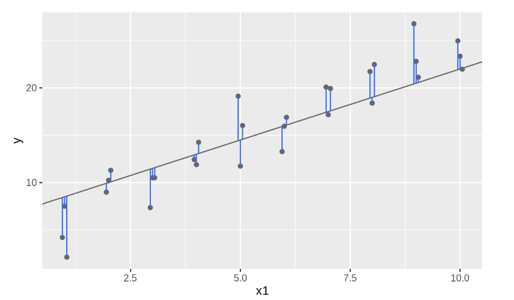
</p>

This distance is just the difference between the y value given by the model (the prediction), and the actual y value in the data (the response). To compute this distance, we first turn our model family into an R function. This takes the model parameters and the data as inputs, and gives values predicted by the model as output:

```{r}
model1 <- function(a, data) {
  a[1] + data$x * a[2]
}
model1(c(7, 1.5), sim1)
```

Next, we need some way to compute an overall distance between the predicted and actual values. In other words, the plot above shows 30 distances: how do we collapse that into a single number?

One common way to do this in statistics to use the “root-mean-squared deviation”. We compute the difference between actual and predicted, square them, average them, and the take the square root. This distance has lots of appealing mathematical properties, which we’re not going to talk about here. You’ll just have to take my word for it!

```{r}
measure_distance <- function(mod, data) {
  diff <- data$y - model1(mod, data)
  sqrt(mean(diff ^ 2))
}
measure_distance(c(7, 1.5), sim1)
```

Next, let’s overlay the 10 best models on to the data. I’ve coloured the models by `-dist`: this is an easy way to make sure that the best models (i.e. the ones with the smallest distance) get the brighest colours.

<p align="center">
  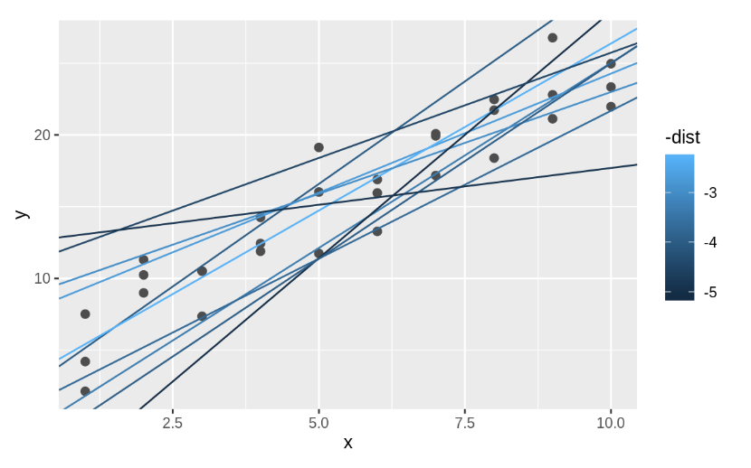
</p>

We selected the 10 best models out of 250 randomly generated. We will see next week that there is an easy method to find an "optimal" model. Here we use the function `optim` to find it, but do not worry about the details of this.

```{r}
best <- optim(c(0, 0), measure_distance, data = sim1)
best$par


ggplot(sim1, aes(x, y)) + 
  geom_point(size = 2, colour = "grey30") + 
  geom_abline(intercept = best$par[1], slope = best$par[2])
```

The line gives the so-called fitted or predicted values, which give us the signal that the model managed to capture from the data.

It’s also useful to see what the model doesn’t capture, the so-called residuals which are left after subtracting the predictions from the data. Residuals are powerful because they allow us to use models to remove striking patterns so we can study the subtler trends that remain.

The residuals are just the distances between the observed and predicted values that we computed above.

```{r}
fitted <- best$par[1] + best$par[2]*sim1$x
sim1$resid <- sim1$y - fitted

ggplot(sim1, aes(x, resid)) + 
  geom_ref_line(h = 0) +
  geom_point() 
```

This looks like random noise, suggesting that our model has done a good job of capturing the patterns in the dataset.

## Models as functions

The concept of a function is very important when thinking about relationships. A function is a **mathematical concept**: the relationship between an output and one or more inputs. One way to talk about a function is that you plug in the inputs and receive back the output. For example, the formula $y = 3x + 7$ can be read as a function with input $x$ and output $y$. Plug in a value of $x$ and receive the output $y$. So, when $x$ is 5, the output y is 22.

One way to represent a function is with a **formula**, but there are other ways as well, for example **graphs** and **tables**. The figure below shows a function representing the relationship between gas usage and temperature. The function is much simpler than the data. In the data, there is a scatter of usage levels at each temperature. But in the function there is only one output value for each input value.

<p align="center">
  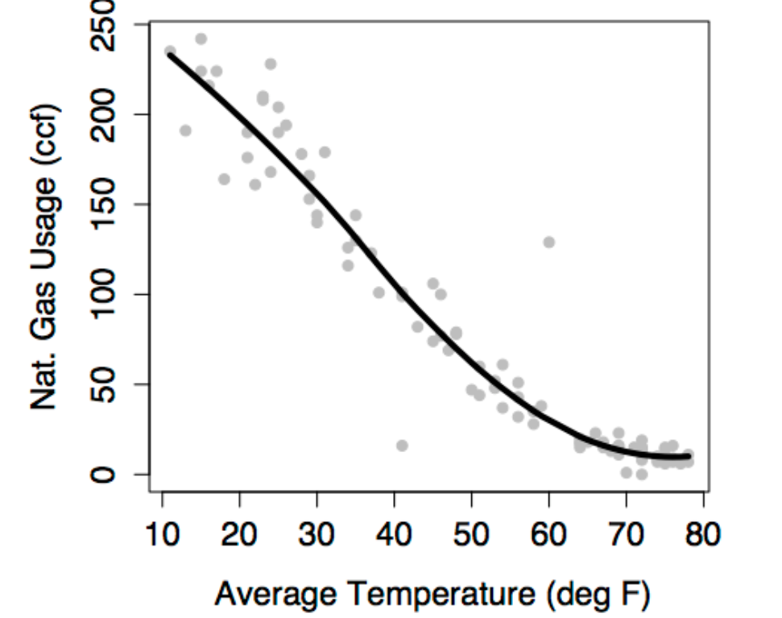
</p>

Some vocabulary will help to describe how to represent relationships with functions.

- The **response variable** is the variable whose behavior or variation you are trying to understand. On a graph, the response variable is conventionally plotted on the vertical axis.

- The **explanatory variables** are the other variables that you want to use to explain the variation in the response. The previous figure shows just one explanatory variable, temperature. It’s plotted on the horizontal axis.

- **Conditioning on explanatory variables** means taking the value of the explanatory variables into account when looking at the response variables. When you looked at the gas usage for those months with a temperature near 49°, you were conditioning gas usage on temperature.

- The **model/fitted/predicted value** is the output of a function. The function – called the model function – has been arranged to take the explanatory variables as inputs and return as output a typical value of the response variable. That is, the model function gives the typical value of the response variable conditioning on the explanatory variables. The function shown in the previous figure is a model function. It gives the typical value of gas usage conditioned on the temperature. For instance, at 49°, the typical usage is 65 ccf. At 20°, the typical usage is much higher, about 200 ccf.

- The **residuals** show how far each case is from its model value. For example, one of the cases plotted in Figure 6.2 is a month where the temperature was 13° and the gas usage was 191 ccf. When the input is 13°, the model function gives an output of 228 ccf. So, for that case, the residual is 191 - 228 = -37 ccf. Residuals are always “actual value minus model value.”

This way, the **idea of a function** is fundamental to understanding statistical models. Whether the function is represented by a formula or a graph, the function takes one or more inputs and produces an output. The output is the model value, a “typical” or “ideal” value of the response variable at given levels of the inputs. The inputs are the values explanatory variables.

The **model function** describes how the typical value of the response variable depends on the explanatory variables. The output of the model function varies along with the explanatory variables. For instance, when temperature is low, the model value of gas usage is high. When temperature is high, the model value of gas usage is low. The idea of “depends on” is very important. 

The model function describes a **relationship**. If you plug in values for the explanatory variables for a given case, you get the model value for that case. The model value is usually different from one case to another, at least so long as the values of the explanatory variables are different. When two cases have exactly the same values of the explanatory values, they will have exactly the same model value even though the actual response value might be different for the two cases.

The **residuals** tell how each case differs from its model value. Both the model values and the residuals are important. The model values tell what’s typical or average. The residuals tell how far from typical an individual case is likely to be. 

Models explain the **variation** in the response variable. Some of the variability is explained by the model, the remainder is unexplained. The model values capture the “deterministic” or “explained” part of the variability of the response variable from case to case. The residuals represent the “random” or “unexplained” part of the variability of the response variable.

### Model Functions with Multiple Explanatory Variables

Historically, women tended to be paid less than men. To some extent, this reflected the division of jobs along sex lines and limited range of jobs that were open to women – secretarial, nursing, school teaching, etc. But often there was simple discrimination; an attitude that women’s work wasn’t as valuable or that women shouldn’t be in the workplace. Over the past thirty or forty years, the situation has changed. Training and jobs that were once rarely available to women – police work, management, medicine, law, science – are now open to them.

Surveys consistently show that women tend to earn less than men: a “wage gap.” To illustrate, consider data from one such survey, the Current Population Survey (CPS) from 1985. In the survey data, each case is one person. The variables are the person’s hourly wages at the time of the survey, age, sex, marital status, the sector of the economy in which they work, etc.

One aspect of these data is displayed by plotting `wage` versus `sex`. The model plotted along with the data show that typical wages for men are higher than for women.

<p align="center">
  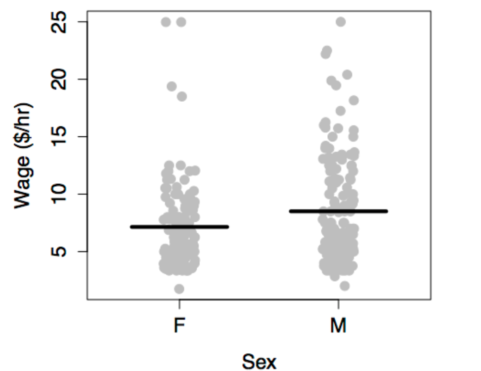
</p>

The situation is somewhat complex since the workforce reflected in the 1985 data is a mixture of people who were raised in the older system and those who were emerging in a more modern system. A woman’s situation can depend strongly on when she was born. This is reflected in the data by the age variable.

There are other factors as well. The roles and burdens of women in family life remain much more traditional than their roles in the economy. Perhaps marital status ought to be taken into account. In fact, there are all sorts of variables that you might want to include – job type, race, location, etc. A statistical model can include multiple explanatory variables, all at once. To illustrate, consider explaining wage using the worker’s age, sex, and marital status.

In a typical graph of data, the vertical axis stands for the response variable and the horizontal axis for the explanatory variable. But what do you do when there is more than one explanatory variable? One approach, when some of the explanatory variables are categorical, is to use differing symbols or colors to represent the differing levels of the categories. The figure below shows wages versus age, sex, and marital status plotted out this way.

<p align="center">
  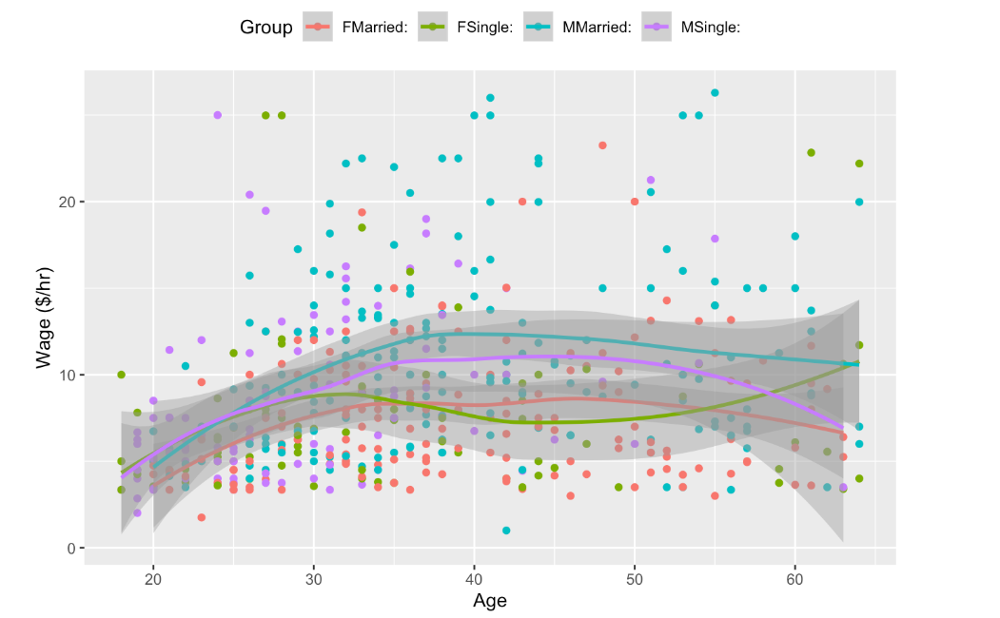
</p>

The first thing that might be evident from the scatter plot is that not very much is obvious from the data on their own. There does seem to be a slight increase in wages with age, but the cases are scattered all over the place.

The model, shown as the continuous curves in the figure, simplifies things. The relationships shown in the model are much clearer. You can see that wages tend to increase with age, up until about age 40, and they do so differently for men and for women and differently for married people and single people.

Models can sometimes reveal patterns that are **not evident** in a graph of the data. This is a great advantage of modeling over simple visual inspection of data. There is a real risk, however, that a model is imposing structure that is not really there on the scatter of data, just as people imagine animal shapes in the stars. A skeptical approach is always warranted.

## Reading a model

There are two distinct ways that you can read a model.

- Read out the **model value**. Plug in specific values for the explanatory variables and read out the resulting model value. For instance, an input temperature of 35° produces a predicted output gas usage of 125 ccf. Or a single, 30-year old female has a model value of $8.10 per hour. (Remember, the model is based on data from 1985!)

- Characterize the **relationship** described by the model. In contrast to reading out a model value for some specific values of the explanatory variables, here interest is in the overall relationship: how gas usage depends on temperature; how wages depend on sex or marital status or age.
 
 Reading out the model value is useful when you want to make a **prediction** (What would the gas usage be if the temperature were 10° degrees?) or when you want to compare the actual value of the response variable to what the model says is a typical value. (Is the gas usage lower than expected in the 49° month, perhaps due to my new furnace?).

Characterizing the relationship is useful when you want to make statements about broad patterns that go beyond individual cases. Is there really a connection between marital status and wage? Which way does it go?

The **shape** of the model function tells you about such broad relationships. Reading the shape from a graph of the model is not difficult.

For a **quantitative explanatory variable**, e.g., temperature or age, the model form is a continuous curve or line. An extremely important aspect of this curve is its slope. For the model of gas usage, the slope is down to the right: a negative slope. This means that as temperature increases, the gas usage goes down. In contrast, for the model of wages, the slope is up to the right: a positive slope. This means that as age increases, the wage goes up.

For **categorical variables**, slopes don’t apply. Instead, the pattern can be described in terms of differences. In the model where wage is explained only by sex, the difference between typical wages for males and females is 2.12 dollars per hour.

When there is more than one explanatory variable, there will be a distinct slope or difference associated with each.

## Model Design

The suitability of a model for its intended purpose depends on choices that the modeler makes. There are three fundamental choices:

 1. The data.
 2. The response variable.
 3. The explanatory variables.
 
### The data

How were the data collected? Are they a random sample from a **relevant** sampling frame? Are they part of an experiment in which one or more variables were intentionally **manipulated** by the experimenter, or are they **observational** data? Are the relevant variables being measured? (This includes those that may not be directly of interest but which have a strong influence on the response.) Are the variables being measured in a meaningful way? Start thinking about your models and the variables you will want to include while you are still planning your **data collection**.

When you are confronted with a situation where your data are not suitable, you need to be honest and realistic about the **limitations** of the conclusions you can draw. 

### The response variable

The appropriate choice of a response variable for a model is often obvious. The response variable should be the thing that you want to **predict**, or the thing whose variability you want to understand. Often, it is something that you think is the effect produced by some other cause.

For example, in examining the relationship between gas usage and outdoor temperature, it seems clear that gas usage should be the response: temperature is a major determinant of gas usage. But suppose that the modeler wanted to be able to measure outdoor temperature from the amount of gas used. Then it would make sense to take temperature as the response variable.

Similarly, wages make sense as a response variable when you are interested in how wages vary from person to person depending on traits such as age, experience, and so on. But suppose that a sociologist was interested in assessing the influence of income on personal choices such as marriage. Then the marital status might be a suitable response variable, and wage would be an explanatory variable.

### Explanatory variables

Much of the thought in modeling goes into the **selection** of explanatory variables and we will see several ways to decide if an explanatory variable ought to be included in a model.

Of course, some of the things that shape the choice of explanatory variables are obvious. Do you want to study sex-related differences in wage? Then sex had better be an explanatory variable. Is temperature a major determinant of the usage of natural gas? Then it makes sense to include it as an explanatory variable.

You will see situations where including an explanatory variable **hurts** the model, so it is important to be careful. A much more common mistake is to leave out explanatory variables. Unfortunately, few people learn the techniques for handling multiple explanatory variables and so your task will often need to go beyond modeling to include **explaining** how this is done.

When designing a model, you should think hard about what are potential explanatory variables and be prepared to include them in a model along with the variables that are of direct interest.

### Model terms

Once the modeler has selected explanatory variables, a choice must be made about model terms.

Notice that the various models have graphs of different shapes. The gas-usage model is a gentle curve, the wage-vs-sex model is just two values, and the more elaborate wage model is four lines with different **slopes** and **intercepts**.

<p align="center">
  
  
  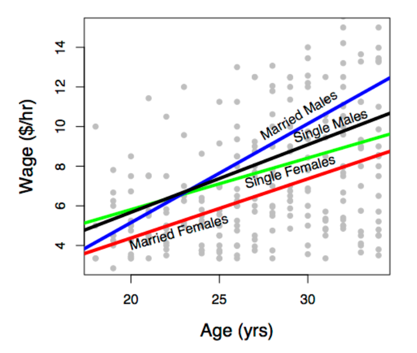
</p>

The modeler determines the shape of the model through his or her **choice** of model terms. The basic idea of a model term is that explanatory variables can be included in a model in **more than one way**. Each kind of term describes a different way to include a variable in the model.

You need to learn to describe models using model terms for several reasons. 

 1. First, you will **communicate** in this language with the computers that you will use to perform the calculations for models.
 2. Second, when there is more than one explanatory variable, it’s hard to visualize the model function with a graph. Knowing the language of model terms will help you **“see”** the shape of the function even when you can’t graph it. 
 3. Third, model terms are the way to talk about **“parts”** of models. In evaluating a model, statistical methods can be used to take the model apart and describe the contribution of each part. 

There are just a few basic kinds of models terms. They will be introduced by examples.

 1. **intercept term**: a sort of “baseline” that is included in almost every model.
 2. **main terms**: the effect of explanatory variables directly.
 3. **interaction terms** how different explanatory variables modulate the relationship of each other to the response variable.
 4. **transformation terms**: simple modifications of explanatory variables.
 
 Models almost always include the intercept term and a main term for each of the explanatory variables. Transformation and interaction terms can be added to create more expressive or flexible shapes.
 
### Swimming world records

The data are the record time (in seconds) for the 100-meter freestyle race along with the year in which the record was set and the sex of the swimmer. The response variable will be time, the explanatory variables will be year and sex.

<p align="center">
  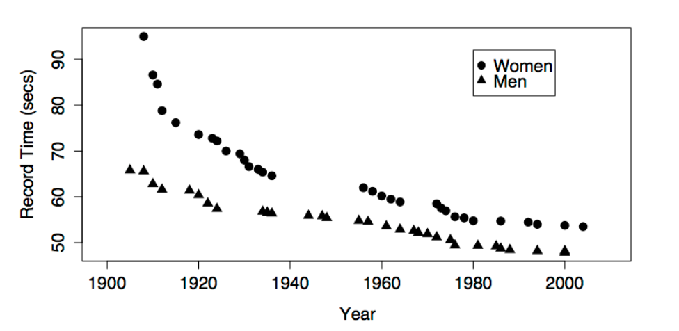
  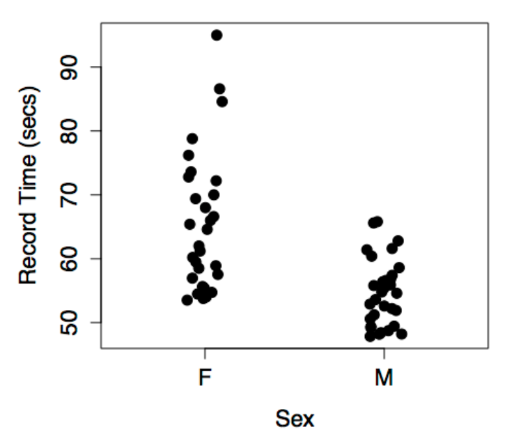
</p>

The figures show some obvious patterns, seen most clearly in the plot of time versus year. The record time has been going down over the years. This is natural, since setting a new record means beating the time of the previous record. There’s also a clear difference between the men’s and women’s records; men’s record times are faster than women’s, although the difference has decreased markedly over the years.

The following models may or may not reflect these patterns, depending on which model terms are included.

The **intercept term** is included in almost every statistical model. The intercept term is a bit strange because it isn’t something you measure; it isn’t a variable. (The term “intercept” will make sense when model formulas are introduced in the next section).

The figure below shows the swimming data with a simple model consisting only of the intercept term.

<p align="center">
  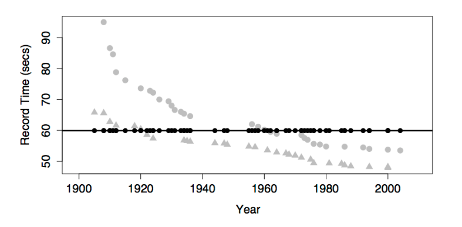
  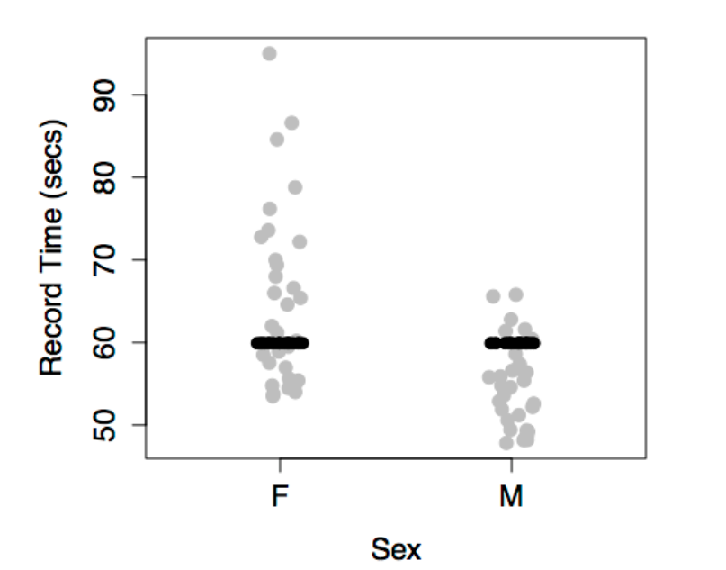
</p>

The model value for this model is exactly the same for every case. In order to create model variation from case to case, you would need to include at least one explanatory variable in the model.

The most basic and common way to include an explanatory variable is as a **main effect**. Almost all models include the intercept term and a main term for each of the explanatory variables.

This produces model values that vary with year, but show no difference between the sexes. This is because sex has not been included in the model.

<p align="center">
  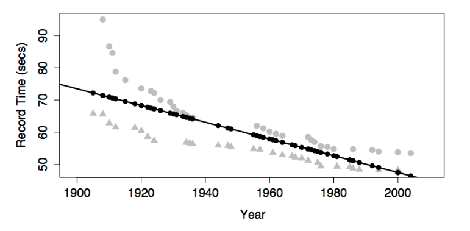
  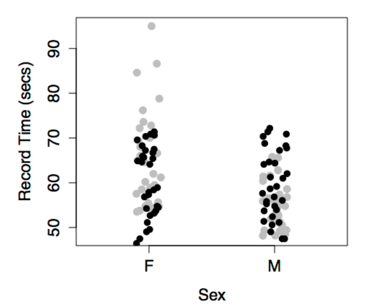
</p>

The model values have been plotted out as small black dots. The model pattern is evident in the first graph: swim time versus year. But in the second graph – swim time versus sex – it seems to be all scrambled. 

Don’t be confused by this. The right-hand graph doesn’t include year as a variable, so the dependence of the model values on year is not at all evident from that graph. Still, each of the model value dots in the left graph occurs in the right graph at exactly the same vertical coordinate.

This produces different model values for each level of sex.

<p align="center">
  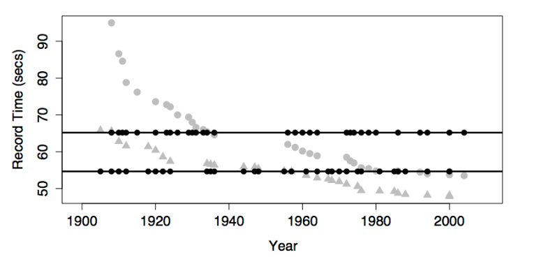
  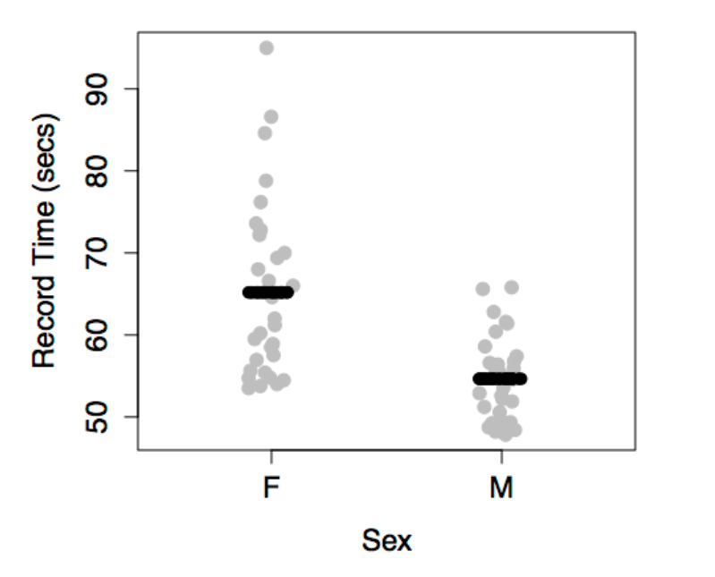
</p>

There is no model variation with year because year has not been included in the model. This model gives dependence on both sex and year.

<p align="center">
  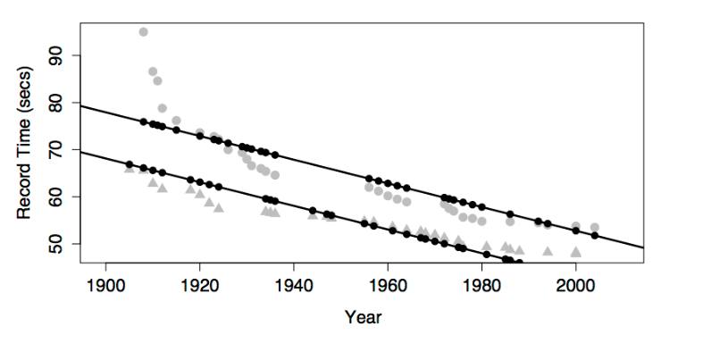
  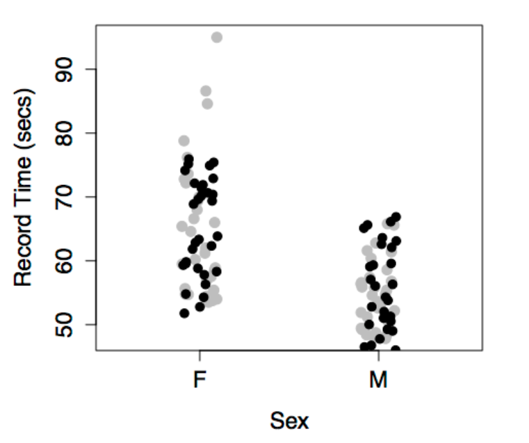
</p>

Note that the model values form two parallel lines in the graph of time versus year: one line for each sex.

Interaction terms combine two other terms, typically two main terms. An interaction term can describe how one explanatory variable **modulates** the role of another explanatory variable in modeling the relationship of both with the response variable.

In the graph, including the **interaction term** between sex and year produces a model with two non-parallel lines for time versus year. (The model also has the main terms for both sex and year and the intercept term, as always.)

<p align="center">
  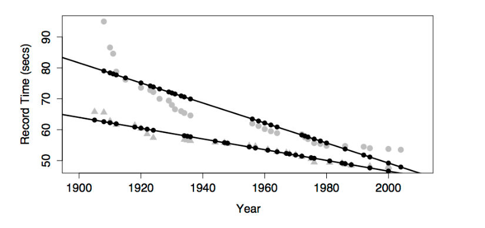
  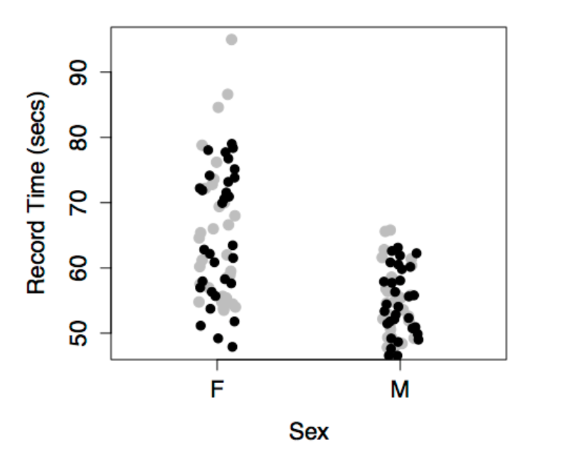
</p>

One way to think about the meaning of the interaction term in this model is that it describes how the effect of sex changes with year.

Looking at the model, you can see how the difference between the sexes changes over the years; the difference is getting smaller. Without the interaction term, the model values would be two parallel lines; the difference between the lines wouldn’t be able to change over the years.

Another, equivalent way to put things is that the interaction term describes how the effect of year changes with sex. The effect of year on the response is reflected by the slope of the model line. Looking at the model, you can see that the slope is different depending on sex: steeper for women than men.

For most people, it’s surprising that one term – the interaction between sex and year – can describe both how the effect of year is modulated by sex, and how the effect of sex is modulated by year. But these are just two ways of looking at the same thing.

A common misconception about interaction terms is that they describe how one explanatory variable affects another explanatory variable. Don’t fall into this error. Model terms are always about how the response variable depends on the explanatory variables, not how explanatory variables depend on one another. An interaction term between two variables describes how two explanatory variables **combine** jointly to influence the response variable.

Once people learn about interaction terms, they are tempted to include them everywhere. After all, it’s natural to think that world record swimming times would depend differently on year for women than for men. Of course wages might depend differently on age for men and women! Regretably, the uncritical use of interaction terms can lead to poor models.

A transformation term is a modification of another term using some mathematical transformation. Transformation terms only apply to quantitative variables. Some common transformations are $x^2$ or $\sqrt{x}$ or $\log(x)$, where the quantitative explanatory variable is $x$.

A **transformation term** allows the model to have a dependence on $x$ that is not a straight line. The graph shows a model that includes these terms: an intercept, main effects of sex and year, an interaction between sex and year, and a year-squared transformation term.

<p align="center">
  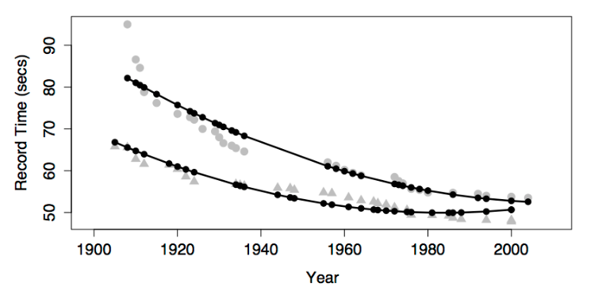
  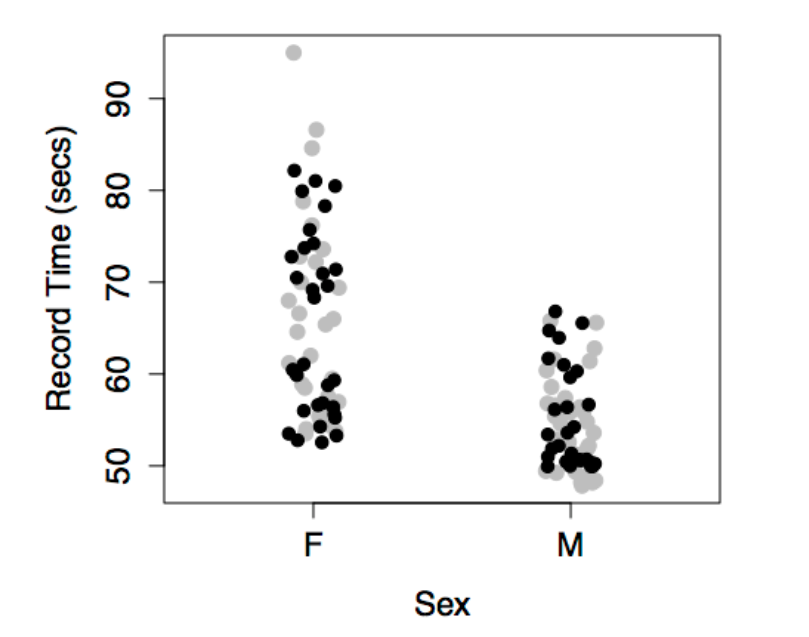
</p>

Adding in the year-squared term provides some curvature to the model function.

Look carefully at the model with a year-squared transformation term. You may notice that, according to the model, world record times for men have been getting worse since about year 1990. This is, of course, nonsense. Records can’t get worse. A new record is set only when an old record is beaten. 

The model doesn’t know this common sense about records – the model terms allow the model to curve in a certain way and the model curves in exactly that way. What you probably want out of a model of world records is a slight curve that’s constrained never to slope upward. 

There is no elementary way to do this. Indeed, it is an unresolved problem in statistics how best to include in a model additional knowledge that you might have such as “world records can’t get worse with time.”

It’s possible to construct a model with main terms but no intercept terms. If the explanatory variables are all quantitative, this is almost always a **mistake**. The figure, which plots the model function for swim time modeled by age with no intercept term, shows why.

<p align="center">
  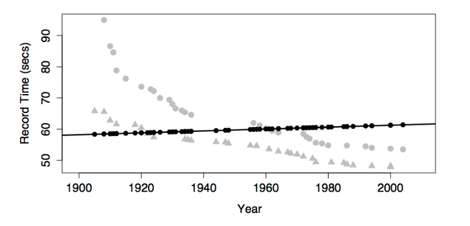
  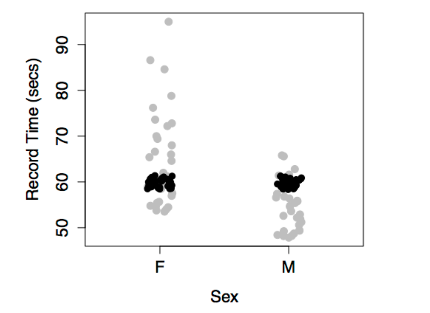
</p>

The model function is sloping slightly upward rather than falling as the data clearly indicate. This is because, without an intercept term, the model line is forced to go through the **origin**. The line is sloping upward so that it will show a time of zero in the hypothetical year zero! Silly. It’s no wonder that the model function fails to look anything like the data.

Never leave out the intercept unless you have a very good reason. Indeed, statistical software typically includes the intercept term by default. You have to go out of your way to tell the software to exclude the intercept.

## Model notation

There is a concise notation for specifying the choices made in a model design, that is, which is the response variable, what are the explanatory variables, and what model terms to use. This notation is the one you will use it in working with computers.

To illustrate, here is the notation for some of the models looked at earlier in this chapter:

 - ccf ~ 1 + temperature
 - wage ~ 1 + sex
 - time ~ 1 + year + sex + year:sex
 
The ~ symbol (pronounced “tilde”) divides each statement into two parts. On the left of the tilde is the name of the response variable. On the right is a list of model terms. When there is more than one model term, as is typically the case, the terms are separated by a + sign.

The examples show three types of model terms:

 - The symbol 1 stands for the intercept term.
 - A variable name (e.g., sex or temperature) stands for using that variable in a main term.
 - An interaction term is written as two names separated by a colon, for instance year:sex.
 
Although this notation looks like arithmetic or algebra, IT IS NOT. The plus sign does not mean arithmetic addition, it simply is the divider mark between terms. In English, one uses a comma to mark the divider as in “rock, paper, and scissors.” The modeling notation uses + instead: “rock + paper + scissors.” So, in the modeling notation 1 + age does not mean “arithmetically add 1 to the age.” Instead, it means “two model terms: the intercept and age as a main term.”

Similarly, don’t confuse the tilde with an algebraic equal sign. The model statement is not an equation. So the statement wage ~ 1 + age does not mean “wage equals 1 plus age.” Instead it means, wage is the response variable and there are two model terms: the intercept and age as a main term."

In order to avoid accidentally leaving out important terms, the modeling notation includes some shorthand. Two main points will cover most of what you will do:

- You don’t have to type the 1 term; it will be included by default. So, wage ~ age is the same thing as wage ~ 1 + age. On those very rare occasions when you might want to insist that there be no intercept term, you can indicate this with a minus sign: wage ~ age - 1.

- Almost always, when you include an interaction term between two variables, you will also include the main terms for those variables. The * sign can be used as shorthand. The model wage ~ 1 + sex + age + sex:age can be written simply as wage ~ sex * age.

## Daily Flights Example

Let’s work through a dataset including the number of flights that leave NYC per day. This is a really small dataset — only 365 rows and 2 columns — and we’re not going to end up with a fully realised model, but as you’ll see, the steps along the way will help us better understand the data. Let’s get started by counting the number of flights per day and visualising it with ggplot2.

```{r, echo = FALSE, fig.width=9,fig.height=4, fig.align="center", message=FALSE}
library(nycflights13)
library(lubridate)
library(tidyverse)
library(modelr)
daily <- flights %>% 
  mutate(date = make_date(year, month, day)) %>% 
  group_by(date) %>% 
  summarise(n = n())
ggplot(daily, aes(date, n)) + 
  geom_line()
```

Understanding the long-term trend is challenging because there’s a very strong day-of-week effect that dominates the subtler patterns. Let’s start by looking at the distribution of flight numbers by day-of-week:

```{r, echo = FALSE, fig.width=9,fig.height=4, fig.align="center"}
daily <- daily %>% 
  mutate(wday = wday(date, label = TRUE))
ggplot(daily, aes(wday, n)) + 
  geom_boxplot()
```

There are fewer flights on weekends because most travel is for business. The effect is particularly pronounced on Saturday: you might sometimes leave on Sunday for a Monday morning meeting, but it’s very rare that you’d leave on Saturday as you’d much rather be at home with your family.

One way to remove this strong pattern is to use a model where a model term is day of the week. First, we fit the model, and display its predictions overlaid on the original data:

```{r, echo = FALSE, fig.width=9,fig.height=4, fig.align="center"}
mod <- lm(n ~ wday, data = daily)

grid <- daily %>% 
  data_grid(wday) %>% 
  add_predictions(mod, "n")

ggplot(daily, aes(wday, n)) + 
  geom_boxplot() +
  geom_point(data = grid, colour = "red", size = 4)
```

Let's visualize the residuals

```{r, echo = FALSE, fig.width=9,fig.height=4, fig.align="center"}
daily <- daily %>% 
  add_residuals(mod)
daily %>% 
  ggplot(aes(date, resid)) + 
  geom_ref_line(h = 0) + 
  geom_line()
```

Note the change in the y-axis: now we are seeing the deviation from the expected number of flights, given the day of week. This plot is useful because now that we’ve removed much of the large day-of-week effect, we can see some of the subtler patterns that remain.

1. Our model seems to fail starting in June: you can still see a strong regular pattern that our model hasn’t captured. Drawing a plot with one line for each day of the week makes the cause easier to see:
 
```{r, echo = FALSE, fig.width=9,fig.height=4, fig.align="center"}
ggplot(daily, aes(date, resid, colour = wday)) + 
  geom_ref_line(h = 0) + 
  geom_line()
```

Our model fails to accurately predict the number of flights on Saturday: during summer there are more flights than we expect, and during Fall there are fewer.

2. There are some days with far fewer flights than expected. If you’re familiar with American public holidays, you might spot New Year’s day, July 4th, Thanksgiving and Christmas. 
 
```{r, echo = FALSE, fig.width=9,fig.height=4, fig.align="center"}
ggplot(daily, aes(date, resid, colour = wday)) + 
  geom_ref_line(h = 0) + 
  geom_line()
```
 
3. There seems to be some smoother long term trend over the course of a year. There are fewer flights in January (and December), and more in summer (May-Sep). 
 
```{r, echo = FALSE, fig.width=9,fig.height=4, fig.align="center"}
daily %>% 
  ggplot(aes(date, resid)) + 
  geom_ref_line(h = 0) + 
  geom_line(colour = "grey50") + 
  geom_smooth(se = FALSE, span = 0.20)
```

It is not the purpose of this chapter to teach you how to address these, but simply to notice them!!