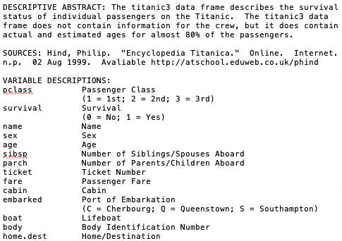
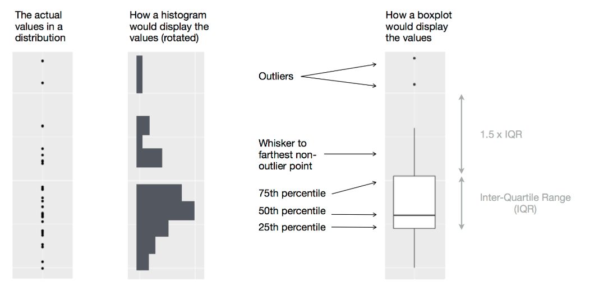
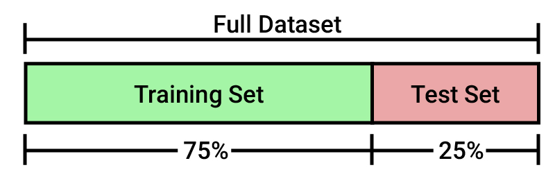
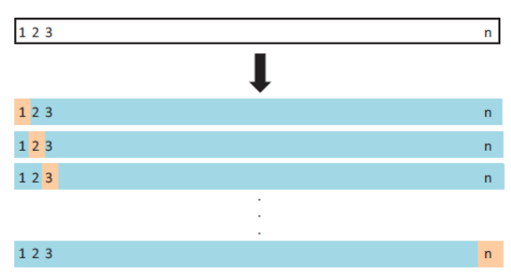

# Exploratory Data Analysis

In the previous chapter we understood some important concepts about modeling. However, when we want to model any phenomenon we must rely on historical data to describe it. The management and study of these data is an essential phase for any professional in the area. 

In this chapter we will define the phases that precede statistical modeling, and we will learn some fundamental concepts.

## Data Cleansing

We need to be sure that the data we use to create our models is reliable and well structured. And for that we are going to carry out a "tedious" data cleansing process. During this process we are going to handle **missing values**, **outliers**, **obvious inconsistences** and **dummy variables**.

The first step in the modeling process consists of understanding our goals and the data provided to us. Normally we will have documentation about all the data provided. In case we are the ones who collect those data, we need to create the documentation ourselves. It is essential to understand all the variables that we have to determine their importance for the model. Once we understand out data we import the dataset in R to start working on it.

**Titanic Example:**

<p align="center">
  
</p>

Once we have understood our data we are going to import it into R and study quantitatively how the variables behave before carrying out the cleaning. To do this, first check that the data have been imported correctly into R, ensuring that all rows and columns are identified in our data frame.

```{r}
data <- read.csv("./Data/titanic3.csv", stringsAsFactors = FALSE, na.strings = "")
```

```{r, echo=FALSE}
library(DT)
datatable(data)
```

Secondly, we can obtain the structure of our data frame using the `str()` function to identify the variable types we have.

```{r}
str(data)
```

### Handling missing values

When we have missing values in a dataset there are several ways to handle them. Let's start grouping the solutions in two types:

#### Deletion (drastic approach): 
If we find missing values, following this approach we will remove the data, either the whole row or the whole column, depending on whether the missing information corresponds more with the case (we will delete that row) or with the variable (we will delete that column). For the deletion by row we have a basic function of R that will eliminate all the cases in which there is at least one missing value that is `na.omit()`. But we will never delete data only by columns or by rows, it will depend on the percentage of missing values that we identify in each column. A good criterion is to eliminate all the columns that have more than 80% of missing values. Once we have eliminated those columns we will clean the cases with missing values by rows.

#### Imputation: 
Inferring the missing values. This consists of adding or replacing missing values with other values, for example a 0 or the average. There are several methods to impute a missing value and the choice of the best method will depend quite a lot on the context of the information. 

- Fill in any missing value with 0. In this case we can find for example ages or destination equal to 0, so it does not fit well for all missing values of the dataset. 

- Impute the value with a string. If we impute by the word "unknown", this word will appear instead of the missing values, but there are many variables for which we could fill with better information. Therefore, the most commonly used option is to replace the values in different ways for each variable.

- We can also use some central tendency measure when filling in missing data, and that is to impute them by the mean or by the median. We can take the values that are not missing from the numeric columns and fill in the missing values with the mean of those values. 

### Handling missing values (deletion)

To start handling missing values from our dataset let's check how many we have for each variable. To do this we are going to use the `is.na()` function, let's see this function applied to the `body` variable:

```{r}
head(is.na(data$body))
```

This function will return a Boolean vector with TRUE's for missing values and FALSE's for filled values. If we need the complementary vector we could obtain it using the expression `!is.na()`.

```{r}
head(!is.na(data$body))
```

We can use the `sum()` function to count how many NA's we have in the variable

```{r}
sum(is.na(data$body))
```

But this is only informing us about one variable, and we will need to know the amount of missing values we are working with.

<div class="exercise">
**Exercise**
Develop a function that shows us the missing values for each of the variables of any dataset that we introduce as input.
</div>

Once we know the missing values we have to work with, we have to decide what to do with them. Remember that one way to handle them was to eliminate the cases with missing values, and we can do this through the `na.omit()` function. Let's see how it works comparing the dataset without missing values and the original one

```{r}
x = na.omit(data)
c(dim(data), dim(x))
```

We see that we have 0 values now in our dataset. This is because all cases have at least one missing value. Let see what happens if we delete the missing values by columns:

```{r}
y = data.frame(t(na.omit(t(data))))
c(dim(data), dim(y))
```

In this case we don't lose as much information as we did removing the cases with missing values, but we keep wasting information of variables that can be useful. For this reason, we will always try to balance the deletion of columns and rows.

To do this we are going to create a function that remove all columns with more than 80% of missing values and then remove the remaining cases with missing values.

<div class="exercise">
**Exercise**
Develop a function that remove all columns with more than 80% of missing values and then remove the remaining cases.
</div>

### Handling missing values (imputation)

That's great! We already know how to deal with missing values from a case-elimination perspective. This would be one of the solutions, but we have already talked about another possible solution: the imputation of missing values. As mentioned above, there are many ways to impute missing values. Let's start by replacing all NA's with 0.

```{r}
data0 = data
data0[is.na(data0)] = 0
datatable(data0)
```

This is a good method, but we see that, for example, the variable `home.dest`(destination) is now equal to 0 in many cases, which is not easy to interpret. 

Let's see another imputation option. Now let's impute NA's by the word "Unknown".

```{r}
dataString = data
dataString[is.na(dataString)] = "Unknown"
datatable(dataString)
```

The problem now, as you can expect, is the opposite. We are treating numeric variables as characters when imputing by a word. For this reason, we will always try to impute the missing values of each variable considering its characteristics. Let's see how to do it with the following exercise: 

<div class="exercise">
**Exercise:**

Impute separately the missing values of the variable `body` by zeros, the missing values of the variable `home.dest` by the word "Unknown" and the missing values of the variable `age` by the mean in the variable `age`. 

**Hint:** To impute by the mean we need to estimate the mean of the variable, but the `mean()` function will return an error if we have missing values inside the variable. For that reason we have to include a parameter inside the `mean()` function called `na.rm = TRUE`.

</div>

**Note:** There are many other imputation methods much more appropriate, statistically speaking, than the ones we have used, but also much more complex. You will see many of this methods in the future, but in the meantime I recommend this [paper](http://www.stat.uchicago.edu/~eichler/stat24600/Admin/MissingDataReview.pdf) from the Loyola University to go deeper.


### Outliers

There are multiple methods and a lot of literature about outliers. We will understand outliers as an observation (or set of observations) that are inconsistent with the data set. We will see one technique to detect these outliers, the **boxplot**. 

**NOTE**: Outliers are NOT errors. We must detect and manage them, but not necessarily remove them, this is a statistical decision and depends on each situation.

For variables in which we can assume normality, the boxplot is a well-recognized technique. All the values above or below the whiskers are considered outliers. The upper whisker is calculated by adding 1.5 times the interquartile range to the third quartile, and the lower by subtracting it from the second quartile. 

The **Interquantile Range** is a measure of statistical dispersion, being equal to the difference between 75th and 25th percentiles, or between upper and lower quartiles, $IQR = Q3 −  Q1$. In other words, the IQR is the first quartile subtracted from the third quartile.

Now we are going to see how the boxplot works. We will use the functions `boxplot` to print the graph, and `boxplot.stats` to obtain the exact values of the outliers.

```{r}
x = c(1:50, 90, 150)
boxplot.stats(x)$out
```

```{r}
boxplot(x)
```

In this case, the values 90 and 150 are considered as outliers as they are above the whisker. We have used a factor of 1.5 to create the whiskers, but we can change this parameter. The more we increase this factor the more we will extend the whiskers, so we include more values inside the range.

```{r}
boxplot.stats(x, coef = 2)$out
```

The boxplot method fails when data are skewly distributed, as in an exponential distribution. Again, to go deeper in this field I recommend to start reading this [paper](http://www.eng.tau.ac.il/~bengal/outlier.pdf).

### Obvious inconsistencies

An obvious inconsistency occurs when a case contains a value or a combination of values that cannot correspond to reality. For example, a person cannot have a negative age, a man cannot be pregnant, and a child cannot have a driver's license.

This can be expressed simply through rules or constraints. Checking for obvious inconsistencies can be carried out in R by logical operators. For example, to check that all values of `x` are not negative we can use the following code.

```{r}
x = c(-3, 10:20, 30)
xNonNegative = x >= 0
xNonNegative
```

However, as the number of variables increases, the number of rules increases rapidly, and it may be easier to manage the rules separately from the data. In addition, since rules can be interconnected given certain sets of variables, deciding which variable or variables can create an inconsistency can be complicated. 

The `editrules` package can help us define rules about datasets. In addition, with `editrules` we will be able to check which rules are fulfilled or not, and it allows us to find the minimum set of values that we have to change to avoid inconsistencies. 

We are going to work with a dataset called `people.csv` to establish our rules. Let's start by reading the dataset and checking which variables we have

```{r}
df = read.csv("./Data/people.csv", row.names = "X")
datatable(df)
```

To check how the library works let's start by defining some restrictions on the `age` variable 
```{r, echo = FALSE, message=FALSE}
library(editrules)
```

```{r}
rules = editset(c("age >= 0", "age <= 150"))
rules
```

The `editset` function analyzes textual rules and stores them in an object we have called `rules`. Each rule is given a name according to its type (`numeric`, `categorical` or `mixed`). In our example there are only two numerical rules. Now we can verify the data using the function `violatedEdits`.

```{r}
violatedEdits(rules, df)
```

We can see how the second rule is broken in case `4` of our dataset as it has an age greater than `150` years. This function will return a `logical array` indicating the possible inconsistencies in the data according to our rules.

As we have said before, the number of rules that we will apply will increase enormously depending on the number of variables in our dataset. However, `editrules` will make our work easier, being able to write even the list of rules in a text file and introducing it later in R with the `editfile` function. Here we have an example:

```{r}
rules = editfile("./Data/rules.txt")
rules
```

In this file we can see that there are numerical, categorical and mixed, and also univariate and multivariate rules.

In addition, as the number of rules can increase a lot, this library offers us another two functions to summarize the violation of the rules: `summary` and `plot`

```{r}
violatedRules = violatedEdits(rules, df)
summary(violatedRules)
```

```{r}
plot(violatedRules)
```

### Dummy variables

What does dummifying a variable means? It is a process that consists of creating separate variables for each category when we  have a categorical variable. Although categorical variables already contain a lot of information, it is sometimes useful to convert that category into separate columns. 

Example with the variable "sex": this variable defines a category, a classification of each of the rows between men and women. Instead of using this categorical variable we will create two dummy variables, a male column (0,1) and a female one (0,1). What we do is eliminate the categorical variables and create new variables for each category of the variable.

However, we don't normally need to write all this code to create the dummy variables since R already takes into account the factors as if they were dummy variables in most of R modeling functions. But in case there is a library that does not interpret the factors as dummy variables, we can use this code to dummify the variables.

```{r}
dummy_sex <- model.matrix( ~ sex - 1, data = data)
datatable(dummy_sex)
```

## Exploratory Data Analysis

**Exploratory Data Analysis** (EDA) is not a formal process with a strict set of rules. More than anything, EDA is a state of mind.  During the initial phases of EDA you should feel free to investigate every idea that occurs to you. Some of these ideas will pan out, and some will be dead ends. As your exploration continues, you will home in on a few particularly productive areas that you’ll eventually write up and communicate to others.

EDA is an important part of any data analysis, even if the questions are handed to you on a platter, because you always need to investigate the quality of your data.  Data cleaning is just one step in the EDA process: you ask questions about whether your data meets your expectations or not. To do data cleaning, you’ll need to deploy all the tools of EDA: visualization, transformation, and modelling.

Your goal during EDA is to develop an understanding of your data. The easiest way to do this is to use questions as tools to guide your investigation. When you ask a question, the question focuses your attention on a specific part of your dataset and helps you decide which graphs, models, or transformations to make.

EDA is fundamentally a creative process. And like most creative processes, the key to asking quality questions is to generate a large quantity of questions. It is difficult to ask revealing questions at the start of your analysis because you do not know what insights are contained in your dataset. On the other hand, each new question that you ask will expose you to a new aspect of your data and increase your chance of making a discovery. You can quickly drill down into the most interesting parts of your data—and develop a set of thought-provoking questions—if you follow up each question with a new question based on what you find.

There is no rule about which questions you should ask to guide your research. However, two types of questions will always be useful for making discoveries within your data. You can loosely word these questions as:

 - What type of variation occurs within my variables?

 - What type of covariation occurs between my variables?

The rest of this class will look at these two questions. We’ll explain what variation and covariation are, and we’ll show you several ways to answer each question. 

### Some terminology

To make the discussion easier, let’s define some terms:

 - A **variable** is a quantity, quality, or property that you can measure.

 - A **value** is the state of a variable when you measure it. The value of a variable may change from measurement to measurement.

 - An **observation** is a set of measurements made under similar conditions (you usually make all of the measurements in an observation at the same time and on the same object). An observation will contain several values, each associated with a different variable. I’ll sometimes refer to an observation as a data point.

 - **Tabular data** is a set of values, each associated with a variable and an observation. Tabular data is tidy if each value is placed in its own “cell”, each variable in its own column, and each observation in its own row.

So far, all of the data that you’ve seen has been tidy. In real-life, most data isn’t tidy,

### Variation

Variation is the tendency of the values of a variable to change from measurement to measurement. You can see variation easily in real life; if you measure any continuous variable twice, you will get two different results. This is true even if you measure quantities that are constant, like the speed of light. Each of your measurements will include a small amount of error that varies from measurement to measurement. 

Categorical variables can also vary if you measure across different subjects (e.g. the eye colors of different people), or different times (e.g. the energy levels of an electron at different moments). Every variable has its own pattern of variation, which can reveal interesting information. The best way to understand that pattern is to visualize the distribution of the variable’s values.

#### Visualising distributions - Discrete case

How you visualize the distribution of a variable will depend on whether the variable is categorical or continuous. A variable is **categorical** if it can only take one of a small set of values. In R, categorical variables are usually saved as factors or character vectors. To examine the distribution of a categorical variable, use a bar chart:

```{r}
library(ggplot2)
ggplot(data = diamonds) +
  geom_bar(mapping = aes(x = cut))
```
```{r, fig.height=4}
barplot(table(diamonds$cut))
```

The height of the bars displays how many observations occurred with each x value. You can compute these values manually with `dplyr::count()`:

```{r}
library(dplyr)
diamonds %>% 
  count(cut)
```

```{r}
table(diamonds$cut)
```

#### Visualising distributions - Continuous case

A variable is **continuous** if it can take any of an infinite set of ordered values. Numbers and date-times are two examples of continuous variables. To examine the distribution of a continuous variable, use a histogram:

```{r}
ggplot(data = diamonds) +
  geom_histogram(mapping = aes(x = carat), binwidth = 0.5)
```

```{r, fig.height=4}
hist(diamonds$carat)
```

A histogram divides the x-axis into equally spaced bins and then uses the height of a bar to display the number of observations that fall in each bin. In the graph above, the tallest bar shows that almost 30,000 observations have a `carat` value between 0.25 and 0.75, which are the left and right edges of the bar.

You can set the width of the intervals in a histogram with the `binwidth` argument, which is measured in the units of the `x` variable. You should always explore a variety of binwidths when working with histograms, as different binwidths can reveal different patterns. For example, here is how the graph above looks when we zoom into just the diamonds with a size of less than three carats and choose a smaller binwidth.

```{r}
smaller <- diamonds %>% 
  filter(carat < 3)
  
ggplot(data = smaller, mapping = aes(x = carat)) +
  geom_histogram(binwidth = 0.1)
```

```{r, fig.height=4}
smaller <- subset(diamonds, diamonds$carat < 3)

hist(smaller$carat,breaks = 20)
```

If you wish to overlay multiple histograms in the same plot, I recommend using `geom_freqpoly()` instead of `geom_histogram()`. `geom_freqpoly()` performs the same calculation as `geom_histogram()`, but it uses lines instead of displaying the counts with bars. It’s much easier to understand overlapping lines than bars.

```{r}
ggplot(data = smaller, mapping = aes(x = carat, colour = cut)) +
  geom_freqpoly(binwidth = 0.1)
```

The function `density` can be used for the same purpose in standard `R`.

Now that you can visualize variation, what should you look for in your plots? And what type of follow-up questions should you ask? I’ve put together a list below of the most useful types of information that you will find in your graphs, along with some follow-up questions for each type of information. The key to asking good follow-up questions will be to rely on your curiosity (What do you want to learn more about?) as well as your skepticism (How could this be misleading?).

In both bar charts and histograms, tall bars show the common values of a variable, and shorter bars show less-common values. Places that do not have bars reveal values that were not seen in your data. To turn this information into useful questions, look for anything unexpected:

 - Which values are the most common? Why?

 - Which values are rare? Why? Does that match your expectations?

 - Can you see any unusual patterns? What might explain them?

As an example, the histogram below suggests several interesting questions:

 - Why are there more diamonds at whole carats and common fractions of carats?

 - Why are there more diamonds slightly to the right of each peak than there are slightly to the left of each peak?

 - Why are there no diamonds bigger than 3 carats?
 
```{r}
ggplot(data = smaller, mapping = aes(x = carat)) +
  geom_histogram(binwidth = 0.01)
```

Clusters of similar values suggest that subgroups exist in your data. To understand the subgroups, ask:

 - How are the observations within each cluster similar to each other?

 - How are the observations in separate clusters different from each other?

 - How can you explain or describe the clusters?

The histogram below shows the length (in minutes) of 272 eruptions of the Old Faithful Geyser in Yellowstone National Park. Eruption times appear to be clustered into two groups: there are short eruptions (of around 2 minutes) and long eruptions (4-5 minutes), but little in between.

```{r}
ggplot(data = faithful, mapping = aes(x = eruptions)) + 
  geom_histogram(binwidth = 0.25)
```

Many of the questions above will prompt you to explore a relationship between variables, for example, to see if the values of one variable can explain the behavior of another variable. We’ll get to that shortly.

Outliers are observations that are unusual; data points that don’t seem to fit the pattern. Sometimes outliers are data entry errors; other times outliers suggest important new science. When you have a lot of data, outliers are sometimes difficult to see in a histogram. For example, take the distribution of the `y` variable from the diamonds dataset. The only evidence of outliers is the unusually wide limits on the x-axis.

```{r}
ggplot(diamonds) + 
  geom_histogram(mapping = aes(x = y), binwidth = 0.5)
```

There are so many observations in the common bins that the rare bins are so short that you can’t see them (although maybe if you stare intently at 0 you’ll spot something). To make it easy to see the unusual values, we need to zoom to small values of the y-axis with `coord_cartesian()`:

```{r}
ggplot(diamonds) + 
  geom_histogram(mapping = aes(x = y), binwidth = 0.5) +
  coord_cartesian(ylim = c(0, 50))
```

```{r, fig.height=4}
hist(diamonds$y, ylim=c(0,50))
```

This allows us to see that there are three unusual values: 0, ~30, and ~60. We pluck them out with `dplyr`:

```{r}
unusual <- diamonds %>% 
  filter(y < 3 | y > 20) %>% 
  select(price, x, y, z) %>%
  arrange(y)
unusual
```

```{r}
unusual <- subset(diamonds, y < 3 | y > 20)
unusual <- cbind(unusual$price,unusual$x, unusual$y, unusual$z)
unusual
```

The `y` variable measures one of the three dimensions of these diamonds, in mm. We know that diamonds can’t have a width of 0mm, so these values must be incorrect. We might also suspect that measurements of 32mm and 59mm are implausible: those diamonds are over an inch long, but don’t cost hundreds of thousands of dollars!

It’s good practice to repeat your analysis with and without the outliers. If they have minimal effect on the results, and you can’t figure out why they’re there, it’s reasonable to replace them with missing values, and move on. However, if they have a substantial effect on your results, you shouldn’t drop them without justification. You’ll need to figure out what caused them (e.g. a data entry error) and disclose that you removed them in your write-up.

If you’ve encountered unusual values in your dataset, and simply want to move on to the rest of your analysis, you have two options.

1. Drop the entire row with the strange values:
 
```{r}
diamonds2 <- diamonds %>% 
  filter(between(y, 3, 20))
```

```{r}
diamonds2 <- subset(diamonds, y>= 3 & y<=20)
```

I don’t recommend this option because just because one measurement is invalid, doesn’t mean all the measurements are. Additionally, if you have low quality data, by time that you’ve applied this approach to every variable you might find that you don’t have any data left!

2. Instead, I recommend replacing the unusual values with missing values. The easiest way to do this is to use `mutate()` to replace the variable with a modified copy. You can use the `ifelse()` function to replace unusual values with `NA`:
 
```{r}
diamonds2 <- diamonds %>% 
  mutate(y = ifelse(y < 3 | y > 20, NA, y))
```

```{r}
diamonds2$y2 = ifelse(diamonds$y < 3 | diamonds$y > 20, NA, diamonds$y)
```


`ifelse()`  has three arguments. The first argument test should be a logical vector. The result will contain the value of the second argument, yes, when test is TRUE, and the value of the third argument, no, when it is false.

Like R, ggplot2 subscribes to the philosophy that missing values should never silently go missing. It’s not obvious where you should plot missing values, so ggplot2 doesn’t include them in the plot, but it does warn that they’ve been removed:

```{r warning = TRUE}
ggplot(data = diamonds2, mapping = aes(x = x, y = y)) + 
  geom_point()
```

To suppress that warning, set `na.rm = TRUE`:

```{r}
ggplot(data = diamonds2, mapping = aes(x = x, y = y)) + 
  geom_point(na.rm = TRUE)
```

Other times you want to understand what makes observations with missing values different to observations with recorded values. For example, in `nycflights13::flights`, missing values in the `dep_time` variable indicate that the flight was cancelled. So you might want to compare the scheduled departure times for cancelled and non-cancelled times. You can do this by making a new variable with `is.na()`.

```{r}
nycflights13::flights %>% 
  mutate(
    cancelled = is.na(dep_time),
    sched_hour = sched_dep_time %/% 100,
    sched_min = sched_dep_time %% 100,
    sched_dep_time = sched_hour + sched_min / 60
  ) %>% 
  ggplot(mapping = aes(sched_dep_time)) + 
    geom_freqpoly(mapping = aes(colour = cancelled), binwidth = 1/4)
```

However this plot isn’t great because there are many more non-cancelled flights than cancelled flights.

### Covariation

If variation describes the behavior *within* a variable, **covariation** describes the behavior **between** variables. Covariation is the tendency for the values of two or more variables to vary together in a related way. The best way to spot covariation is to visualise the relationship between two or more variables. How you do that should again depend on the type of variables involved.

#### A categorical and continuous variable

It’s common to explore the distribution of a continuous variable broken down by a categorical variable, as in the previous frequency polygon. The default appearance of `geom_freqpoly()` is not that useful for that sort of comparison because the height is given by the count. That means if one of the groups is much smaller than the others, it’s hard to see the differences in shape. For example, let’s explore how the price of a diamond varies with its quality:

```{r}
ggplot(data = diamonds, mapping = aes(x = price)) + 
  geom_freqpoly(mapping = aes(colour = cut), binwidth = 500)
```

It’s hard to see the difference in distribution because the overall counts differ so much:

```{r}
ggplot(diamonds) + 
  geom_bar(mapping = aes(x = cut))
```

To make the comparison easier we need to swap what is displayed on the y-axis. Instead of displaying count, we’ll display **density**, which is the count standardised so that the area under each frequency polygon is one.

```{r}
ggplot(data = diamonds, mapping = aes(x = price, y = ..density..)) + 
  geom_freqpoly(mapping = aes(colour = cut), binwidth = 500)
```

There’s something rather surprising about this plot - it appears that fair diamonds (the lowest quality) have the highest average price! But maybe that’s because frequency polygons are a little hard to interpret - there’s a lot going on in this plot.

Another alternative to display the distribution of a continuous variable broken down by a categorical variable is the **boxplot**. A boxplot is a type of visual shorthand for a distribution of values that is popular among statisticians. Each boxplot consists of:

- A box that stretches from the 25th percentile of the distribution to the 75th percentile, a distance known as the interquartile range (IQR). In the middle of the box is a line that displays the median, i.e. 50th percentile, of the distribution. These three lines give you a sense of the spread of the distribution and whether or not the distribution is symmetric about the median or skewed to one side.

- Visual points that display observations that fall more than 1.5 times the IQR from either edge of the box. These outlying points are unusual so are plotted individually.

- A line (or whisker) that extends from each end of the box and goes to the farthest non-outlier point in the distribution.
 
 
<p align="center">
  
</p>


#### A categorical and continuous variable

Let’s take a look at the distribution of price by cut using `geom_boxplot()`:

```{r}
ggplot(data = diamonds, mapping = aes(x = cut, y = price)) +
  geom_boxplot()
```

We see much less information about the distribution, but the boxplots are much more compact so we can more easily compare them (and fit more on one plot). It supports the counterintuitive finding that better quality diamonds are cheaper on average!

`cut` is an ordered factor: fair is worse than good, which is worse than very good and so on. Many categorical variables don’t have such an intrinsic order, so you might want to reorder them to make a more informative display. One way to do that is with the `reorder()` function.

For example, take the `class` variable in the `mpg` dataset. You might be interested to know how highway mileage varies across classes:

```{r}
ggplot(data = mpg, mapping = aes(x = class, y = hwy)) +
  geom_boxplot()
```

To make the trend easier to see, we can reorder `class` based on the median value of `hwy`:

```{r}
ggplot(data = mpg) +
  geom_boxplot(mapping = aes(x = reorder(class, hwy, FUN = median), y = hwy))
```

If you have long variable names, `geom_boxplot()` will work better if you flip it 90°. You can do that with `coord_flip()`.

```{r}
ggplot(data = mpg) +
  geom_boxplot(mapping = aes(x = reorder(class, hwy, FUN = median), y = hwy)) +
  coord_flip()
```

#### Two categorical variables

To visualise the covariation between categorical variables, you’ll need to count the number of observations for each combination. One way to do that is to rely on the built-in `geom_count()`:


```{r}
ggplot(data = diamonds) +
  geom_count(mapping = aes(x = cut, y = color))
```

The size of each circle in the plot displays how many observations occurred at each combination of values. Covariation will appear as a strong correlation between specific x values and specific y values.

Another approach is to compute the count with dplyr:

```{r}
diamonds %>% 
  count(color, cut)
```

Then visualise with `geom_tile()` and the `fill` aesthetic:

```{r}
diamonds %>% 
  count(color, cut) %>%  
  ggplot(mapping = aes(x = color, y = cut)) +
    geom_tile(mapping = aes(fill = n))
```

#### Two continuous variables

You’ve already seen one great way to visualise the covariation between two continuous variables: draw a scatterplot with `geom_point()`. You can see covariation as a pattern in the points. For example, you can see an exponential relationship between the carat size and price of a diamond.

```{r}
ggplot(data = diamonds) +
  geom_point(mapping = aes(x = carat, y = price))
```

```{r fig.height=4}
plot(diamonds$carat,diamonds$price)
```

Scatterplots become less useful as the size of your dataset grows, because points begin to overplot, and pile up into areas of uniform black (as above). One way to fix the problem is to use the alpha aesthetic to add transparency.

```{r}
ggplot(data = diamonds) + 
  geom_point(mapping = aes(x = carat, y = price), alpha = 1 / 100)
```

But using transparency can be challenging for very large datasets. Another solution is to use bin. Previously you used `geom_histogram()` and `geom_freqpoly()` to bin in one dimension.

The function `geom_bin2d()` does the same in two dimensions.

```{r}
ggplot(data = smaller) +
  geom_bin2d(mapping = aes(x = carat, y = price))
```

Another option is to bin one continuous variable so it acts like a categorical variable. Then you can use one of the techniques for visualising the combination of a categorical and a continuous variable that you learned about. For example, you could bin `carat` and then for each group, display a boxplot:

```{r}
ggplot(data = smaller, mapping = aes(x = carat, y = price)) + 
  geom_boxplot(mapping = aes(group = cut_width(carat, 0.1)))
```

### Patterns and models

Patterns in your data provide clues about relationships. If a systematic relationship exists between two variables it will appear as a pattern in the data. If you spot a pattern, ask yourself:

 - Could this pattern be due to coincidence (i.e. random chance)?

 - How can you describe the relationship implied by the pattern?

 - How strong is the relationship implied by the pattern?

 - What other variables might affect the relationship?

 - Does the relationship change if you look at individual subgroups of the data?

A scatterplot of Old Faithful eruption lengths versus the wait time between eruptions shows a pattern: longer wait times are associated with longer eruptions. The scatterplot also displays the two clusters that we noticed before.

```{r}
ggplot(data = faithful) + 
  geom_point(mapping = aes(x = eruptions, y = waiting))
```

Patterns provide one of the most useful tools for data scientists because they reveal covariation. If you think of variation as a phenomenon that creates uncertainty, covariation is a phenomenon that reduces it. If two variables covary, you can use the values of one variable to make better predictions about the values of the second. If the covariation is due to a causal relationship (a special case), then you can use the value of one variable to control the value of the second.

Models are a tool for extracting patterns out of data. For example, consider the diamonds data. It’s hard to understand the relationship between cut and price, because cut and carat, and carat and price are tightly related. It’s possible to use a model to remove the very strong relationship between price and carat so we can explore the subtleties that remain. The following code fits a model that predicts price from carat and then computes the residuals (the difference between the predicted value and the actual value). The residuals give us a view of the price of the diamond, once the effect of carat has been removed.

```{r}
library(modelr)

mod <- lm(log(price) ~ log(carat), data = diamonds)

diamonds2 <- diamonds %>% 
  add_residuals(mod) %>% 
  mutate(resid = exp(resid))

ggplot(data = diamonds2) + 
  geom_point(mapping = aes(x = carat, y = resid))
```

Once you’ve removed the strong relationship between carat and price, you can see what you expect in the relationship between cut and price: relative to their size, better quality diamonds are more expensive

```{r}
ggplot(data = diamonds2) + 
  geom_boxplot(mapping = aes(x = cut, y = resid))
```


## Cross Validation

A common danger in modeling is overfitting. Overfitting happens when we create a model that behaves perfectly with our data, predicting a large percentage of the dependent variable, but when generalizing it is not able to predict the data that come from reality. On the other hand, underfitting occurs when we create a model that does not fit our data (our sample of the population), and therefore will not fit properly to the reality. In none of the cases we can say that our model is generalizable.

To explain it in a less technical language, let's give an example. Imagine that you would like to move to Japan, and therefore you have decided to study the language from home. Let's put two suppositions.

- **Overfitting:** You decide that you are going to see all the episodes of Dragon Ball to get an idea of the language before going to Japan. You repeat all the sagas of this series several times during a year, and once you know perfectly the language of the series you think you are ready to start your trip to Japan. You pack your bag and take the first flight, and when you arrive at Tokyo airport you have your first conversation with a Japanese person. You quickly realize that you don't understand practically anything he's saying to you, and every time you talk (thing like "Kamehamehaaa!!!" or "Yūgō!!") he looks at you strangely, as if you weren't speaking the right way. You have trained your mind very well with specific data that is not able to be generalized to other contexts and situations, so it is not useful for your purpose. This would be a case of Overfitting.

- **Underfitting:** You decide that you are going to read some of the Japanese dictionary before you leave. You spend two days reading the dictionary and the third day you take a flight to Tokyo. Obviously, when you arrive at Tokyo airport and start talking to a Japanese person, you don't understand anything he says to you and you can't articulate a word. You have trained your mind badly with very poor data, so although the words you have studied are used in more general contexts, you are not able to reach your goal. This would be a case of Underfitting.

<p align="center">
  
</p>

In the graphs we can identify, on the left, the underfitting model, and on the right the overfitting model. But how could we solve this problem?

Following the example, let's imagine that we find a bar in our city where we can talk to Japanese people to practice our language. If we follow the first strategy, the first time we get there the same thing will happen, but we will realize about our mistakes in a controlled environment and we have time to return home and train with other situations. This is called **Cross Validation**. We divide our data into training sets and test sets to check that our model not only works correctly with the data I use to train it, but also with new data that has nothing to do with the training set.

To avoid the over and underfitting problems we will use cross validation techniques. In this section we will explain the four most important cross validation techniques. All of them can be summarized in the following steps:

- Reserve a small sample of the data set
- Build (or train) the model using the remaining part of the data set
- Test the effectiveness of the model on the the reserved sample of the data set. If the model works well on the test data set, then it’s good.

### Train/Test split cross validation

Dividing a dataset into a training set and a testing set is a common and necessary operation when making a predictive model. It is important that we learn how to do this before we start creating any model. In general terms, an original dataset is usually divided into two sets: training and testing. Sometimes it is divided into a third subset called a validation set.

- Training dataset: This is the set with which we build the model. With this set we will calculate the parameters to obtain the equations that we will use later.
- Testing dataset: It is the set with which we check the effectiveness of our model. The equations and parameters of the original model are now used to calculate which is the output (Dependent Variable) based on the inputs of the testing set (Independent Variables). These outputs are used to compare the efficiency of the model, and see if it is really useful to predict or not the result.  

<p align="center">
  
</p>

Generally, the training set and the testing set are divided using a ratio of 75%(training)-25%(testing) or even 80%-20%.

There are many ways to divide data into two sections. The easiest way is to take the first 75%-80% for training and the rest for testing. However, this method can lead to problems because the first rows come from a different data source than the middle and end rows, or because they are ordered by time and so the time factor is important in the model. These situations can lead to the final result of the model being deviated from what it should have been. 

The most effective way is to use a method to select rows randomly. Let's look at different methods for dividing the dataset into training and testing sets. 

Let's start by reading the "Advertising" dataset. We will use four different ways to divide the original dataset into training and testing sets.

```{r}
data = read.csv("./Data/Advertising.csv") # Read the data
dim(data) # Test the structure is well readed (3333 rows and 21 columns)
```

1. We are going to split the sample based on a random method, using the normal distribution. First we will create a vector of the same length as the number of cases in the dataset, but normally distributed.

```{r}
randVec = rnorm(nrow(data))
hist(randVec)
```

2. We use this new variable to randomly divide the cases. To do this we are going to create a new variable that we will call `check` that will store `TRUE` in the positions where `randVec` is less than 0.8 and `FALSE` in the remaining positions.

```{r}
check = randVec < 0.8
head(check,6)
```

3. Finally, we could define the `training` set with those data that meet the `check` condition and the `test` set with those that do not.

```{r}
training = data[check,]
test = data[!check,]
c(dim(training), dim(test))
```

We can also do this by using the `sample` function in a simpler way than by generating a new random variable.

```{r}
smp_size <- round(0.80 * nrow(data))

trainIndex <- sample(nrow(data), size = smp_size)

train <- data[trainIndex, ]
test <- data[-trainIndex, ]

c(dim(train), dim(test))
```

Finally, we can use libraries like `dplyr` or `caret` to make it faster.

```{r}
library(dplyr)

train <- sample_frac(data, 0.8)
trainIndex <- as.numeric(rownames(train))
test <- data[-trainIndex, ]

c(dim(train), dim(test))
```

```{r, message=FALSE}
library(caret)

trainingSamples <- createDataPartition(data$Sales, p = 0.8, list = FALSE)
train  <- data[trainingSamples, ]
test <- data[-trainingSamples, ]

c(dim(train), dim(test))
```

This cross validation method, carried out in any of the four ways we have seen, is the most classic, and although it is still the most used, it is not the one that gives us the best results. Let's look at two other methods that are a little more complex: Leave one out cross validation (LOOCV) and K-fold cross validation. Let's see how each of them works and how to carry them out using the `caret` library.

### Leave one out cross validation (LOOCV)

This method works as follow:

1. Leave out one data point and build the model on the rest of the data set
2. Test the model against the data point that is left out at step 1 and record the test error associated with the prediction
3. Repeat the process for all data points
4. Compute the overall prediction error by taking the average of all these test error estimates recorded at step 2

<p align="center">
  
</p>

Let's see how it works in R

```{r}
# Define training control
trainControl <- trainControl(method = "LOOCV")
# Train the model
model <- train(Sales ~., data = data, method = "lm",
               trControl = trainControl)
# Summarize the results
print(model)
```

The advantage of the LOOCV method is that we make use all data points reducing potential bias. However, the process is repeated as many times as there are data points, resulting to a higher execution time when n is extremely large. Additionally, we test the model performance against one data point at each iteration. This might result to higher variation in the prediction error, if some data points are outliers. 

### K-fold cross validation

The k-fold cross-validation method evaluates the model performance on different subsets of the training data and then calculate the average prediction error rate. The algorithm is as follow:

1. Randomly split the data set into k-subsets (or k-fold) (for example 5 subsets)
2. Reserve one subset and train the model on all other subsets
3. Test the model on the reserved subset and record the prediction error
4. Repeat this process until each of the k subsets has served as the test set.
5. Compute the average of the k recorded errors. This is called the cross-validation error serving as the performance metric for the model.
6. K-fold cross-validation (CV) is a robust method for estimating the accuracy of a model.

The most obvious advantage of k-fold CV compared to LOOCV is computational. A less obvious but potentially more important advantage of k-fold CV is that it often gives more accurate estimates of the test error rate than does LOOCV. Typical question, is how to choose right value of k?

Lower value of K is more biased and hence undesirable. On the other hand, higher value of K is less biased, but can suffer from large variability. It is not hard to see that a smaller value of k (say k = 2) always takes us towards the train-test approach, whereas a higher value of k (say k = number of data points) leads us to LOOCV approach.

In practice, one typically performs k-fold cross-validation using k's between 5 and 10, as these values have been shown empirically to yield test error rate estimates that suffer neither from excessively high bias nor from very high variance. The following example uses `caret` library to perform the 10-fold cross validation to estimate the prediction error.

```{r}
# Define training control
trainControl <- trainControl(method = "cv", number = 10)
# Train the model
model <- train(Sales ~., data = data, method = "lm",
               trControl = trainControl)
# Summarize the results
print(model)
```

### Repeated K-fold cross validation

The process of splitting the data into k-folds can be repeated a number of times, this is called repeated k-fold cross validation. The final model error is taken as the mean error from the number of repeats. Is generally recommended to use the (repeated) k-fold cross-validation to estimate the prediction error rate. The following example uses 10-fold cross validation with 3 repeats:

```{r}
# Define training control
trainControl <- trainControl(method = "repeatedcv", 
                              number = 10, repeats = 3)
# Train the model
model <- train(Sales ~., data = data, method = "lm",
               trControl = trainControl)
# Summarize the results
print(model)
```


## Exercises Solutions

<div class="exercise">
**Exercise 1 Solution**

```{r}
data <- read.csv("./Data/titanic3.csv", stringsAsFactors = FALSE, na.strings = "")
n_nan_print = function(df){
    for (i in 1:ncol(df)){
        if (sum(is.na(df[,i])) > 0){
            print(paste("The column", colnames(data[i]), "have", sum(is.na(df[,i])), "missing values"))
        }
    }
}

n_nan_print(data)
```

</div>

<div class="exercise">
**Exercise 2 Solution**

```{r}
remove_mv = function(df,per=0.8){
    df_new = df[ ,(colSums((is.na(df))/nrow(df)) < per)]
    df_new = na.omit(df_new)
    return(df_new)
}

z = remove_mv(data,0.4)
c(dim(data), dim(z))
```
</div>


<div class="exercise">
**Exercise 3 Solution:**

```{r}
dataImputed = data
dataImputed$body[is.na(dataImputed$body)] = 0
dataImputed$home.dest[is.na(dataImputed$home.dest)] = "Unknown"
dataImputed$age[is.na(dataImputed$age)] = round(mean(data$age, na.rm=T))
datatable(dataImputed)
```
</div>
